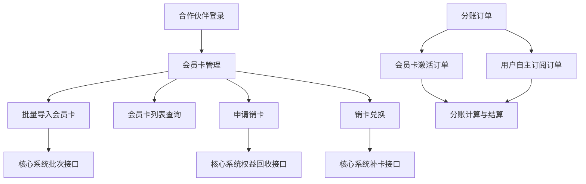
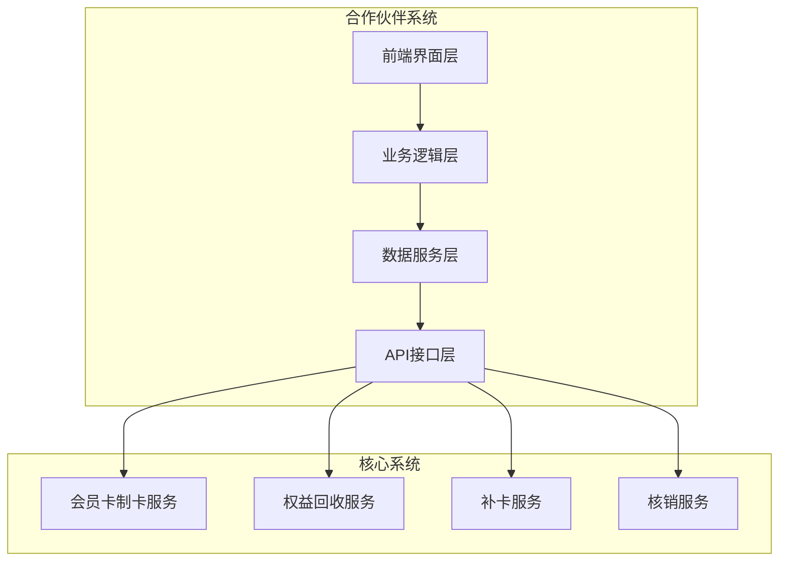
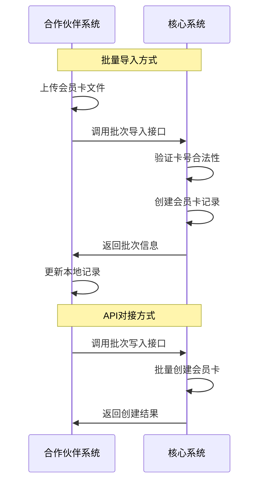
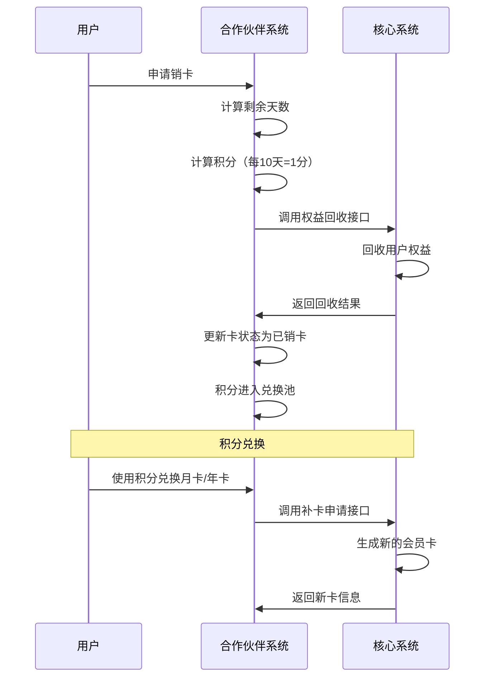
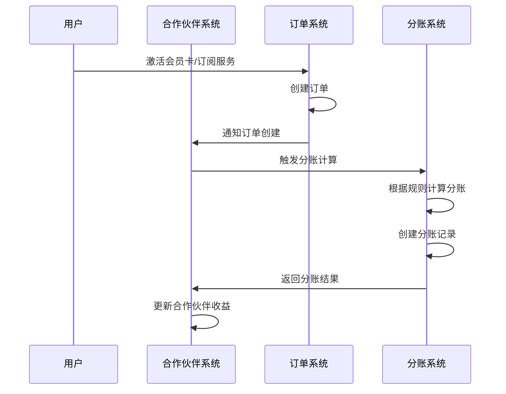
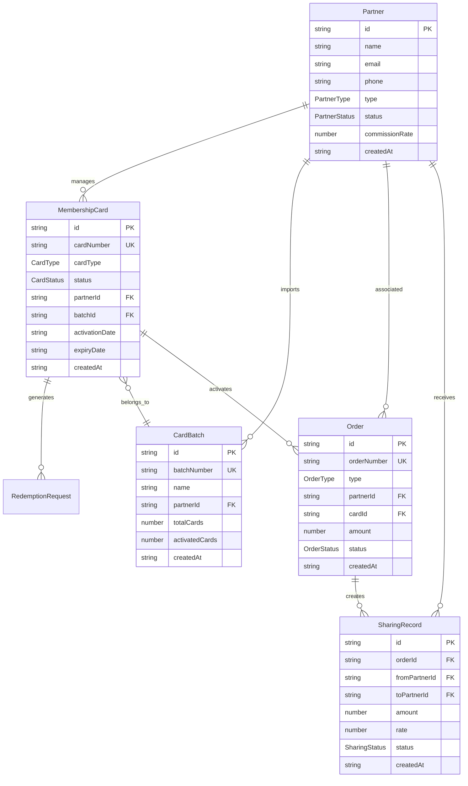
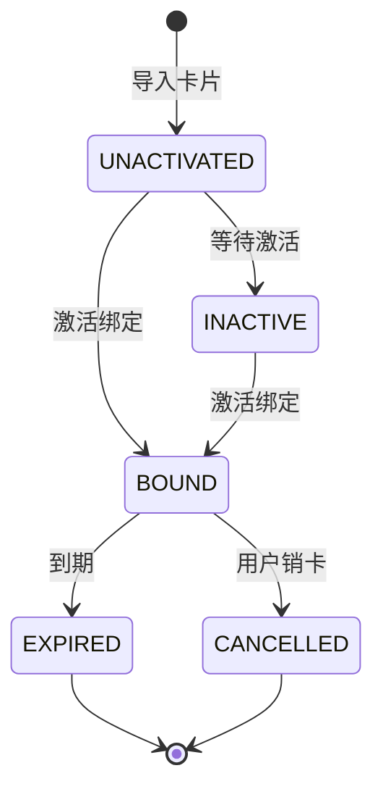
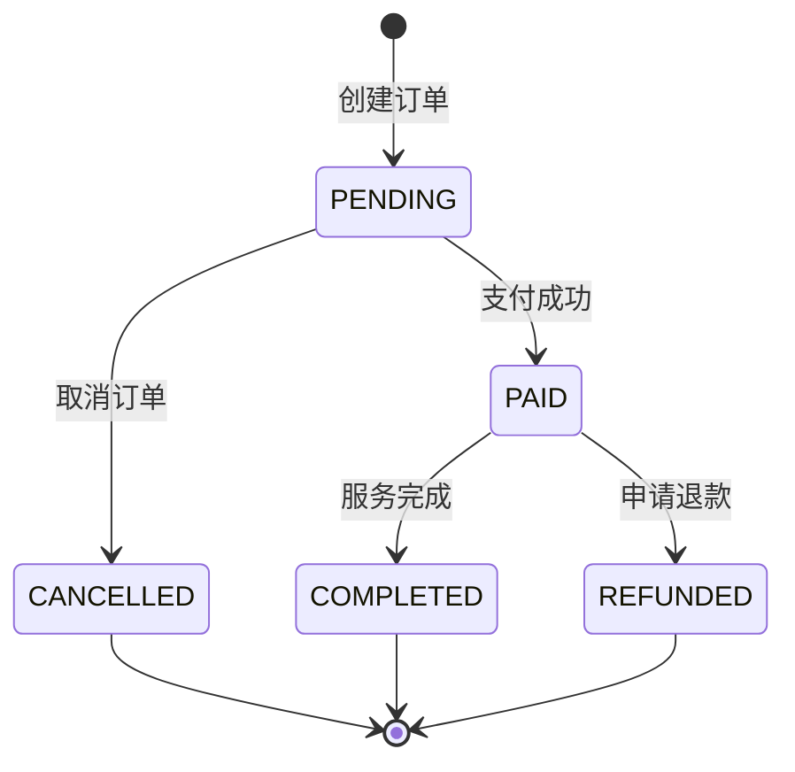

# 合作伙伴系统产品需求与API开发设计文档

## 1. 产品需求概述（PRD）

### 1.1 产品背景
合作伙伴系统是一个现代化的B2B合作伙伴关系管理平台，主要用于管理会员卡业务和分账功能。系统分为核心系统和合作伙伴系统两部分：
- **核心系统**：负责会员卡制卡、用户权益回收、兑换补卡和核销
- **合作伙伴系统**：负责会员卡管理、分账订单处理等业务功能

### 1.2 核心业务需求

#### 1.2.1 会员卡管理核心需求

**会员卡类型定义**：
1. **普通卡**：只需要卡密和手机号即可激活
2. **绑定卡**：需要卡密、手机号、MAC地址、渠道包

**会员卡状态管理**：
- **活跃（待激活）**：已导入但未激活的卡
- **未激活**：长期未激活的卡
- **已绑定**：用户已激活并绑定设备的卡
- **已过期**：超过有效期的卡
- **已销卡**：用户退款后权益已回收的卡

#### 1.2.2 业务流程需求

**提货流程**：
- 支持批量导入会员卡或通过接口对接批次写入
- 支持按批次查询会员卡列表

**销卡兑换流程**：
- 用户销卡后，按照履约时间，按天计算剩余卡的天数进入兑换池
- 合作伙伴可以通过兑换池的累计积分，每一天积分，通过积分可申请兑换月卡、年卡等

**分账订单需求**：
- 会员卡激活订单：用户激活会员卡产生的订单
- 用户自主订阅订单：后续用户自主订阅跟伙伴渠道相关的订单

### 1.3 核心用户需求分析

#### 1.3.1 合作伙伴用户
- **角色描述**：企业合作伙伴，系统主要使用者
- **核心需求**：
  - 会员卡管理效率：需要便捷的批量导入和管理工具
  - 收益透明化：需要清晰的分账明细和收益统计
  - 操作便捷性：需要简单易用的操作界面
  - 数据准确性：需要准确的业务数据和及时的状态更新

#### 1.3.2 业务痛点
1. **手工处理效率低**：传统的线下处理方式效率低下
2. **数据不透明**：缺乏实时的业务数据展示
3. **对账复杂**：人工对账容易出错且耗时
4. **权益处理困难**：销卡退费流程复杂

### 1.4 核心功能需求

#### 1.4.1 第一期功能范围
**重点**：合作伙伴能够登录查看会员卡的管理功能，以及分账订单

**必需功能**：
- 用户登录和权限管理
- 会员卡批量导入（文件方式）
- 会员卡列表查询和管理
- 按批次查询功能
- 分账订单查询（会员卡激活订单、用户自主订阅订单）
- 基础的仪表板展示

## 2. 技术架构设计

### 1.1 项目背景
合作伙伴系统是一个现代化的B2B合作伙伴关系管理平台，主要用于管理会员卡业务和分账功能。系统分为核心系统和合作伙伴系统两部分：
- **核心系统**：负责会员卡制卡、用户权益回收、兑换补卡和核销
- **合作伙伴系统**：负责会员卡管理、分账订单处理等业务功能

### 1.2 技术架构
- **前端**：React 18 + TypeScript + Vite + Tailwind CSS + shadcn/ui
- **状态管理**：Zustand
- **路由**：React Router v6
- **UI组件**：@radix-ui 组件库
- **开发工具**：ESLint + Prettier

### 1.3 核心业务流程



## 2. 系统架构

### 2.1 整体架构设计



### 2.2 模块架构

#### 2.2.1 前端模块结构
```
src/
├── components/           # UI组件
│   ├── auth/            # 认证组件
│   ├── layout/          # 布局组件
│   └── ui/              # 基础UI组件
├── pages/               # 页面组件
│   ├── Dashboard.tsx    # 仪表板
│   ├── Cards.tsx        # 会员卡管理
│   ├── Partners.tsx     # 合作伙伴管理
│   └── RevenueSharing.tsx # 分账管理
├── services/            # 业务服务层
├── store/               # 状态管理
└── types/               # 类型定义
```

#### 2.2.2 服务层架构
```
services/
├── authService.ts           # 认证服务
├── cardService.ts           # 会员卡服务
├── partnerService.ts        # 合作伙伴服务
├── revenueSharingService.ts # 分账服务
├── reconciliationService.ts # 对账服务
└── dashboardService.ts      # 仪表板服务
```

## 3. 详细功能设计与产品规划

### 3.1 项目里程碑规划

#### 3.1.1 第一期（核心功能）- 8周
**目标**：实现合作伙伴基础会员卡管理功能

**主要功能**：
- 用户登录和权限管理
- 会员卡批量导入（文件方式）
- 会员卡列表查询和管理
- 按批次查询功能
- 基础的仪表板展示

**交付物**：
- 可用的合作伙伴管理系统
- 与核心系统的基础接口对接
- 系统部署和配置文档

#### 3.1.2 第二期（分账功能）- 6周
**目标**：实现分账订单管理功能

**主要功能**：
- 会员卡激活订单管理
- 用户自主订阅订单管理
- 分账规则配置
- 分账记录查询
- 收益统计报表

**交付物**：
- 完整的分账管理功能
- 分账规则引擎
- 财务对账接口

#### 3.1.3 第三期（高级功能）- 4周
**目标**：实现销卡兑换和高级管理功能

**主要功能**：
- 申请销卡功能
- 销卡积分兑换
- API方式批量导入
- 高级数据报表
- 系统优化和性能提升

**交付物**：
- 完整的会员权益管理
- 积分兑换系统
- 性能优化版本

### 3.2 产品细化需求

#### 3.2.1 界面设计要求

**设计原则**：
- **简洁性**：界面布局清晰简洁，突出核心功能
- **一致性**：统一的UI组件风格和交互模式
- **易用性**：符合用户习惯的操作流程

**布局要求**：
- 左侧导航 + 主内容区域布局
- 顶部显示用户信息和快速操作
- 支持响应式设计（桌面、平板、手机）

**功能导航**：
- 一级导航：仪表板、会员卡管理、分账管理、报表、设置
- 二级导航：根据功能模块细分
- 面包屑导航：显示当前位置

#### 3.2.2 数据安全要求

**身份认证**：
- 支持用户名密码登录
- 密码强度要求：8位以上，包含字母数字特殊字符
- 账户锁定机制：5次错误登录后锁定30分钟

**数据保护**：
- 敏感数据加密存储（手机号、身份信息）
- 通信数据SSL加密
- 操作日志记录和审计

**权限控制**：
- 基于角色的访问控制（RBAC）
- 接口级权限验证
- 数据级权限隔离（合作伙伴只能查看自己的数据）

#### 3.2.3 性能要求

**响应时间**：
- 页面加载时间：< 3秒
- 接口响应时间：< 1秒
- 文件上传处理：< 30秒（1万条记录）

**并发处理**：
- 支持100个并发用户
- 支持10个并发文件上传
- 数据库连接池：20个连接

**数据处理能力**：
- 单次批量导入：≤ 10,000条记录
- 数据查询分页：默认20条/页，最大100条/页
- 数据保留期：3年

## 4. 会员卡管理功能设计

### 4.1 会员卡类型和状态定义

#### 4.1.1 会员卡类型枚举
```typescript
enum CardType {
  REGULAR = 'REGULAR',  // 普通卡：只需卡密和手机号激活
  BOUND = 'BOUND'       // 绑定卡：需卡密、手机号、MAC地址、渠道包
}
```

#### 4.1.2 会员卡状态定义
```typescript
enum CardStatus {
  UNACTIVATED = 'UNACTIVATED',  // 待激活（活跃）
  INACTIVE = 'INACTIVE',        // 未激活
  BOUND = 'BOUND',              // 已绑定
  EXPIRED = 'EXPIRED',          // 已过期
  CANCELLED = 'CANCELLED'       // 已销卡（用户退款后权益已回收）
}
```

### 4.2 会员卡数据模型和业务规则

```typescript
interface MembershipCard {
  id: string;                    // 会员卡ID
  cardNumber: string;            // 卡号
  cardType: CardType;            // 卡类型
  status: CardStatus;            // 卡状态
  partnerId: string;             // 合作伙伴ID
  batchId: string;               // 批次ID
  activationDate?: string;       // 激活时间
  expiryDate?: string;           // 到期时间
  bindingInfo?: BindingInfo;     // 绑定信息
  remainingDays?: number;        // 剩余天数
  createdAt: string;             // 创建时间
  updatedAt: string;             // 更新时间
}

interface BindingInfo {
  phoneNumber: string;           // 手机号
  macAddress?: string;           // MAC地址（绑定卡需要）
  channelPackage?: string;       // 渠道包（绑定卡需要）
  bindingTime: string;           // 绑定时间
  deviceInfo?: DeviceInfo;       // 设备信息
}
```


**会员卡业务规则**：
- **导入规则**：
  - 卡号不能重复
  - 批次号必须唯一
  - 文件大小限制：10MB
  - 单次导入上限：10,000张卡

- **状态流转规则**：
  - 只有“已绑定”状态的卡可以申请销卡
  - 销卡后不可恢复
  - 积分计算：每10天 = 1积分

- **权益回收规则**：
  - 根据履约时间和剩余天数计算
  - 需要核心系统确认回收结果
  - 支持销卡申请撤销（24小时内）

### 4.3 会员卡批次管理

```typescript
interface CardBatch {
  id: string;                    // 批次ID
  batchNumber: string;           // 批次号
  name: string;                  // 批次名称
  partnerId: string;             // 合作伙伴ID
  totalCards: number;            // 总卡数
  activatedCards: number;        // 已激活卡数
  status: 'imported' | 'processing' | 'completed';
  importMethod: 'file' | 'api';  // 导入方式
  createdAt: string;             // 创建时间
  createdBy: string;             // 创建人
}
```

### 4.4 核心业务流程设计

#### 4.4.1 会员卡提货流程



#### 4.4.2 销卡兑换流程



## 5. API接口设计与核心系统对接

### 5.1 与核心系统对接接口

#### 5.1.1 会员卡批次导入接口

**接口地址**：`POST /api/core/cards/batch-import`

**请求参数**：
```typescript
interface BatchImportRequest {
  partnerId: string;             // 合作伙伴ID
  batchName: string;             // 批次名称
  cards: CardImportData[];       // 会员卡数据
}

interface CardImportData {
  cardNumber: string;            // 卡号
  cardType: CardType;            // 卡类型
  expiryDate?: string;           // 到期时间
  batchNumber: string;           // 批次号
}
```

**响应数据**：
```typescript
interface BatchImportResponse {
  success: boolean;
  data: {
    batchId: string;             // 批次ID
    totalCards: number;          // 总卡数
    successCount: number;        // 成功导入数量
    failedCount: number;         // 失败数量
    errors: string[];            // 错误信息
  };
  message: string;
}
```

#### 5.1.2 用户权益批量回收接口

**接口地址**：`POST /api/core/rights/batch-recovery`

**请求参数**：
```typescript
interface RightsRecoveryRequest {
  partnerId: string;             // 合作伙伴ID
  cards: RightsRecoveryCard[];   // 待回收权益的卡
}

interface RightsRecoveryCard {
  cardId: string;                // 会员卡ID
  cardNumber: string;            // 卡号
  remainingDays: number;         // 剩余天数
  reason: string;                // 回收原因
}
```

**响应数据**：
```typescript
interface RightsRecoveryResponse {
  success: boolean;
  data: {
    recoveredCount: number;      // 回收成功数量
    totalPoints: number;         // 总积分
    failedCards: string[];       // 失败的卡号
  };
  message: string;
}
```

#### 5.1.3 批量申请补卡接口

**接口地址**：`POST /api/core/cards/replacement-request`

**请求参数**：
```typescript
interface ReplacementRequest {
  partnerId: string;             // 合作伙伴ID
  requests: ReplacementCardData[];
}

interface ReplacementCardData {
  originalCardId: string;        // 原卡ID
  points: number;                // 使用积分
  rewardType: 'monthly' | 'yearly'; // 兑换类型
  requestReason: string;         // 申请原因
}
```

### 5.2 合作伙伴系统内部接口

#### 5.2.1 会员卡管理接口

```typescript
// 获取会员卡列表
GET /api/cards/partner/{partnerId}
Query: {
  page?: number;
  pageSize?: number;
  status?: CardStatus;
  batchId?: string;
  keyword?: string;
}

// 按批次查询会员卡
GET /api/cards/batch/{batchId}

// 获取批次列表
GET /api/batches/partner/{partnerId}

// 申请销卡
POST /api/cards/{cardId}/cancel
Body: {
  reason: string;
}

// 计算销卡积分
GET /api/cards/{cardId}/redemption-points

// 创建兑换申请
POST /api/redemptions
Body: CreateRedemptionRequest
```

#### 5.2.2 分账订单接口

```typescript
// 获取分账记录
GET /api/revenue-sharing/partner/{partnerId}
Query: {
  startDate: string;
  endDate: string;
  type?: 'received' | 'paid';
}

// 获取激活订单
GET /api/orders/activation/{partnerId}

// 获取订阅订单
GET /api/orders/subscription/{partnerId}
```

## 6. 分账订单管理系统

### 6.1 订单类型定义

```typescript
enum OrderType {
  ACTIVATION = 'ACTIVATION',     // 会员卡激活订单
  SUBSCRIPTION = 'SUBSCRIPTION'  // 用户自主订阅订单
}

interface Order {
  id: string;                    // 订单ID
  orderNumber: string;           // 订单号
  type: OrderType;               // 订单类型
  partnerId: string;             // 关联合作伙伴
  cardId?: string;               // 关联会员卡（激活订单）
  userId: string;                // 用户ID
  amount: number;                // 订单金额
  status: OrderStatus;           // 订单状态
  paymentTime?: string;          // 支付时间
  sharingRecords: SharingRecord[]; // 分账记录
  createdAt: string;
}
```

### 6.2 分账计算规则

```typescript
interface SharingRule {
  id: string;                    // 规则ID
  partnerId: string;             // 合作伙伴ID
  orderType: OrderType;          // 适用订单类型
  commissionRate: number;        // 分账比例
  conditions: RuleCondition[];   // 分账条件
  priority: number;              // 优先级
  effectiveDate: string;         // 生效时间
  expiryDate?: string;           // 失效时间
  isActive: boolean;             // 是否启用
}

interface RuleCondition {
  field: string;                 // 条件字段
  operator: string;              // 操作符
  value: string | number;        // 条件值
}
```

### 6.3 分账流程设计



## 7. 数据模型设计与数据治理

### 7.1 核心实体关系图



### 7.2 状态机设计

#### 7.2.1 会员卡状态流转



#### 7.2.2 订单状态流转



## 8. 业务组件架构设计

### 8.1 会员卡管理组件

```typescript
// Cards.tsx 组件架构
interface CardsProps {
  partnerId: string;
}

const Cards: React.FC<CardsProps> = ({ partnerId }) => {
  // 状态管理
  const [cards, setCards] = useState<MembershipCard[]>([]);
  const [batches, setBatches] = useState<CardBatch[]>([]);
  const [activeTab, setActiveTab] = useState<'cards' | 'batches' | 'redemptions'>('cards');
  
  // 核心功能
  const handleFileUpload = async (file: File) => {
    // 批量导入会员卡逻辑
  };
  
  const handleBatchSelect = async (batchId: string) => {
    // 按批次查询会员卡
  };
  
  const handleCancelCard = async (cardId: string) => {
    // 申请销卡逻辑
  };
  
  const handleCalculateRedemption = async (card: MembershipCard) => {
    // 计算积分兑换
  };
  
  return (
    // 组件渲染逻辑
  );
};
```

### 8.2 分账管理组件

```typescript
// RevenueSharing.tsx 组件架构
const RevenueSharing: React.FC = () => {
  // 状态管理
  const [mySharing, setMySharing] = useState<SharingRecord[]>([]);
  const [downstreamSharing, setDownstreamSharing] = useState<SharingRecord[]>([]);
  const [sharingRules, setSharingRules] = useState<RevenueSharingRule[]>([]);
  
  // 数据加载
  const loadData = async () => {
    // 加载分账数据逻辑
  };
  
  return (
    // 分账管理界面
  );
};
```

### 8.3 服务层设计

```typescript
// CardService 服务类
export class CardServiceClass {
  private api = axios.create({
    baseURL: `${API_BASE_URL}/cards`,
  });
  
  // 获取会员卡列表
  async getCards(partnerId: string): Promise<MembershipCard[]> {
    // 实现逻辑
  }
  
  // 批量导入会员卡
  async importCards(partnerId: string, file: File): Promise<void> {
    // 文件上传和导入逻辑
  }
  
  // 通过接口对接批量写入
  async createBatch(importRequest: ImportCardsRequest): Promise<CardBatch> {
    // API对接导入逻辑
  }
  
  // 申请销卡
  async cancelCard(cardId: string): Promise<void> {
    // 销卡申请逻辑
  }
  
  // 计算销卡积分
  async calculateRedemptionPoints(cardId: string): Promise<{ points: number; days: number }> {
    // 积分计算逻辑
  }
}
```

## 9. 测试策略和质量保证

### 9.1 单元测试覆盖

#### 9.1.1 服务层测试
```typescript
describe('CardService', () => {
  test('应该正确获取会员卡列表', async () => {
    const partnerId = 'test-partner-id';
    const cards = await CardService.getCards(partnerId);
    expect(cards).toBeInstanceOf(Array);
    expect(cards.every(card => card.partnerId === partnerId)).toBe(true);
  });
  
  test('应该正确计算销卡积分', async () => {
    const cardId = 'test-card-id';
    const result = await CardService.calculateRedemptionPoints(cardId);
    expect(result).toHaveProperty('points');
    expect(result).toHaveProperty('days');
    expect(result.points).toBeGreaterThanOrEqual(0);
  });
});
```

#### 9.1.2 组件测试
```typescript
describe('Cards Component', () => {
  test('应该正确渲染会员卡列表', () => {
    render(<Cards partnerId="test-partner" />);
    expect(screen.getByText('会员卡管理')).toBeInTheDocument();
  });
  
  test('应该支持批量导入功能', async () => {
    render(<Cards partnerId="test-partner" />);
    const uploadButton = screen.getByText('批量导入');
    fireEvent.click(uploadButton);
    expect(screen.getByText('选择文件')).toBeInTheDocument();
  });
});
```

### 9.2 集成测试

#### 9.2.1 API接口测试
```typescript
describe('Core System Integration', () => {
  test('批次导入接口应该正常工作', async () => {
    const importRequest: BatchImportRequest = {
      partnerId: 'test-partner',
      batchName: 'Test Batch',
      cards: [
        {
          cardNumber: 'CARD001',
          cardType: CardType.REGULAR,
          batchNumber: 'BATCH001'
        }
      ]
    };
    
    const response = await fetch('/api/core/cards/batch-import', {
      method: 'POST',
      headers: { 'Content-Type': 'application/json' },
      body: JSON.stringify(importRequest)
    });
    
    expect(response.ok).toBe(true);
    const result = await response.json();
    expect(result.success).toBe(true);
  });
});
```

### 9.3 端到端测试场景

```typescript
describe('会员卡管理端到端流程', () => {
  test('完整的会员卡导入和管理流程', async () => {
    // 1. 登录系统
    await login('partner@example.com', 'password');
    
    // 2. 导航到会员卡管理页面
    await navigateTo('/cards');
    
    // 3. 批量导入会员卡
    await uploadFile('test-cards.csv');
    await waitForImportComplete();
    
    // 4. 验证导入结果
    const cardList = await getCardList();
    expect(cardList).toHaveLength(100);
    
    // 5. 查看批次详情
    await selectBatch('BATCH001');
    
    // 6. 申请销卡
    await cancelCard('CARD001');
    
    // 7. 验证销卡状态
    const cardStatus = await getCardStatus('CARD001');
    expect(cardStatus).toBe('CANCELLED');
  });
});
```