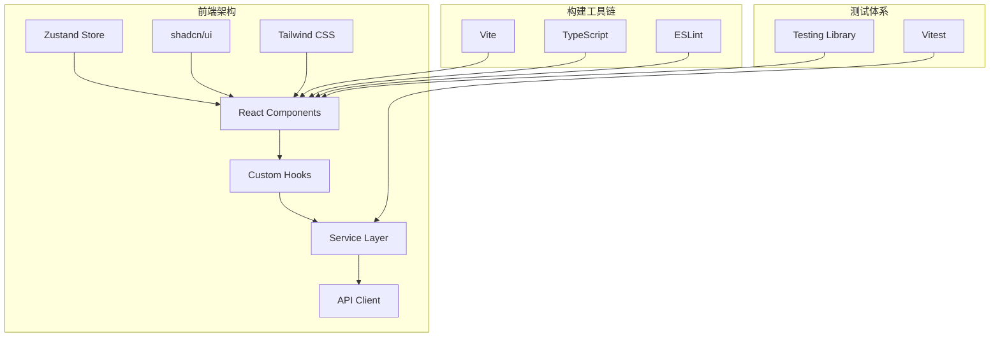
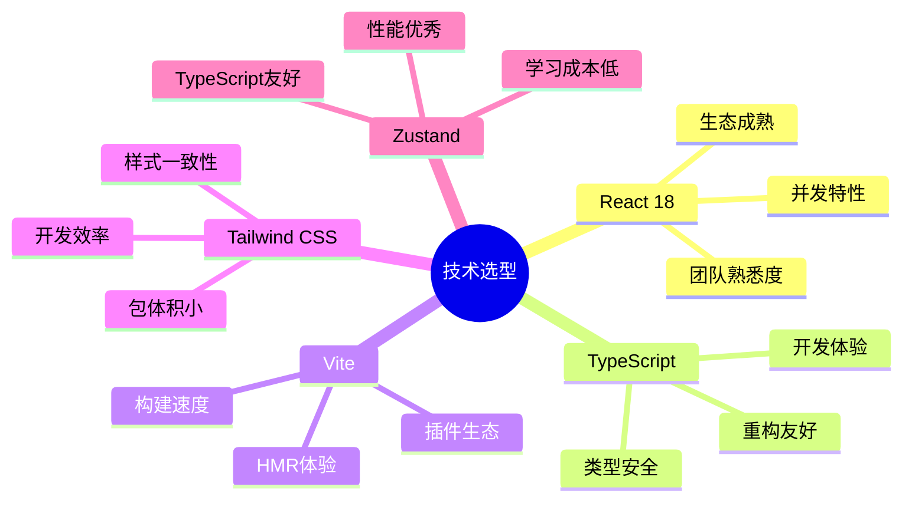

# 系统架构设计文档

合作伙伴管理系统的完整系统架构设计和技术规范。

## 🏗️ 整体架构概览

### 架构风格
采用**分层架构 + 模块化设计**的混合架构风格：
- **表现层**：React组件 + shadcn/ui
- **业务逻辑层**：Service服务层
- **数据访问层**：API客户端 + Mock数据
- **状态管理层**：Zustand全局状态



## 📋 技术栈选型

### 核心技术栈

#### 前端框架层
```typescript
// 技术选型及版本
const techStack = {
  // 核心框架
  react: "18.3.1",           // 现代React特性，并发渲染
  typescript: "^5.5.3",      // 类型安全，开发体验
  
  // 构建工具
  vite: "^5.4.1",           // 快速构建，HMR
  
  // 样式系统
  tailwindcss: "^3.4.11",   // 原子化CSS
  "shadcn/ui": "latest",     // 高质量组件库
  
  // 状态管理
  zustand: "^4.5.7",        // 轻量级状态管理
  
  // 路由管理
  "react-router-dom": "^6.26.2", // 声明式路由
  
  // HTTP客户端
  axios: "^1.11.0",         // 功能丰富的HTTP库
  
  // 图表组件
  recharts: "^2.12.7",      // React图表库
  
  // 表单管理
  "react-hook-form": "^7.53.0", // 高性能表单库
  zod: "^3.23.8",           // 运行时类型验证
}
```

#### 选型理由分析


## 🏛️ 分层架构设计

### 1. 表现层 (Presentation Layer)

#### 组件分层设计
```typescript
// 组件层次结构
interface ComponentArchitecture {
  // 页面级组件 (Page Components)
  pages: {
    responsibility: "路由入口，数据获取，业务编排"
    dependencies: ["services", "hooks", "components"]
    examples: ["Dashboard.tsx", "Cards.tsx", "Partners.tsx"]
  }
  
  // 业务组件 (Business Components)
  businessComponents: {
    responsibility: "特定业务逻辑，复合UI交互"
    dependencies: ["ui", "hooks", "services"]
    examples: ["PartnerDashboard.tsx", "CardActivationModal.tsx"]
  }
  
  // UI组件 (UI Components)
  uiComponents: {
    responsibility: "纯UI渲染，可复用，无业务逻辑"
    dependencies: ["shadcn/ui", "tailwind"]
    examples: ["Button", "Card", "Dialog"]
  }
  
  // 布局组件 (Layout Components)
  layoutComponents: {
    responsibility: "页面布局，导航，通用交互"
    dependencies: ["ui", "auth"]
    examples: ["Layout.tsx", "Header.tsx", "Sidebar.tsx"]
  }
}
```

#### 组件设计原则
```typescript
// 1. 单一职责原则
const UserProfile: React.FC<UserProfileProps> = ({ userId }) => {
  // 只负责用户信息展示
}

// 2. 开闭原则 - 通过props扩展
interface ButtonProps {
  variant?: 'default' | 'outline' | 'ghost'
  size?: 'sm' | 'md' | 'lg'
  className?: string
  children: React.ReactNode
}

// 3. 组合优于继承
const UserCard = () => (
  <Card>
    <CardHeader>
      <UserAvatar />
      <UserInfo />
    </CardHeader>
    <CardContent>
      <UserStats />
    </CardContent>
  </Card>
)
```

### 2. 业务逻辑层 (Business Logic Layer)

#### Service层设计模式
```typescript
// 基础服务抽象类
abstract class BaseService {
  protected static apiClient = createApiClient()
  
  protected static handleError(error: any): never {
    // 统一错误处理逻辑
    throw new ServiceError(error)
  }
  
  protected static transformResponse<T>(response: ApiResponse): T {
    // 统一响应转换逻辑
    return response.data
  }
}

// 具体业务服务实现
export class CardService extends BaseService {
  // 获取会员卡列表
  static async getCards(partnerId: string, filters?: CardFilters): Promise<Card[]> {
    try {
      const response = await this.apiClient.get(`/cards/${partnerId}`, {
        params: filters
      })
      return this.transformResponse<Card[]>(response)
    } catch (error) {
      this.handleError(error)
    }
  }
  
  // 批量导入会员卡 - 仅管理员权限
  static async importCards(partnerId: string, cards: ImportCardData[]): Promise<ImportResult> {
    this.checkPermission('cards:import') // 权限检查
    
    try {
      const response = await this.apiClient.post(`/cards/${partnerId}/import`, {
        cards
      })
      return this.transformResponse<ImportResult>(response)
    } catch (error) {
      this.handleError(error)
    }
  }
}
```

#### 权限控制架构
```typescript
// 权限控制系统设计
interface PermissionSystem {
  // 权限定义
  permissions: {
    'dashboard:read': '查看仪表板'
    'cards:read': '查看会员卡'
    'cards:write': '编辑会员卡'
    'cards:import': '导入会员卡'  // 仅管理员
    'partners:read': '查看合作伙伴'
    'partners:write': '编辑合作伙伴'
  }
  
  // 角色权限映射
  rolePermissions: {
    admin: Permission[]     // 完整权限，包含cards:import
    partner: Permission[]   // 限定权限，不含cards:import
    user: Permission[]      // 基础权限
  }
  
  // 权限检查方法
  hasPermission: (permission: string) => boolean
  checkPermission: (permission: string) => void | never
}

// 使用装饰器模式进行权限控制
function requirePermission(permission: string) {
  return function(target: any, propertyKey: string, descriptor: PropertyDescriptor) {
    const originalMethod = descriptor.value
    
    descriptor.value = function(...args: any[]) {
      if (!useAuthStore.getState().hasPermission(permission)) {
        throw new PermissionError(`缺少权限: ${permission}`)
      }
      return originalMethod.apply(this, args)
    }
  }
}

// 应用权限装饰器
export class CardService extends BaseService {
  @requirePermission('cards:import')
  static async importCards(partnerId: string, cards: ImportCardData[]): Promise<ImportResult> {
    // 实现逻辑
  }
}
```

### 3. 数据访问层 (Data Access Layer)

#### API客户端架构
```typescript
// API客户端配置
interface ApiClientConfig {
  baseURL: string
  timeout: number
  retryCount: number
  interceptors: {
    request: RequestInterceptor[]
    response: ResponseInterceptor[]
  }
}

// 创建API客户端
export const createApiClient = (config?: Partial<ApiClientConfig>) => {
  const client = axios.create({
    baseURL: import.meta.env.VITE_API_BASE_URL || 'http://localhost:3000/api',
    timeout: 10000,
    ...config
  })
  
  // 请求拦截器 - 添加认证头
  client.interceptors.request.use((config) => {
    const { accessToken } = useAuthStore.getState()
    if (accessToken) {
      config.headers.Authorization = `Bearer ${accessToken}`
    }
    return config
  })
  
  // 响应拦截器 - 错误处理
  client.interceptors.response.use(
    (response) => response,
    (error) => {
      if (error.response?.status === 401) {
        // 处理认证失效
        useAuthStore.getState().logout()
        window.location.href = '/login'
      }
      return Promise.reject(error)
    }
  )
  
  return client
}
```

#### Mock数据架构
```typescript
// Mock数据管理系统
interface MockDataSystem {
  // 数据模块化管理
  modules: {
    'mock-data.ts': '基础Mock数据'
    'mock-data-cards.ts': '会员卡相关数据'
    'mock-data-sharing.ts': '分账相关数据'
    'mock-data-recovery-pool.ts': '权益回收池数据'
    'mock-data-orders.ts': '订单相关数据'
    'mock-data-reconciliation.ts': '对账相关数据'
  }
  
  // 数据生成器
  generators: {
    generateCards: (count: number, partnerId: string) => Card[]
    generateSharingRecords: (partnerId: string, dateRange: DateRange) => SharingRecord[]
    generateRecoveryPool: (partnerId: string) => RecoveryPool
  }
  
  // 环境切换
  useMockData: boolean // 通过环境变量控制
}

// Mock数据使用示例
export class CardService extends BaseService {
  static async getCards(partnerId: string): Promise<Card[]> {
    // 环境变量控制是否使用Mock数据
    if (import.meta.env.VITE_USE_MOCK_DATA === 'true') {
      return mockCardData.getCardsForPartner(partnerId)
    }
    
    // 真实API调用
    const response = await this.apiClient.get(`/cards/${partnerId}`)
    return this.transformResponse<Card[]>(response)
  }
}
```

### 4. 状态管理层 (State Management Layer)

#### Zustand架构设计
```typescript
// 状态管理架构
interface StateArchitecture {
  // 全局状态分类
  globalStates: {
    auth: 'AuthState'           // 认证状态
    app: 'AppState'             // 应用状态
    notifications: 'NotificationState' // 通知状态
  }
  
  // 局部状态管理
  localStates: {
    forms: 'react-hook-form'    // 表单状态
    ui: 'useState/useReducer'   // UI交互状态
    cache: 'TanStack Query'     // 数据缓存状态
  }
}

// 认证状态设计
interface AuthState {
  // 状态数据
  user: User | null
  accessToken: string | null
  refreshToken: string | null
  permissions: string[]
  isAuthenticated: boolean
  
  // 派生状态
  isAdmin: boolean
  isPartner: boolean
  canImportCards: boolean  // 重要：导入权限检查
  
  // 状态操作
  login: (authData: AuthResponse) => void
  logout: () => void
  refreshAccessToken: () => Promise<void>
  updateUser: (user: Partial<User>) => void
  
  // 权限检查
  hasPermission: (permission: string) => boolean
  hasAnyPermission: (permissions: string[]) => boolean
  hasAllPermissions: (permissions: string[]) => boolean
}

// 状态持久化设计
export const useAuthStore = create<AuthState>()(
  persist(
    (set, get) => ({
      // 状态初始值
      user: null,
      accessToken: null,
      refreshToken: null,
      permissions: [],
      isAuthenticated: false,
      
      // 派生状态计算
      get isAdmin() {
        return get().user?.role === 'admin'
      },
      
      get canImportCards() {
        return get().hasPermission('cards:import')
      },
      
      // 状态操作实现
      login: (authData) => set({
        user: authData.user,
        accessToken: authData.accessToken,
        refreshToken: authData.refreshToken,
        permissions: authData.permissions,
        isAuthenticated: true
      }),
      
      hasPermission: (permission) => {
        const { permissions } = get()
        return permissions.includes(permission)
      }
    }),
    {
      name: 'auth-storage',
      // 选择性持久化
      partialize: (state) => ({
        user: state.user,
        accessToken: state.accessToken,
        refreshToken: state.refreshToken,
        permissions: state.permissions,
        isAuthenticated: state.isAuthenticated
      })
    }
  )
)
```

## 🔧 模块化设计

### 功能模块划分
```typescript
// 模块依赖关系图
interface ModuleDependencies {
  // 核心模块
  core: {
    auth: []                    // 无依赖
    api: ['auth']              // 依赖认证
    types: []                  // 类型定义，无依赖
  }
  
  // 业务模块
  business: {
    cards: ['core/api', 'core/auth']
    partners: ['core/api', 'core/auth'] 
    dashboard: ['cards', 'partners', 'revenue-sharing']
    'revenue-sharing': ['core/api', 'core/auth']
    reconciliation: ['core/api', 'core/auth']
    'recovery-pool': ['cards', 'core/api', 'core/auth']
  }
  
  // UI模块
  ui: {
    components: ['core/types']
    layouts: ['core/auth', 'ui/components']
    pages: ['business/*', 'ui/layouts']
  }
}
```

### 模块边界设计
```typescript
// 模块接口定义
export interface ModuleInterface {
  // 对外暴露的服务
  services: {
    [key: string]: ServiceClass
  }
  
  // 对外暴露的组件
  components: {
    [key: string]: React.ComponentType
  }
  
  // 对外暴露的类型
  types: {
    [key: string]: TypeDefinition
  }
  
  // 模块配置
  config: ModuleConfig
}

// 模块注册机制
class ModuleRegistry {
  private modules = new Map<string, ModuleInterface>()
  
  register(name: string, module: ModuleInterface) {
    this.validateDependencies(module)
    this.modules.set(name, module)
  }
  
  get(name: string): ModuleInterface | undefined {
    return this.modules.get(name)
  }
  
  private validateDependencies(module: ModuleInterface) {
    // 验证模块依赖关系
  }
}
```

## 🔒 安全架构设计

### 认证与授权
```typescript
// 安全架构设计
interface SecurityArchitecture {
  // 认证层
  authentication: {
    strategy: 'JWT'
    tokenStorage: 'localStorage' // 考虑安全性，生产环境可用httpOnly cookie
    tokenRefresh: 'automatic'
    sessionTimeout: 3600 // 1小时
  }
  
  // 授权层
  authorization: {
    model: 'RBAC'              // 基于角色的访问控制
    granularity: 'feature'     // 功能级权限控制
    inheritance: false         // 不支持权限继承，简化实现
  }
  
  // 数据安全
  dataSecurity: {
    sensitiveDataEncryption: true  // 敏感数据加密
    apiDataValidation: true        // API数据验证
    xssProtection: true           // XSS防护
    csrfProtection: false         // SPA应用，暂不需要
  }
}

// 权限检查HOC
export const withPermission = (permission: string) => {
  return function<P>(Component: React.ComponentType<P>) {
    return function PermissionGatedComponent(props: P) {
      const hasPermission = useAuthStore(state => state.hasPermission(permission))
      
      if (!hasPermission) {
        return <AccessDenied permission={permission} />
      }
      
      return <Component {...props} />
    }
  }
}

// 使用示例
export const CardImportButton = withPermission('cards:import')(
  ({ onImport }: { onImport: () => void }) => (
    <Button onClick={onImport}>导入会员卡</Button>
  )
)
```

### 数据验证架构
```typescript
// 多层数据验证
interface ValidationLayers {
  // 前端验证
  clientSide: {
    formValidation: 'react-hook-form + zod'
    typeValidation: 'TypeScript'
    runtimeValidation: 'zod schemas'
  }
  
  // API层验证
  apiLayer: {
    requestValidation: 'middleware validation'
    responseValidation: 'response schema validation'
    businessRuleValidation: 'service layer validation'
  }
}

// Zod schema示例
const CardImportSchema = z.object({
  cards: z.array(z.object({
    cardNumber: z.string().regex(/^\d{10,16}$/, '卡号格式错误'),
    cardSecret: z.string().min(6, '卡密至少6位').max(20, '卡密最多20位'),
    cardType: z.enum(['NORMAL', 'BINDING'], { message: '卡类型无效' }),
    validityPeriod: z.number().min(1).max(3650, '有效期最长10年')
  })).min(1, '至少导入一张卡').max(1000, '单次最多导入1000张卡')
})

// 在组件中使用
const useCardImportForm = () => {
  const form = useForm<CardImportData>({
    resolver: zodResolver(CardImportSchema),
    defaultValues: {
      cards: []
    }
  })
  
  return form
}
```

## 📊 性能架构设计

### 前端性能优化
```typescript
// 性能优化策略
interface PerformanceOptimization {
  // 代码分割
  codeSplitting: {
    routeLevel: 'React.lazy + Suspense'  // 路由级分割
    componentLevel: 'dynamic imports'     // 组件级分割
    vendorSeparation: 'Vite build optimization' // 第三方库分离
  }
  
  // 缓存策略
  caching: {
    componentMemoization: 'React.memo'    // 组件缓存
    computationMemoization: 'useMemo'     // 计算结果缓存
    callbackMemoization: 'useCallback'   // 回调函数缓存
    apiDataCaching: 'TanStack Query'      // API数据缓存
  }
  
  // 渲染优化
  rendering: {
    virtualScrolling: 'react-window'      // 虚拟滚动
    lazyLoading: 'Intersection Observer'  // 懒加载
    imageOptimization: 'responsive images' // 图片优化
  }
}

// 性能监控
const usePerformanceMonitor = () => {
  useEffect(() => {
    // 监控首屏加载时间
    const observer = new PerformanceObserver((list) => {
      const entries = list.getEntries()
      entries.forEach((entry) => {
        if (entry.entryType === 'navigation') {
          console.log('页面加载时间:', entry.loadEventEnd - entry.loadEventStart)
        }
      })
    })
    
    observer.observe({ entryTypes: ['navigation'] })
    
    return () => observer.disconnect()
  }, [])
}
```

### 数据处理性能
```typescript
// 大数据量处理策略
interface DataProcessingStrategy {
  // 分页策略
  pagination: {
    clientSide: 'usePagination hook'      // 客户端分页
    serverSide: 'API pagination'          // 服务端分页
    virtualPagination: 'react-window'     // 虚拟分页
  }
  
  // 搜索优化
  search: {
    debouncing: 'useDebounce hook'        // 防抖搜索
    clientFiltering: 'local array filter' // 客户端过滤
    serverFiltering: 'API query params'   // 服务端过滤
  }
  
  // 批量操作
  batchOperations: {
    batchSize: 100                        // 批量大小限制
    progressTracking: true                // 进度跟踪
    errorHandling: 'partial success'      // 部分成功处理
  }
}

// 批量处理Hook
const useBatchProcessor = <T>(
  items: T[],
  processor: (batch: T[]) => Promise<void>,
  batchSize = 100
) => {
  const [progress, setProgress] = useState(0)
  const [isProcessing, setIsProcessing] = useState(false)
  const [errors, setErrors] = useState<Error[]>([])
  
  const processBatches = useCallback(async () => {
    setIsProcessing(true)
    setProgress(0)
    setErrors([])
    
    const batches = chunk(items, batchSize)
    
    for (let i = 0; i < batches.length; i++) {
      try {
        await processor(batches[i])
        setProgress((i + 1) / batches.length * 100)
      } catch (error) {
        setErrors(prev => [...prev, error as Error])
      }
    }
    
    setIsProcessing(false)
  }, [items, processor, batchSize])
  
  return { processBatches, progress, isProcessing, errors }
}
```

## 🧪 测试架构设计

### 测试策略
```typescript
// 测试金字塔
interface TestingStrategy {
  // 单元测试 (70%)
  unitTests: {
    coverage: 'services, utils, hooks'
    framework: 'Vitest'
    focus: 'business logic, edge cases'
  }
  
  // 组件测试 (20%)
  componentTests: {
    coverage: 'React components'
    framework: 'Vitest + Testing Library'
    focus: 'user interactions, props validation'
  }
  
  // 集成测试 (10%)
  integrationTests: {
    coverage: 'page-level workflows'
    framework: 'Vitest + Testing Library'
    focus: 'user journeys, API integration'
  }
}

// 测试工具配置
export const testConfig = {
  // Vitest配置
  vitest: {
    environment: 'jsdom',
    setupFiles: ['./src/test/setup.ts'],
    coverage: {
      provider: 'v8',
      reporter: ['text', 'html', 'lcov'],
      thresholds: {
        statements: 80,
        branches: 80,
        functions: 80,
        lines: 80
      }
    }
  },
  
  // Mock配置
  mocks: {
    api: 'MSW (Mock Service Worker)',
    localStorage: 'custom mock',
    environment: 'vi.mock'
  }
}
```

## 🔄 部署架构设计

### 构建优化
```typescript
// Vite构建配置
export default defineConfig({
  build: {
    target: 'es2015',
    outDir: 'dist',
    sourcemap: true,
    
    // 代码分割配置
    rollupOptions: {
      output: {
        manualChunks: {
          // 基础框架
          'vendor-react': ['react', 'react-dom'],
          'vendor-router': ['react-router-dom'],
          
          // UI库
          'vendor-ui': ['@radix-ui/react-dialog', '@radix-ui/react-button'],
          
          // 工具库
          'vendor-utils': ['axios', 'date-fns', 'clsx'],
          
          // 图表库
          'vendor-charts': ['recharts'],
          
          // 业务模块
          'business-cards': ['./src/services/cardService.ts', './src/pages/Cards.tsx'],
          'business-dashboard': ['./src/services/dashboardService.ts', './src/pages/Dashboard.tsx']
        }
      }
    },
    
    // 压缩配置
    minify: 'terser',
    terserOptions: {
      compress: {
        drop_console: true,
        drop_debugger: true
      }
    }
  },
  
  // 优化配置
  optimizeDeps: {
    include: ['react', 'react-dom', 'axios'],
    exclude: ['@vite/client']
  }
})
```

### 环境配置
```typescript
// 多环境配置
interface EnvironmentConfig {
  development: {
    API_BASE_URL: 'http://localhost:3000/api'
    USE_MOCK_DATA: 'true'
    DEBUG_MODE: 'true'
    LOG_LEVEL: 'debug'
  }
  
  staging: {
    API_BASE_URL: 'https://staging-api.example.com'
    USE_MOCK_DATA: 'false'
    DEBUG_MODE: 'true'
    LOG_LEVEL: 'info'
  }
  
  production: {
    API_BASE_URL: 'https://api.example.com'
    USE_MOCK_DATA: 'false'
    DEBUG_MODE: 'false'
    LOG_LEVEL: 'error'
  }
}
```

---

**架构师**: Damingdong  
**文档版本**: v1.0  
**最后更新**: 2024-09-16