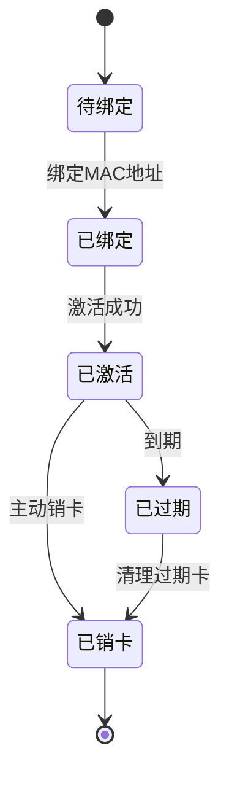
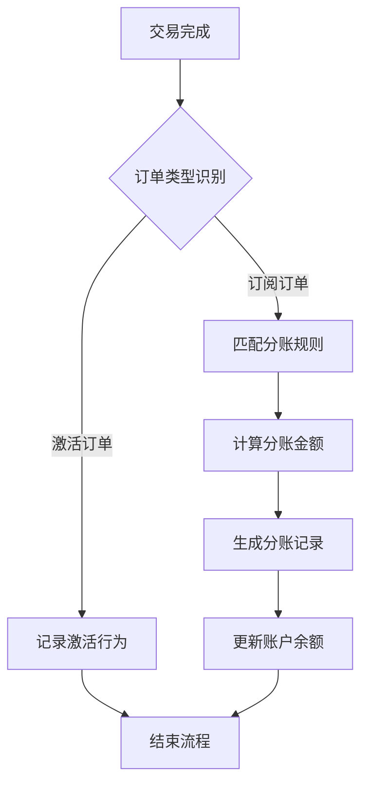

# 业务需求文档 (BRD) - 合作伙伴管理系统

## 📋 文档概述

### 项目背景
合作伙伴管理系统旨在为企业提供完整的合作伙伴关系管理解决方案，主要解决以下业务问题：

1. **会员卡管理复杂性**：大量会员卡的导入、激活、状态跟踪
2. **设备管理复杂性**：设备绑定、状态监控、回收管理
3. **合作伙伴业绩跟踪**：多渠道合作伙伴的业绩统计和分析
4. **订单管理复杂性**：激活订单和订阅订单的统一管理、查询和导出
5. **收益分成管理**：复杂的分成规则和结算流程
6. **权益回收处理**：退卡、换卡等权益回收的统一管理

### 业务目标
- **提高运营效率**：自动化会员卡管理、分账计算、对账流程
- **增强合作伙伴体验**：提供直观的业绩查看和报表功能
- **降低运营成本**：减少人工干预，提高数据处理准确性
- **支持业务扩展**：灵活的分账规则和合作伙伴管理体系

### 目标用户画像
- **系统管理员**：拥有完整系统访问权限，负责系统配置和数据管理
- **合作伙伴**：查看自己的业绩数据、会员信息和分成情况
- **普通用户**：基础数据查看权限

## 🎯 核心业务价值

### 业务价值主张
- **自动化管理**：减少人工操作，提高数据处理效率
- **透明化分账**：清晰的分账规则和结算流程
- **实时化监控**：实时业务数据监控和预警
- **标准化流程**：统一的业务流程和操作规范

### 关键成功指标 (KSI)
- **运营效率提升**：减少50%的人工操作时间
- **数据处理准确性**：达到99.9%的数据准确性
- **合作伙伴满意度**：合作伙伴满意度达到90%以上
- **系统可用性**：系统可用性达到99.9%

## 💼 业务范围

### 包含功能
- 会员卡全生命周期管理
- 设备绑定和状态管理
- 订单管理和分账计算
- 合作伙伴业绩跟踪
- 权益回收池管理
  - **批量兑换流程**：支持单次最多兑换100张会员卡，需满足以下条件：
    1. 卡片状态为“可回收”
    2. 同一批次卡片MAC地址归属同一合作伙伴
    3. 兑换后自动生成分账记录
- 对账和报表功能

### 排除功能
- 支付网关集成（由第三方系统处理）
- 硬件设备管理（仅软件层面集成）
- 客户服务系统（独立系统）

## 📊 业务约束

### 技术约束
- 支持现有技术栈：React + TypeScript + Vite
- 兼容现有数据库结构
- 遵循现有安全规范

### 业务约束
- 分账规则仅适用于订阅订单
- 激活订单仅用于记录，不参与分账
- 合作伙伴数据权限隔离
- **权益回收池限制**：
  - 单次批量兑换上限：100张会员卡
  - 每日批量兑换上限：500张会员卡
  - 兑换后需冷却24小时方可再次操作

### 时间约束
- MVP版本在12周内完成
- 分阶段交付，优先核心功能

## 🔄 业务流程概览

### 会员卡生命周期管理

### 分账业务流程

## 💰 投资回报分析

### 成本估算
- **开发成本**：12周开发周期
- **运维成本**：云服务器和监控服务
- **培训成本**：用户培训和支持

### 收益预期
- **效率提升**：预计节省30%人工成本
- **错误减少**：减少人工错误导致的损失
- **业务增长**：支持更多合作伙伴接入

### ROI分析
- **投资回收期**：预计6个月
- **净现值**：3年内实现正向回报
- **内部收益率**：预计达到25%

## 🚀 实施策略

### 分阶段实施
1. **MVP阶段**：核心会员卡管理和分账功能
2. **扩展阶段**：高级报表和合作伙伴管理
3. **优化阶段**：性能优化和用户体验提升

### 风险缓解
- **技术风险**：采用成熟技术栈，充分测试
- **业务风险**：与业务部门紧密合作，及时调整
- **用户接受度**：提供充分培训和持续支持

---

**文档版本**: v1.0  
**创建日期**: 2025-01-05  
**业务分析师**: AI助手  
**审核状态**: 待审核