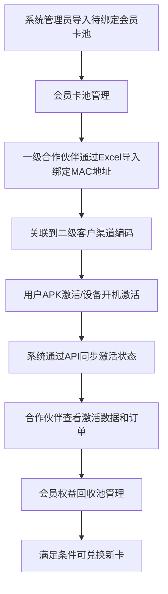
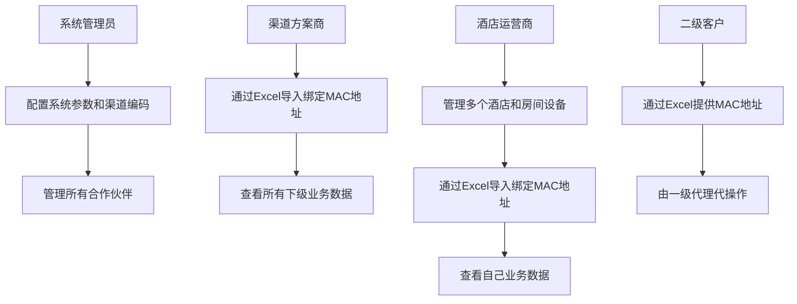

# 业务需求文档 (BRD) - 合作伙伴管理系统

## 📋 文档概述

### 项目背景
合作伙伴管理系统旨在为会员卡预售业务提供完整的全生命周期管理解决方案，主要解决以下业务问题：

1. **会员卡预售管理**：支持渠道方案商（一级代理）和酒店运营商（一级代理）的会员卡预售业务
2. **设备绑定管理**：基于MAC地址的设备绑定，支持酒店客户为房间电视设备预绑定会员卡
3. **激活状态跟踪**：通过API接口与外部系统同步APK激活和设备开机激活状态
4. **订单管理透明化**：合作伙伴可查看激活订单和订阅订单，支持线下对账
5. **会员权益回收池**：支持会员卡权益回收和再次兑换，形成业务闭环

### 业务目标
- **提高运营效率**：自动化会员卡管理、设备绑定、激活跟踪流程
- **增强合作伙伴体验**：提供直观的业务数据查看和统计功能
- **降低运营成本**：减少人工干预，提高数据处理准确性
- **支持业务扩展**：灵活的分级合作伙伴管理体系

### 目标用户画像（基于RBAC多角色权限设计）

#### 平台方（超级管理员）
- **业务定位**：系统最高权限管理者，负责全局业务管理和风控
- **核心权限**：
  - 全局系统管理和角色权限配置
  - 所有业务数据查看和统计分析
  - **会员权益回收池管理（必备功能）**：权益回收、审批、兑换管理
  - 系统参数配置和业务规则设置

#### 会员卡代理商
- **业务定位**：代理销售/管理会员卡业务，负责卡池导入、设备绑定和权益回收
- **核心权限**：
  - 会员卡池导入和库存管理（仅限自有卡池）
  - MAC地址绑定和设备管理（仅限自有设备）
  - 激活订单查看和管理（仅限相关订单）
  - **会员权益回收池管理**：自有设备的权益回收和兑换操作
  - **不一定参与用户订阅分账**：部分代理商只做卡业务

#### 渠道分账角色
- **业务定位**：仅参与用户订阅后的分账结算，负责收益核对
- **核心权限**：
  - 订阅订单查看和导出（仅限自有渠道）
  - 分账明细查看和核对
  - **不一定有会员卡代理权限**：部分渠道只做用户运营分账

#### 混合角色（代理商+分账）
- **业务定位**：既代理会员卡业务，也参与用户订阅分账
- **核心权限**：
  - 同时具备会员卡代理商和渠道分账角色的全部权限
  - 跨渠道业务数据整合查看
  - 收益汇总和业务分析

#### 二级客户/硬件厂商
- **业务定位**：仅提供硬件或对接服务，不直接操作系统
- **核心权限**：
  - 仅查看自身相关设备的状态
  - 无直接操作权限，通过代理商或分账角色间接参与

## 🎯 核心业务价值

### 业务价值主张
- **会员卡预售管理**：支持渠道方案商和酒店运营商的会员卡预售业务闭环
- **设备绑定自动化**：基于MAC地址的设备绑定，支持批量导入和单个操作
- **激活状态实时跟踪**：通过API接口与外部系统同步激活状态
- **业务数据透明化**：合作伙伴可查看订单、激活数据和业务统计
- **会员权益回收池（必备功能）**：平台方专属的权益回收管理，支持未使用/过期/回收会员卡权益的重新分配、统计和风控，形成完整的业务闭环
- **基于RBAC的多角色权限体系**：支持平台方、代理商、分账角色、混合角色的灵活权限配置，满足不同业务场景需求

### 关键成功指标 (KSI)
- **运营效率提升**：减少50%的人工操作时间
- **数据处理准确性**：达到99.9%的数据准确性
- **合作伙伴满意度**：合作伙伴满意度达到90%以上
- **系统可用性**：系统可用性达到99.9%

## 💼 业务范围

### 包含功能
- **会员卡池管理**：**系统管理员导入待绑定会员卡池**，建立会员卡库存
- **设备绑定管理**：**一级合作伙伴通过Excel导入绑定MAC地址**，支持批量导入和单个操作
- **激活状态同步**：通过API接口与外部系统同步激活状态
- **订单管理**：支持激活订单和订阅订单的查询、导出，用于线下对账
- **会员权益回收池**：支持批量/单条MAC地址回收，单个MAC限制回收3次
- **权限分级管理**：支持渠道方案商、酒店运营商的分级权限，上级可查看下级数据

### 排除功能
- 二级代理独立操作系统（由一级代理代操作）
- 复杂的分账计算引擎（仅展示分账数据）
- 自动对账系统（支持数据导出线下对账）

## 📊 业务约束

### 技术约束
- 支持现有技术栈：React + TypeScript + Vite
- 兼容现有数据库结构
- 遵循现有安全规范

### 业务约束
- 激活操作在前端APK或酒店设备完成，系统仅负责状态同步
- 二级客户不直接操作系统，由一级代理通过Excel代操作
- 用户敏感信息和卡密采用中间部分星号替代方式展示

### 时间约束
- MVP版本在12周内完成
- 分阶段交付，优先核心功能

## 🔄 业务流程概览

### 会员卡全生命周期管理流程

### 用户角色权限流程

## 💰 投资回报分析

### 成本估算
- **开发成本**：12周开发周期
- **运维成本**：云服务器和监控服务
- **培训成本**：用户培训和支持

### 收益预期
- **效率提升**：预计节省30%人工成本
- **错误减少**：减少人工错误导致的损失
- **业务增长**：支持更多合作伙伴接入

### ROI分析
- **投资回收期**：预计6个月
- **净现值**：3年内实现正向回报
- **内部收益率**：预计达到25%

## 🚀 实施策略

### MVP阶段性里程碑规划

#### 里程碑1：会员卡预售和设备绑定 (第8周)
**核心能力**: 支持完整的会员卡预售和设备绑定业务流程
- ✅ **会员卡池管理**：渠道方案商和酒店运营商批量导入和管理会员卡
- ✅ **设备绑定**：通过Excel导入绑定MAC地址，支持批量导入和单个操作
- ✅ **权限分级**：支持渠道方案商、酒店运营商的分级权限
- ✅ **会员权益回收池基础**：支持回收功能基础结构

**业务价值**:
- 实现会员卡预售全流程自动化管理
- 减少人工操作，提高数据处理效率50%
- 支持分级合作伙伴快速开展业务

#### 里程碑2：激活状态跟踪和业务数据展示 (第10周)
**核心能力**: 提供完整的激活状态跟踪和业务数据展示
- ✅ **激活状态同步**：通过API接口与外部系统同步激活状态
- ✅ **订单管理**：支持激活订单和订阅订单的查询、导出
- ✅ **数据权限隔离**：各层级合作伙伴只能查看自己权限范围内的数据
- ✅ **数据安全**：用户敏感信息和卡密采用星号替代展示

**业务价值**:
- 实现业务数据透明化，增强合作伙伴信任
- 支持业务分析和决策
- 提高数据准确性至99.9%

#### 里程碑3：系统稳定性和性能优化 (第12周)
**核心能力**: 确保系统稳定运行和良好用户体验
- ✅ **性能优化**：页面加载时间≤3秒，API响应时间≤2秒
- ✅ **数据准确性**：关键业务数据准确性≥99.9%
- ✅ **用户体验**：界面简洁直观，操作流程顺畅
- ✅ **权限控制**：完整的角色权限管理体系

**业务价值**:
- 系统可用性达到99.9%，支持业务连续性
- 用户体验优化，提高合作伙伴满意度
- 安全加固，保护业务数据安全

### 风险缓解
- **技术风险**：采用成熟技术栈，充分测试，分阶段交付降低风险
- **业务风险**：与业务部门紧密合作，及时调整，优先实现核心业务闭环
- **用户接受度**：提供充分培训和持续支持，分阶段上线降低学习成本

---

**文档版本**: v2.0  
**创建日期**: 2025-10-29  
**业务分析师**: AI助手  
**审核状态**: 待审核