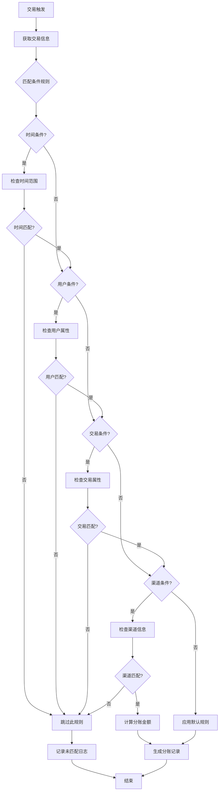
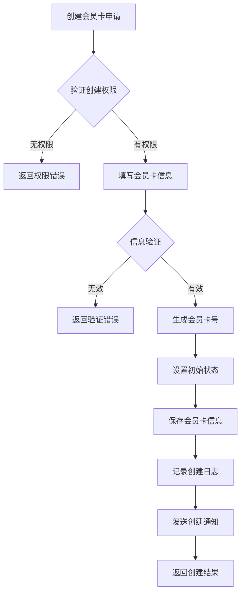
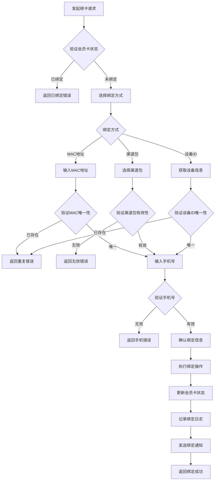
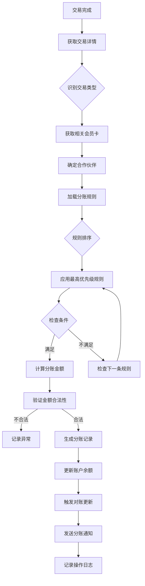
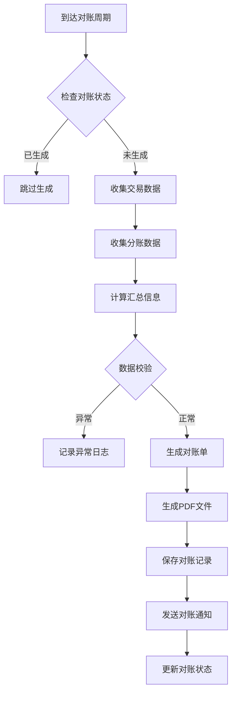
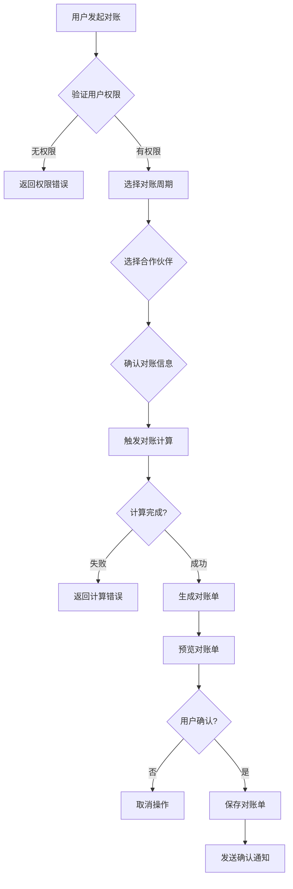
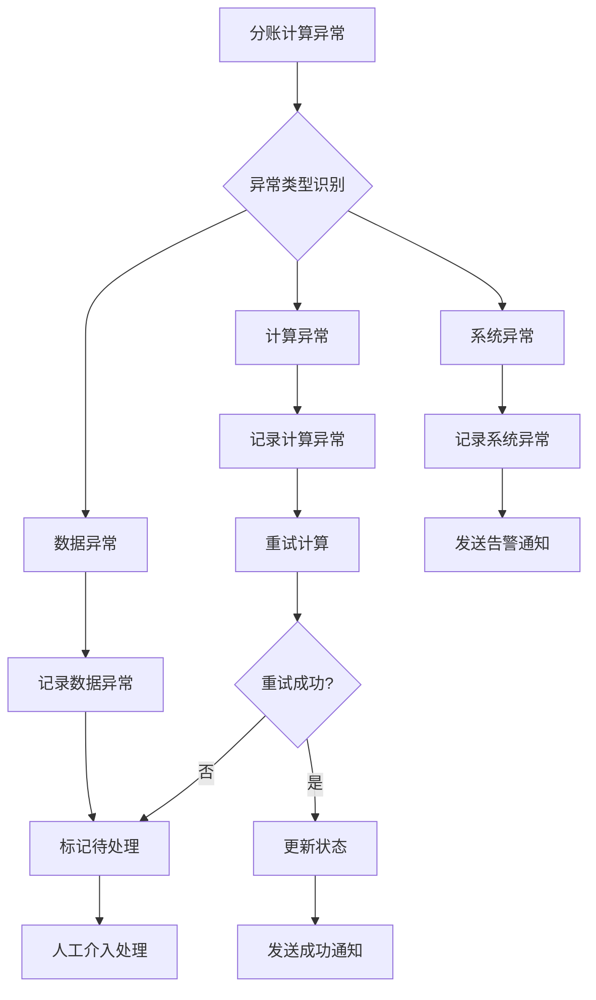

# 三方合作伙伴系统 - 业务流程补充文档

## 📋 文档说明
本文档是对现有PRD的补充，详细描述了系统的核心业务流程、条件式分账规则、异常处理机制等关键业务细节。

---

## 🔄 核心业务流程详解

### 1. 条件式分账业务流程

#### 1.1 条件式分账规则类型
条件式分账是基于特定业务条件进行的分账计算，支持以下条件类型：

**时间条件**
- 工作日/周末分账比例不同
- 节假日特殊分账规则
- 特定时间段优惠分账

**用户条件**
- 新用户首次消费分账
- VIP用户特殊分账比例
- 用户等级分账差异

**交易条件**
- 交易金额区间分账
- 交易频次分账
- 交易类型分账

**渠道条件**
- 不同销售渠道分账差异
- 推广渠道分账奖励
- 直销vs分销分账区别

#### 1.2 条件判断流程图


#### 1.3 条件式分账配置示例
```typescript
// 条件式分账规则配置
interface ConditionalRevenueRule {
  id: string;
  name: string;
  description: string;
  conditions: ConditionGroup[];
  calculations: CalculationRule[];
  priority: number;
  isActive: boolean;
}

// 条件组定义
interface ConditionGroup {
  operator: 'AND' | 'OR';
  conditions: Condition[];
}

// 单个条件定义
interface Condition {
  type: 'time' | 'user' | 'transaction' | 'channel';
  operator: 'equals' | 'not_equals' | 'greater_than' | 'less_than' | 'in' | 'not_in';
  field: string;
  value: any;
}

// 实际配置示例
const weekendPromotionRule: ConditionalRevenueRule = {
  id: "rule_weekend_promotion",
  name: "周末促销活动分账",
  description: "周末消费享受特殊分账比例",
  conditions: [
    {
      operator: 'AND',
      conditions: [
        {
          type: 'time',
          operator: 'in',
          field: 'day_of_week',
          value: [6, 0] // 周六、周日
        },
        {
          type: 'transaction',
          operator: 'greater_than',
          field: 'amount',
          value: 100
        }
      ]
    }
  ],
  calculations: [
    {
      partnerId: 'partner_001',
      percentage: 75, // 周末提升至75%
      minAmount: 0,
      maxAmount: 5000
    }
  ],
  priority: 80,
  isActive: true
};
```

### 2. 会员卡全生命周期业务流程

#### 2.1 会员卡创建流程


#### 2.2 会员卡绑定详细流程


### 3. 分账计算完整流程

#### 3.1 实时分账计算流程


#### 3.2 分账金额计算逻辑
```typescript
// 分账计算引擎
class RevenueCalculationEngine {
  calculateSharing(transaction: Transaction): SharingResult {
    const rules = this.getApplicableRules(transaction);
    const sortedRules = this.sortRulesByPriority(rules);
    
    for (const rule of sortedRules) {
      if (this.evaluateConditions(rule.conditions, transaction)) {
        return this.applyCalculation(rule.calculations, transaction);
      }
    }
    
    return this.applyDefaultCalculation(transaction);
  }

  private evaluateConditions(conditions: ConditionGroup[], transaction: Transaction): boolean {
    return conditions.every(group => 
      group.operator === 'AND' 
        ? group.conditions.every(c => this.evaluateCondition(c, transaction))
        : group.conditions.some(c => this.evaluateCondition(c, transaction))
    );
  }

  private evaluateCondition(condition: Condition, transaction: Transaction): boolean {
    const value = this.getFieldValue(transaction, condition.field);
    
    switch (condition.operator) {
      case 'equals': return value === condition.value;
      case 'not_equals': return value !== condition.value;
      case 'greater_than': return value > condition.value;
      case 'less_than': return value < condition.value;
      case 'in': return condition.value.includes(value);
      case 'not_in': return !condition.value.includes(value);
      default: return false;
    }
  }
}
```

### 4. 对账业务流程

#### 4.1 自动对账生成流程


#### 4.2 手动对账触发流程


### 5. 异常处理与补偿机制

#### 5.1 分账计算异常处理


#### 5.2 补偿机制设计
```typescript
// 分账补偿机制
interface CompensationService {
  // 检测需要补偿的交易
  detectCompensationNeeds(): Promise<CompensationItem[]>;
  
  // 执行补偿计算
  executeCompensation(items: CompensationItem[]): Promise<CompensationResult>;
  
  // 记录补偿日志
  recordCompensationLog(result: CompensationResult): Promise<void>;
}

// 补偿项目定义
interface CompensationItem {
  originalTransactionId: string;
  expectedAmount: number;
  actualAmount: number;
  difference: number;
  compensationReason: string;
  priority: 'HIGH' | 'MEDIUM' | 'LOW';
}
```

### 6. 业务规则引擎

#### 6.1 规则优先级系统
```typescript
// 规则优先级管理
class RulePriorityManager {
  private static readonly PRIORITY_LEVELS = {
    EMERGENCY: 100,    // 紧急规则
    HIGH: 80,         // 高优先级
    NORMAL: 50,       // 普通优先级
    LOW: 20,          // 低优先级
    DEFAULT: 0        // 默认规则
  };

  calculatePriority(rule: RevenueRule): number {
    let priority = rule.basePriority || this.PRIORITY_LEVELS.NORMAL;
    
    // 时间敏感性调整
    if (this.isTimeSensitive(rule)) {
      priority += 10;
    }
    
    // 合作伙伴等级调整
    priority += this.getPartnerLevelBonus(rule.partnerId);
    
    // 交易金额调整
    priority += this.getAmountBonus(rule.minAmount);
    
    return Math.min(priority, this.PRIORITY_LEVELS.EMERGENCY);
  }
}
```

### 7. 业务监控指标

#### 7.1 关键业务指标(KBI)
| 指标名称 | 定义 | 目标值 | 监控频率 |
|---------|------|--------|----------|
| 分账准确率 | 正确分账交易数/总交易数 | ≥99.9% | 实时 |
| 对账及时率 | 按时完成对账周期数/总周期数 | ≥99% | 每日 |
| 绑卡成功率 | 成功绑卡数/总绑卡申请数 | ≥95% | 实时 |
| 异常处理率 | 已处理异常数/总异常数 | ≥98% | 每小时 |
| 业务响应时间 | 业务流程平均完成时间 | ≤5秒 | 实时 |

#### 7.2 业务健康检查
```typescript
// 业务健康检查服务
class BusinessHealthCheck {
  async checkRevenueAccuracy(): Promise<HealthStatus> {
    const stats = await this.calculateRevenueStats();
    return {
      status: stats.accuracy >= 0.999 ? 'HEALTHY' : 'UNHEALTHY',
      metrics: stats,
      recommendations: this.generateRecommendations(stats)
    };
  }

  async checkReconciliationHealth(): Promise<HealthStatus> {
    const overdue = await this.findOverdueReconciliations();
    return {
      status: overdue.length === 0 ? 'HEALTHY' : 'WARNING',
      overdueCount: overdue.length,
      overdueDetails: overdue
    };
  }
}
```

---

## 📊 实施路线图

### Phase 1: 基础业务流程 (1-2周)
- [ ] 实现条件式分账规则引擎
- [ ] 完善会员卡生命周期管理
- [ ] 建立异常处理机制

### Phase 2: 高级业务功能 (2-3周)
- [ ] 实现业务规则优先级系统
- [ ] 增加补偿机制
- [ ] 完善业务监控体系

### Phase 3: 优化与扩展 (1-2周)
- [ ] 性能优化
- [ ] 业务规则可视化配置
- [ ] 高级报表功能

---

## 🔗 相关文档
- [主PRD文档](./prd.md)
- [API接口规范](./api-spec.md)
- [数据模型设计](./data-model.md)
- [测试用例文档](./test-cases.md)

**文档版本**: v1.0  
**最后更新**: 2025-01-05  
**文档作者**: AI助手