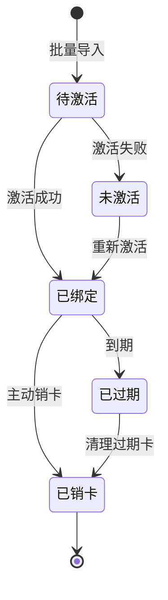
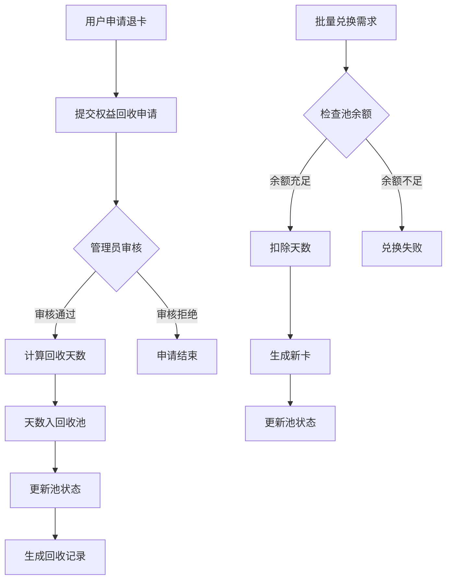
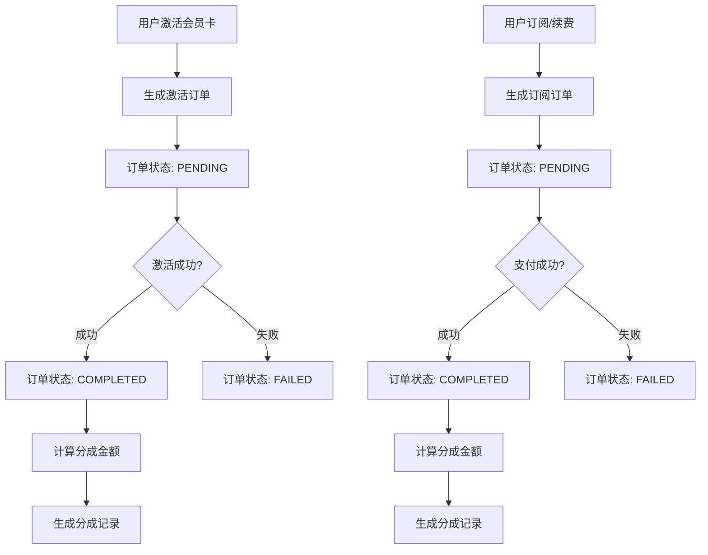
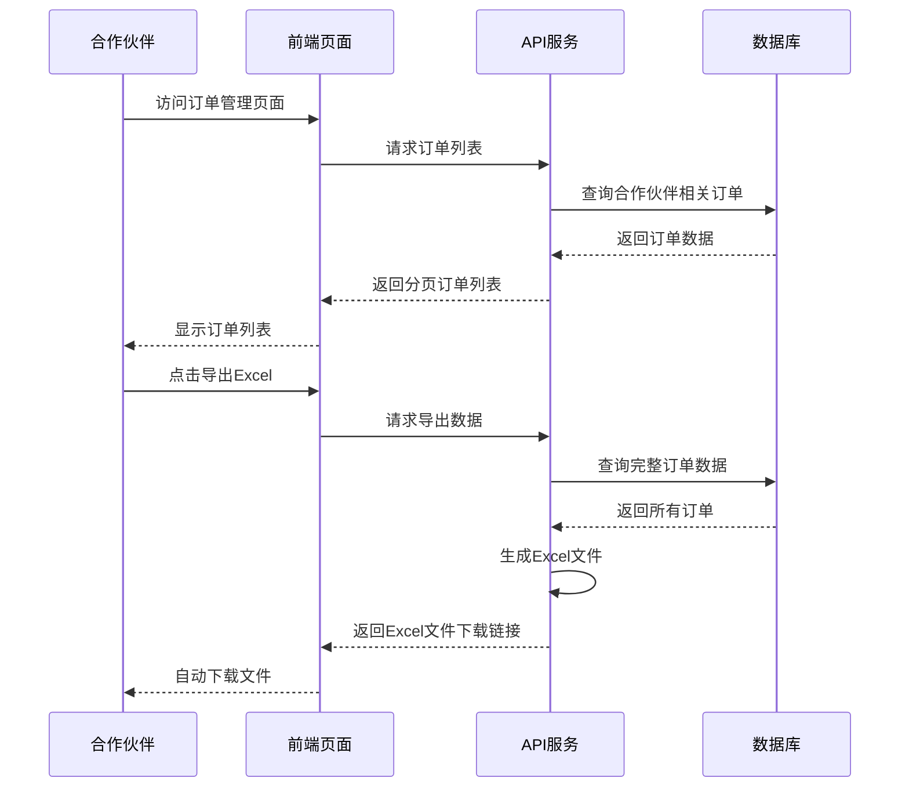
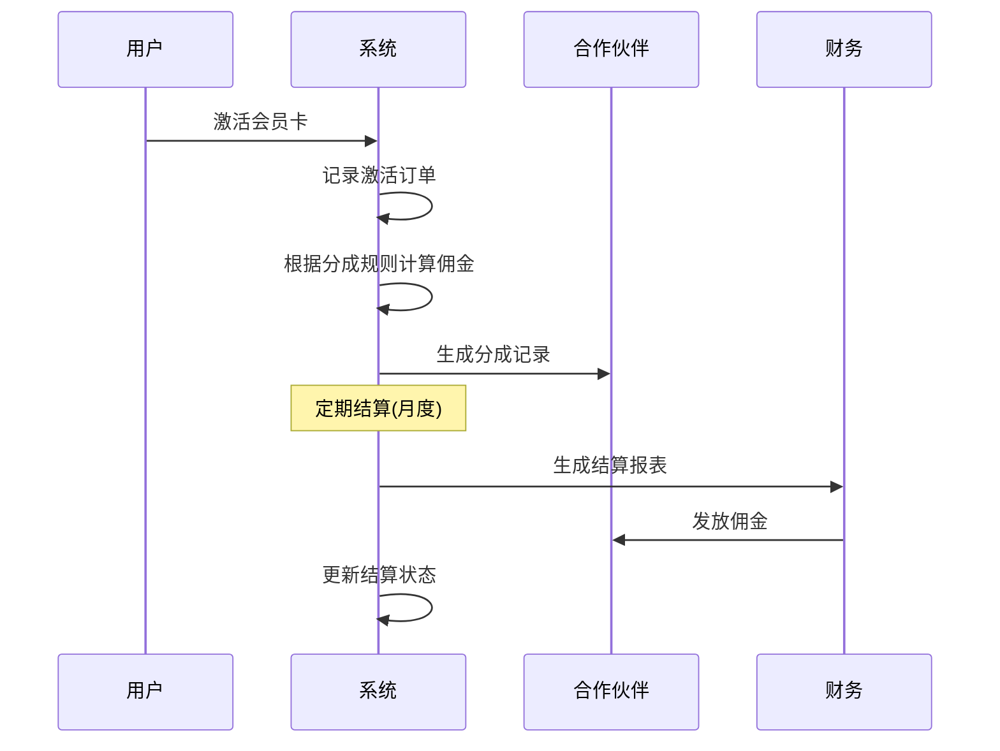

# 业务需求文档

合作伙伴管理系统的完整业务需求和功能设计文档。

## 📋 项目概述

### 项目背景
合作伙伴管理系统旨在为企业提供完整的合作伙伴关系管理解决方案，主要解决以下业务问题：

1. **会员卡管理复杂性**：大量会员卡的导入、激活、状态跟踪
2. **合作伙伴业绩跟踪**：多渠道合作伙伴的业绩统计和分析
3. **订单管理复杂性**：激活订单和订阅订单的统一管理、查询和导出
4. **收益分成管理**：复杂的分成规则和结算流程
5. **权益回收处理**：退卡、换卡等权益回收的统一管理

### 目标用户
- **系统管理员**：拥有完整系统访问权限，负责系统配置和数据管理
- **合作伙伴**：查看自己的业绩数据、会员信息和分成情况
- **普通用户**：基础数据查看权限

## 🎯 核心业务流程

### 会员卡生命周期管理



#### 状态说明
- **待激活 (UNACTIVATED)**：卡片已导入系统，等待用户激活
- **未激活 (INACTIVE)**：激活失败或其他原因导致的未激活状态
- **已绑定 (BOUND)**：卡片已成功激活并绑定到用户
- **已过期 (EXPIRED)**：卡片已达到有效期限
- **已销卡 (CANCELLED)**：卡片已被注销

### 权益回收池业务流程



### 订单管理业务流程



### 订单查询与导出流程





## 🎨 用户界面设计

### 仪表板设计需求

#### 管理员仪表板
- **总览卡片**：总会员数、活跃用户、总收入、月度增长
- **图表展示**：会员增长趋势、收入趋势、合作伙伴业绩排名
- **快捷操作**：批量导入、权益审批、系统配置

#### 合作伙伴仪表板
- **业绩概览**：关联会员数、月度新增、分成收入
- **数据图表**：激活趋势、收入趋势
- **操作功能**：查看详细报表、下载对账单

### 权限控制设计

#### 权限矩阵
| 功能模块 | 管理员 | 合作伙伴 | 普通用户 |
|----------|--------|----------|----------|
| 仪表板查看 | ✅ | ✅ | ✅ |
| 会员卡导入 | ✅ | ❌ | ❌ |
| 会员卡查看 | ✅ | ✅(限自己) | ❌ |
| 合作伙伴管理 | ✅ | ❌ | ❌ |
| 分成管理 | ✅ | ✅(查看) | ❌ |
| 对账管理 | ✅ | ✅(查看) | ❌ |
| 订单查看 | ✅ | ✅(限自己) | ❌ |
| 订单导出 | ✅ | ✅(限自己) | ❌ |
| 订单统计 | ✅ | ✅(限自己) | ❌ |
| 系统设置 | ✅ | ❌ | ❌ |
| 权益审批 | ✅ | ❌ | ❌ |

## 💼 订单管理业务规则

### 订单类型定义

#### 激活订单 (ACTIVATION)
- **触发条件**：用户成功激活会员卡
- **订单金额**：会员卡面值或实际支付金额
- **分成计算**：按照合作伙伴的激活分成比例计算
- **结算时机**：激活成功后即时生成

#### 订阅订单 (SUBSCRIPTION)
- **触发条件**：用户购买订阅服务或续费
- **订单金额**：订阅服务的实际支付金额
- **分成计算**：按照合作伙伴的订阅分成比例计算
- **结算时机**：支付成功后即时生成

### 订单状态管理

```typescript
interface OrderStateTransition {
  // 状态转换规则
  transitions: {
    PENDING: ['PROCESSING', 'CANCELLED']
    PROCESSING: ['COMPLETED', 'FAILED']
    COMPLETED: ['REFUNDED']  // 仅特殊情况
    FAILED: ['PENDING']      // 可重试
    CANCELLED: []            // 终态
    REFUNDED: []             // 终态
  }
  
  // 状态转换条件
  conditions: {
    toPROCESSING: '已验证订单信息'
    toCOMPLETED: '交易成功且服务已激活'
    toFAILED: '交易失败或服务激活失败'
    toCANCELLED: '用户取消或超时取消'
    toREFUNDED: '管理员审批通过的退款申请'
  }
}
```

### 订单查询规则

#### 数据权限控制
```typescript
interface OrderQueryPermissions {
  admin: {
    scope: 'all'           // 可查看所有订单
    filters: ['partnerId', 'orderType', 'status', 'dateRange']
  }
  partner: {
    scope: 'own'           // 仅可查看自己相关订单
    filters: ['orderType', 'status', 'dateRange']
    autoFilter: 'partnerId = currentUser.partnerId'
  }
  user: {
    scope: 'none'          // 无查询权限
  }
}
```

#### 查询性能优化
- **分页限制**：单次最多返回100条记录
- **索引优化**：partnerId + createdAt 复合索引
- **缓存策略**：热点数据5分钟缓存
- **异步导出**：大数据量导出使用异步处理

### Excel导出业务规则

#### 导出数据结构
```typescript
interface ExportOrderData {
  // 基本信息
  orderNumber: string       // 订单编号
  orderType: string        // 订单类型
  partnerName: string      // 合作伙伴名称
  cardNumber?: string      // 会员卡号(激活订单)
  phone?: string          // 用户手机号
  
  // 金额信息
  orderAmount: number      // 订单金额
  commissionRate: string   // 分成比例(百分比)
  commissionAmount: number // 分成金额
  actualAmount: number     // 实际到账金额
  fees: string            // 费用明细
  
  // 时间信息
  orderDate: string       // 订单创建时间
  completedDate?: string  // 订单完成时间
  settlementDate?: string // 结算时间
  
  // 状态信息
  status: string          // 订单状态
  statusDesc: string      // 状态描述
}
```

#### 导出限制规则
- **数据范围**：最多导出近12个月的订单数据
- **文件大小**：单个文件最多50MB，超过则分批导出
- **导出频率**：每个用户每小时最多可导出5次
- **文件保留**：导出文件保留30天，超过自动清理

#### 导出文件格式
```typescript
interface ExportFileFormat {
  filename: string         // 文件名格式: 订单导出_合作伙伴名_YYYYMMDD_HHMMSS.xlsx
  sheets: {
    summary: '订单汇总'  // 第一个工作表：统计信息
    details: '订单明细'  // 第二个工作表：详细数据
  }
  encoding: 'UTF-8'        // 编码格式
  dateFormat: 'YYYY-MM-DD HH:mm:ss' // 日期格式
}
```

### 卡类型定义

#### 普通卡 (NORMAL)
- **激活要求**：卡密 + 手机号
- **使用场景**：基础会员权益
- **有效期**：通常365天

#### 绑定卡 (BINDING)
- **激活要求**：卡密 + 手机号 + MAC地址 + 渠道包
- **使用场景**：设备绑定会员权益
- **有效期**：通常365天
- **特殊规则**：一卡一设备，不可转移

### 激活业务规则

```typescript
// 激活验证逻辑
interface ActivationRules {
  // 基础验证
  cardNumber: string    // 必须存在且未激活
  cardSecret: string    // 必须匹配
  phone: string         // 手机号格式验证
  
  // 绑定卡额外验证
  macAddress?: string   // MAC地址格式验证
  channelPackage?: string // 渠道包验证
  
  // 业务规则
  isCardValid: boolean     // 卡片未过期
  isPhoneUnique: boolean   // 手机号唯一性(可配置)
  isDeviceUnique: boolean  // 设备唯一性(绑定卡)
}
```

### 导入业务规则

#### 权限控制
- **仅管理员可导入**：`cards:import` 权限控制
- **批量导入限制**：单次最多1000张卡
- **重复检查**：卡号唯一性验证

#### 数据验证
```typescript
interface ImportValidation {
  cardNumber: {
    required: true
    unique: true
    format: /^\d{10,16}$/
  }
  cardSecret: {
    required: true
    minLength: 6
    maxLength: 20
  }
  cardType: {
    required: true
    enum: ['NORMAL', 'BINDING']
  }
  validityPeriod: {
    required: true
    min: 1
    max: 3650 // 最长10年
  }
}
```

## 🏢 合作伙伴业务规则

### 合作伙伴分类
- **直接合作伙伴**：直接与平台签约的一级合作伙伴
- **间接合作伙伴**：通过一级合作伙伴引入的二级合作伙伴
- **特殊合作伙伴**：享有特殊分成政策的合作伙伴

### 业绩计算规则

#### 关联关系确定
1. **激活时关联**：用户激活时指定合作伙伴
2. **渠道码关联**：通过渠道码自动识别
3. **设备信息关联**：通过设备MAC地址关联

#### 分成计算公式
```typescript
interface RevenueSharingRules {
  // 基础分成
  baseRate: number        // 基础分成比例(0-1)
  
  // 阶梯分成
  tierRates: Array<{
    minCount: number      // 最小激活数量
    rate: number         // 分成比例
  }>
  
  // 特殊规则
  bonusRules: Array<{
    condition: string    // 奖励条件
    bonusRate: number   // 额外奖励比例
  }>
}

// 计算示例
function calculateSharing(activationCount: number, baseAmount: number): number {
  const tier = findApplicableTier(activationCount)
  const baseSharing = baseAmount * tier.rate
  const bonus = calculateBonus(activationCount, baseAmount)
  return baseSharing + bonus
}
```

## 🔄 权益回收池业务规则

### 回收池设计原理
- **统一管理**：所有退卡、换卡的天数统一入池
- **灵活使用**：支持批量兑换时从池中扣除天数
- **余额控制**：防止超额使用，确保权益平衡

### 入池规则

#### 权益回收审批
```typescript
interface RecoveryApproval {
  // 申请信息
  redemptionRequestId: string
  cardId: string
  applicantId: string
  reason: string
  
  // 计算天数
  remainingDays: number      // 剩余有效天数
  deductionRatio: number     // 扣减比例(0-1)
  finalDays: number          // 最终入池天数
  
  // 审批信息
  operatorId: string         // 审批人
  approvalDate: Date
  remarks: string           // 审批备注
}
```

#### 批量处理规则
- **批量审批**：管理员可一键审批多个申请
- **自动入池**：审批通过后自动计算天数并入池
- **记录追溯**：完整的操作记录和审计日志

### 出池规则

#### 批量兑换验证
```typescript
interface BatchExchangeValidation {
  // 兑换请求
  requestedCards: number     // 请求兑换卡数
  daysPerCard: number       // 每张卡所需天数
  totalRequiredDays: number // 总需天数
  
  // 池状态检查
  availableDays: number     // 可用天数
  isBalanceSufficient: boolean // 余额是否充足
  
  // 业务规则
  maxCardsPerBatch: number  // 单次最大兑换数
  operatorPermission: boolean // 操作员权限
}
```

## 📊 报表系统业务需求

### 报表类型

#### 业绩报表
- **合作伙伴业绩汇总**：激活数量、收入金额、分成金额
- **时间维度分析**：日报、周报、月报、年报
- **趋势分析**：同比、环比增长分析

#### 会员报表
- **会员增长报表**：新增会员、活跃会员、流失会员
- **激活分析报表**：激活成功率、失败原因分析
- **生命周期报表**：会员状态分布、转化漏斗

#### 财务报表
- **分成结算报表**：待结算、已结算、结算明细
- **对账报表**：收入核对、分成核对、差异分析
- **权益回收报表**：回收统计、池使用情况

### 报表权限控制
```typescript
interface ReportPermissions {
  admin: {
    view: ['all_reports']        // 查看所有报表
    export: ['all_formats']      // 导出所有格式
    schedule: true               // 定时报表
  }
  partner: {
    view: ['own_performance', 'own_members'] // 仅查看自己的
    export: ['excel', 'pdf']     // 限定导出格式
    schedule: false              // 不可定时
  }
  user: {
    view: ['summary_only']       // 仅汇总数据
    export: false                // 不可导出
    schedule: false              // 不可定时
  }
}
```

## 🔔 通知系统业务需求

### 通知类型

#### 系统通知
- **权益审批结果**：审批通过/拒绝通知
- **批量操作完成**：导入完成、兑换完成通知
- **系统异常**：API错误、数据异常通知

#### 业务提醒
- **回收池余额不足**：低于阈值时提醒
- **分成结算提醒**：月度结算时间提醒
- **会员卡即将过期**：到期前提醒

#### 用户消息
- **激活成功通知**：会员卡激活成功
- **权益变更通知**：积分、余额变更
- **活动推送**：营销活动通知

### 通知渠道
```typescript
interface NotificationChannels {
  inApp: {
    realtime: boolean      // 实时推送
    persistence: boolean   // 消息持久化
    badge: boolean        // 消息角标
  }
  email: {
    templates: string[]   // 邮件模板
    frequency: 'immediate' | 'daily' | 'weekly'
  }
  sms: {
    urgent: boolean       // 紧急短信
    businessHours: boolean // 工作时间限制
  }
  webhook: {
    urls: string[]        // 回调地址
    retry: number         // 重试次数
  }
}
```

## 🔍 数据分析需求

### 关键指标(KPI)

#### 业务指标
- **会员激活率**：激活成功数 / 导入总数
- **合作伙伴活跃度**：有激活行为的合作伙伴比例
- **权益回收率**：回收申请数 / 激活总数
- **分成及时率**：按时结算的分成比例

#### 技术指标
- **系统响应时间**：API平均响应时间
- **错误率**：接口错误请求比例
- **数据准确性**：数据校验通过率

### 分析维度
```typescript
interface AnalyticsDimensions {
  time: {
    granularity: 'hour' | 'day' | 'week' | 'month' | 'quarter' | 'year'
    comparison: 'previous_period' | 'same_period_last_year'
  }
  
  business: {
    partner: string       // 合作伙伴维度
    cardType: string     // 卡类型维度
    region: string       // 地区维度
    channel: string      // 渠道维度
  }
  
  user: {
    role: 'admin' | 'partner' | 'user'
    behavior: 'activation' | 'redemption' | 'sharing'
  }
}
```

## 📋 数据质量要求

### 数据完整性
- **必填字段验证**：关键业务字段不可为空
- **关联关系检查**：外键约束和引用完整性
- **业务逻辑验证**：状态转换的合理性检查

### 数据准确性
- **格式验证**：手机号、邮箱、MAC地址等格式
- **范围验证**：数值范围、日期范围的合理性
- **业务规则验证**：分成比例、天数计算的准确性

### 数据安全性
- **敏感信息加密**：卡密、手机号等敏感数据
- **访问权限控制**：基于角色的数据访问限制
- **操作审计**：所有数据变更的完整记录

## 🚀 系统性能要求

### 响应时间要求
- **页面加载**：首屏加载时间 < 2秒
- **API响应**：查询接口 < 500ms，更新接口 < 1秒
- **报表生成**：简单报表 < 5秒，复杂报表 < 30秒

### 并发处理能力
- **用户并发**：支持100+用户同时在线
- **API并发**：支持1000+ QPS
- **批量处理**：单次处理10000+记录

### 数据存储要求
- **数据量**：支持千万级会员卡数据
- **备份策略**：每日全量备份，实时增量备份
- **恢复时间**：RTO < 4小时，RPO < 1小时

---

**业务分析师**: Damingdong  
**文档版本**: v1.0  
**最后更新**: 2024-09-16