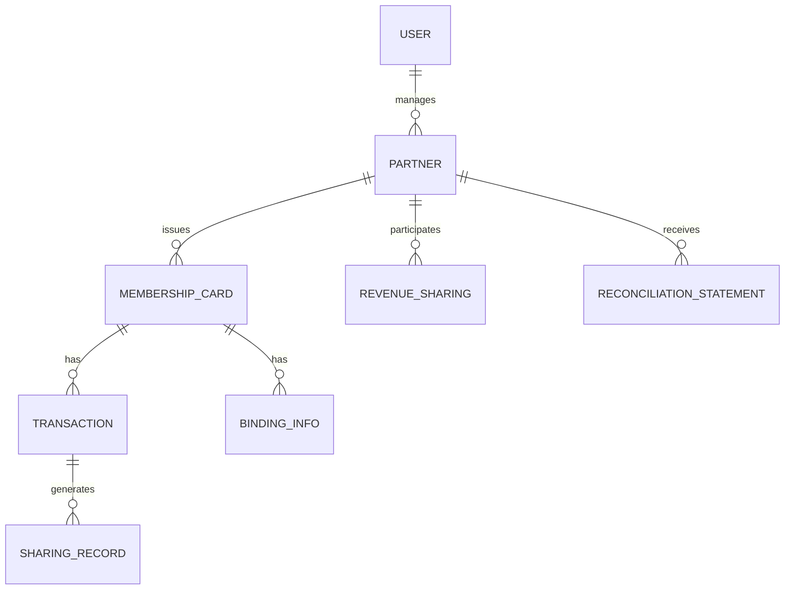

# 三方合作伙伴系统产品需求文档 (PRD) - 更新版

## 1. 项目概述

### 1.1 基本信息
- **项目名称**: partner_system (三方合作伙伴管理系统)
- **技术栈**: React + TypeScript + Vite + Tailwind CSS + Shadcn/ui
- **架构模式**: 单页应用(SPA) + 服务端API
- **部署环境**: 支持本地开发、测试和生产环境

### 1.2 产品定位
构建一个综合性的三方合作伙伴管理平台，实现会员卡管理、分账系统和对账系统的数字化、自动化和智能化管理。

## 2. 核心功能模块

### 2.1 系统架构概览

```
┌─────────────────────────────────────────┐
│           Frontend (React SPA)           │
├─────────────────┬───────────────────────┤
│   Dashboard     │   Cards Management    │
│   Partners      │   Revenue Sharing     │
│   Reconciliation│   User Management     │
└─────────────────┴───────────────────────┘
┌─────────────────────────────────────────┐
│            API Services                  │
├─────────────────┬───────────────────────┤
│ PartnerService  │   CardService         │
│ SharingService  │   ReconciliationSvc   │
│   AuthService   │   UserService         │
└─────────────────┴───────────────────────┘
┌─────────────────────────────────────────┐
│              Data Layer                  │
├─────────────────┬───────────────────────┤
│  LocalStorage   │   Session Storage     │
│  React Query    │   Type Definitions    │
└─────────────────┴───────────────────────┘
```

### 2.2 用户角色与权限系统

#### 2.2.1 用户角色定义
- **ADMIN (管理员)**: 系统超级管理员，拥有所有权限
- **PARTNER (合作伙伴)**: 业务合作伙伴，管理自己的会员卡和分账
- **OPERATOR (操作员)**: 系统操作员，负责日常运营和维护

#### 2.2.2 权限矩阵
| 功能模块 | ADMIN | PARTNER | OPERATOR |
|----------|-------|---------|----------|
| 查看仪表板 | ✓ | ✓ | ✓ |
| 管理合作伙伴 | ✓ | ✗ | ✓ |
| 会员卡管理 | ✓ | ✓(仅限自己) | ✓ |
| 分账管理 | ✓ | ✓(仅限自己) | ✓ |
| 对账管理 | ✓ | ✓(仅限自己) | ✓ |
| 用户管理 | ✓ | ✗ | ✗ |

### 2.3 会员卡管理系统

#### 2.3.1 会员卡类型与状态
**会员卡类型**:
- REGULAR: 普通会员卡
- BOUND: 绑定会员卡

**会员卡状态**:
- ACTIVE: 激活状态
- INACTIVE: 未激活状态
- EXPIRED: 已过期
- BOUND: 已绑定状态

#### 2.3.2 会员卡管理功能
- **会员卡列表**: 展示所有会员卡信息，支持搜索和筛选
- **会员卡详情**: 查看单张会员卡的详细信息
- **会员卡状态管理**: 激活、禁用、绑定等操作
- **批量操作**: 支持批量导入、导出会员卡
- **使用统计**: 实时显示会员卡使用情况和剩余次数

#### 2.3.3 绑定管理功能
**绑定类型**:
- MAC_ADDRESS: MAC地址绑定
- CHANNEL_PACKAGE: 渠道包绑定

**绑定信息**:
- 设备MAC地址
- 渠道包标识
- 绑定手机号
- 设备信息(名称、型号、系统版本)

### 2.4 分账管理系统

#### 2.4.1 分账规则引擎
**分账规则类型**:
- 固定比例分账
- 阶梯式分账
  阶梯式分账示例：
  - 0-1000元：合作伙伴获得70%
  - 1001-5000元：合作伙伴获得75%
  - 5000元以上：合作伙伴获得80%
- 条件式分账

**分账规则配置**:
- 合作伙伴ID
- 分账比例
- 生效时间范围
- 优先级设置
- 激活状态

#### 2.4.2 分账处理流程
1. **交易触发**: 会员卡消费时触发分账计算
2. **规则匹配**: 根据交易信息匹配对应的分账规则
3. **金额计算**: 按照规则计算各参与方的分账金额
4. **记录生成**: 生成分账记录并更新相关账户
5. **状态更新**: 实时更新分账状态和账户余额

#### 2.4.3 分账统计与分析
- **总收入统计**: 显示所有分账的总金额
- **分账明细**: 展示每笔分账的详细信息
- **趋势分析**: 提供分账金额的时间趋势图表
- **合作伙伴分析**: 按合作伙伴统计分账情况

### 2.5 对账管理系统

#### 2.5.1 对账周期与类型
**对账周期**:
- 日对账: 每日生成对账单
- 周对账: 每周生成对账单
- 月对账: 每月生成对账单

**对账类型**:
- 自动对账: 系统自动生成的对账单
- 手动对账: 人工触发的对账单

#### 2.5.2 对账单内容
**基本信息**:
- 对账单编号
- 合作伙伴信息
- 对账周期
- 生成时间

**交易明细**:
- 交易时间
- 交易类型
- 交易金额
- 分账金额
- 交易状态

**汇总信息**:
- 总交易笔数
- 总交易金额
- 总分账金额
- 期初余额
- 期末余额

#### 2.5.3 对账操作功能
- **生成对账单**: 手动或自动触发对账单生成
- **预览对账单**: 在线预览对账单内容
- **下载对账单**: 支持PDF格式下载
- **标记已对账**: 标记对账单为已核对状态

## 3. 技术实现细节

### 3.1 前端技术架构

#### 3.1.1 项目结构
```
src/
├── components/          # 通用组件
│   ├── ui/             # Shadcn/ui组件
│   └── layout/         # 布局组件
├── pages/              # 页面组件
│   ├── Dashboard.tsx   # 仪表板页面
│   ├── Cards.tsx       # 会员卡管理
│   ├── Partners.tsx    # 合作伙伴管理
│   ├── RevenueSharing.tsx # 分账管理
│   └── Reconciliation.tsx # 对账管理
├── services/           # API服务层
│   ├── PartnerService.ts
│   ├── CardService.ts
│   ├── SharingService.ts
│   └── ReconciliationService.ts
├── store/              # 状态管理
│   └── authStore.ts    # 用户认证状态
├── types/              # 类型定义
│   └── index.ts        # 所有TypeScript类型
├── hooks/              # 自定义Hook
└── lib/                # 工具函数和配置
```

#### 3.1.2 关键技术栈
- **React 18**: 使用最新的React特性
- **TypeScript**: 类型安全的JavaScript
- **Vite**: 快速的构建工具
- **Tailwind CSS**: 实用优先的CSS框架
- **Shadcn/ui**: 现代化的React组件库
- **React Query**: 数据获取和缓存管理
- **React Hook Form**: 表单处理
- **Recharts**: 数据可视化图表
- **Lucide React**: 图标库

### 3.2 数据模型设计

#### 3.2.1 核心实体关系


#### 3.2.2 数据模型定义
**用户模型**:
```typescript
interface User {
  id: string;
  username: string;
  email: string;
  phone: string;
  name: string;
  role: UserRole;
  partnerId?: string;
  createdAt: string;
  updatedAt: string;
}
```

**合作伙伴模型**:
```typescript
interface Partner {
  id: string;
  name: string;
  type: PartnerType;
  parentId?: string;
  level: number;
  commissionRate: number;
  status: PartnerStatus;
  contactInfo: ContactInfo;
  createdAt: string;
  updatedAt: string;
}
```

**会员卡模型**:
```typescript
interface MembershipCard {
  id: string;
  cardNumber: string;
  cardType: CardType;
  partnerId: string;
  remainingAmount: number;
  totalAmount: number;
  status: CardStatus;
  bindingInfo?: BindingInfo;
  createdAt: string;
  updatedAt: string;
}
```

### 3.3 API接口设计

#### 3.3.1 RESTful API规范
**基础URL**: `/api/v1`

**合作伙伴管理**:
- `GET /partners` - 获取合作伙伴列表
- `GET /partners/:id` - 获取单个合作伙伴详情
- `POST /partners` - 创建新合作伙伴
- `PUT /partners/:id` - 更新合作伙伴信息
- `DELETE /partners/:id` - 删除合作伙伴

**会员卡管理**:
- `GET /cards` - 获取会员卡列表
- `GET /cards/:id` - 获取会员卡详情
- `POST /cards` - 创建新会员卡
- `PUT /cards/:id` - 更新会员卡信息
- `POST /cards/:id/bind` - 绑定会员卡
- `POST /cards/:id/unbind` - 解绑会员卡

**分账管理**:
- `GET /sharing-records` - 获取分账记录
- `GET /sharing-rules` - 获取分账规则
- `POST /sharing-rules` - 创建分账规则
- `GET /revenue-summary` - 获取收入汇总

**对账管理**:
- `GET /reconciliation-statements` - 获取对账单列表
- `POST /reconciliation-statements` - 生成对账单
- `GET /reconciliation-statements/:id/download` - 下载对账单

### 3.4 状态管理策略

#### 3.4.1 全局状态管理
使用Zustand进行全局状态管理:
- **用户认证状态**: 登录用户信息、权限等
- **应用配置**: 主题、语言等设置

#### 3.4.2 本地状态管理
- **页面级状态**: 使用React的useState和useReducer
- **表单状态**: 使用React Hook Form
- **服务端状态**: 使用React Query进行数据获取和缓存

## 4. 用户界面设计

### 4.1 设计系统
基于Shadcn/ui设计系统，包含:
- **颜色系统**: 主色、辅助色、状态色
- **字体系统**: 标题、正文、辅助文字
- **间距系统**: 8px网格系统
- **组件库**: 按钮、表单、表格、卡片等

### 4.2 响应式设计
- **桌面端**: 1920px及以上分辨率
- **平板端**: 768px - 1919px分辨率
- **手机端**: 320px - 767px分辨率

### 4.3 核心页面设计

#### 4.3.1 仪表板页面
**功能布局**:
- 顶部统计卡片 (总会员卡数、活跃卡数、总收入等)
- 中间图表区域 (收入趋势图、使用分布图)
- 底部最近交易记录

#### 4.3.2 会员卡管理页面
**功能布局**:
- 顶部搜索和筛选区域
- 中部会员卡表格
- 右侧操作面板
- 底部分页控件

#### 4.3.3 分账管理页面
**功能布局**:
- 左侧分账概览卡片
- 右侧分账明细表格
- 底部分账规则配置区域

#### 4.3.4 对账管理页面
**功能布局**:
- 顶部时间选择器
- 中部对账单列表
- 右侧操作按钮区域

## 5. 性能与质量要求

### 5.1 性能指标
- **页面加载时间**: ≤ 3秒
- **API响应时间**: ≤ 2秒
- **并发用户数**: ≥ 1000
- **系统可用性**: ≥ 99.9%

### 5.2 质量要求
- **代码覆盖率**: ≥ 80%
- **缺陷密度**: ≤ 0.5个/千行代码
- **安全漏洞**: 零容忍
- **用户体验评分**: ≥ 4.5/5.0

### 5.3 兼容性要求
- **浏览器支持**: Chrome 90+, Firefox 88+, Safari 14+, Edge 90+
- **移动端支持**: iOS 14+, Android 10+
- **分辨率支持**: 320px - 2560px

## 6. 安全与合规

### 6.1 数据安全
- **数据加密**: 敏感数据AES-256加密存储
- **传输安全**: HTTPS/TLS 1.3加密传输
- **访问控制**: 基于角色的权限控制(RBAC)
- **审计日志**: 完整的操作审计追踪

### 6.2 合规要求
- **数据保护**: 符合GDPR、CCPA等数据保护法规
- **财务合规**: 符合会计准则和税务要求
- **行业标准**: 符合金融、支付行业标准

## 7. 部署与运维

### 7.1 部署架构
- **开发环境**: 本地开发服务器
- **测试环境**: 云服务器部署
- **生产环境**: 高可用云部署

### 7.2 监控与告警
- **应用监控**: 使用Sentry进行错误监控
- **性能监控**: 使用Web Vitals监控性能指标
- **用户行为**: 使用Google Analytics追踪用户行为

### 7.3 备份与恢复
- **数据备份**: 每日自动备份
- **灾难恢复**: RTO ≤ 1小时, RPO ≤ 15分钟

## 8. 后续迭代计划

### 8.1 第一阶段 (MVP)
- 基础会员卡管理
- 简单分账功能
- 月度对账单

### 8.2 第二阶段
- 高级分账规则
- 实时对账
- 移动端优化

### 8.3 第三阶段
- 数据分析与报表
- 第三方系统集成
- 多语言支持

## 9. 风险评估与应对

### 9.1 技术风险
- **性能瓶颈**: 使用缓存和CDN优化
- **兼容性问题**: 充分的浏览器兼容性测试
- **安全漏洞**: 定期安全审计和渗透测试

### 9.2 业务风险
- **需求变更**: 采用敏捷开发，快速迭代
- **用户接受度**: 提供充分的用户培训和支持
- **合规风险**: 提前进行合规性评估

## 10. 项目里程碑

| 阶段 | 时间 | 主要交付物 |
|------|------|-----------|
| 需求确认 | 第1周 | 完整PRD文档 |
| 设计阶段 | 第2-3周 | UI设计稿、技术方案 |
| 开发阶段 | 第4-8周 | 核心功能开发 |
| 测试阶段 | 第9-10周 | 测试报告、缺陷修复 |
| 上线阶段 | 第11周 | 生产环境部署 |
| 运维阶段 | 第12周起 | 监控报告、优化迭代 |

---

**文档版本**: v2.0  
**最后更新**: 2025-01-05  
**文档作者**: AI助手  
**审核状态**: 待确认