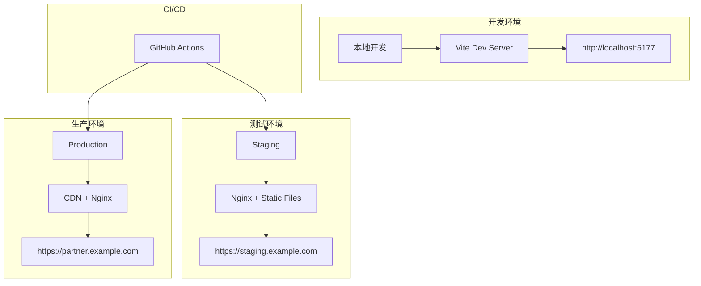

# 部署指南

合作伙伴管理系统的完整部署指南，包含本地开发、测试环境和生产环境的部署方案。

## 🎯 部署概览

### 部署架构


### 环境对比
| 环境 | 用途 | 域名 | 数据源 | 监控 |
|------|------|------|--------|------|
| Development | 本地开发 | localhost:5177 | Mock数据 | 开发工具 |
| Staging | 测试验证 | staging.example.com | 测试API | 基础监控 |
| Production | 生产服务 | partner.example.com | 生产API | 完整监控 |

## 🛠️ 本地开发环境

### 环境要求
```bash
# 必需软件版本
Node.js >= 18.0.0
pnpm >= 8.10.0
Git >= 2.30.0

# 推荐开发工具
VS Code + 扩展：
  - TypeScript and JavaScript Language Features
  - Tailwind CSS IntelliSense
  - ES7+ React/Redux/React-Native snippets
  - Prettier - Code formatter
  - ESLint
```

### 快速启动
```bash
# 1. 克隆项目
git clone https://github.com/DamingDong/partner_system.git
cd partner_system

# 2. 安装依赖
pnpm install

# 3. 配置环境变量
cp .env.example .env.local
# 编辑 .env.local 文件

# 4. 启动开发服务器
pnpm dev

# 5. 访问应用
# 浏览器打开: http://localhost:5177/
```

### 环境变量配置
```bash
# .env.local (本地开发)
VITE_API_BASE_URL=http://localhost:3000/api
VITE_USE_MOCK_DATA=true
VITE_DEBUG_MODE=true
VITE_LOG_LEVEL=debug

# Mock数据配置
VITE_MOCK_DELAY=500
VITE_MOCK_ERROR_RATE=0.1
```

### 开发工具配置
```json
// .vscode/settings.json
{
  "typescript.preferences.importModuleSpecifier": "relative",
  "editor.defaultFormatter": "esbenp.prettier-vscode",
  "editor.formatOnSave": true,
  "editor.codeActionsOnSave": {
    "source.fixAll.eslint": true
  },
  "tailwindCSS.experimental.classRegex": [
    ["cn\\(([^)]*)\\)", "'([^']*)'"]
  ]
}
```

## 🔨 构建流程

### 开发构建
```bash
# 开发模式 - 热重载
pnpm dev

# 类型检查
pnpm type-check

# 代码检查
pnpm lint

# 自动修复
pnpm lint:fix

# 运行测试
pnpm test

# 测试覆盖率
pnpm test:coverage
```

### 生产构建
```bash
# 构建生产版本
pnpm build

# 预览构建结果
pnpm preview

# 分析构建包大小
pnpm build:analyze

# 构建输出目录结构
dist/
├── assets/
│   ├── index-[hash].js
│   ├── vendor-[hash].js
│   └── style-[hash].css
├── index.html
└── robots.txt
```

### 构建优化配置
```typescript
// vite.config.ts
export default defineConfig({
  build: {
    target: 'es2015',
    outDir: 'dist',
    sourcemap: process.env.NODE_ENV !== 'production',
    
    rollupOptions: {
      output: {
        manualChunks: {
          'vendor-react': ['react', 'react-dom', 'react-router-dom'],
          'vendor-ui': ['@radix-ui/react-dialog', '@radix-ui/react-button'],
          'vendor-utils': ['axios', 'date-fns', 'clsx', 'zustand'],
          'vendor-charts': ['recharts']
        }
      }
    },
    
    terserOptions: {
      compress: {
        drop_console: process.env.NODE_ENV === 'production',
        drop_debugger: true
      }
    }
  }
})
```

## 🌐 静态部署

### Nginx配置
```nginx
# /etc/nginx/sites-available/partner-system
server {
    listen 80;
    server_name partner.example.com;
    
    # 重定向到HTTPS
    return 301 https://$server_name$request_uri;
}

server {
    listen 443 ssl http2;
    server_name partner.example.com;
    
    # SSL配置
    ssl_certificate /path/to/ssl/cert.pem;
    ssl_certificate_key /path/to/ssl/private.key;
    ssl_protocols TLSv1.2 TLSv1.3;
    ssl_ciphers ECDHE-RSA-AES256-GCM-SHA512:DHE-RSA-AES256-GCM-SHA512;
    
    # 网站根目录
    root /var/www/partner-system/dist;
    index index.html;
    
    # Gzip压缩
    gzip on;
    gzip_vary on;
    gzip_min_length 1024;
    gzip_types
        text/plain
        text/css
        text/xml
        text/javascript
        application/javascript
        application/xml+rss
        application/json;
    
    # 静态资源缓存
    location ~* \.(js|css|png|jpg|jpeg|gif|ico|svg|woff|woff2|ttf|eot)$ {
        expires 1y;
        add_header Cache-Control "public, immutable";
        access_log off;
    }
    
    # HTML文件不缓存
    location ~* \.(html)$ {
        expires -1;
        add_header Cache-Control "no-store, no-cache, must-revalidate";
    }
    
    # SPA路由支持
    location / {
        try_files $uri $uri/ /index.html;
    }
    
    # API代理 (如果需要)
    location /api/ {
        proxy_pass http://backend-server:3000/api/;
        proxy_set_header Host $host;
        proxy_set_header X-Real-IP $remote_addr;
        proxy_set_header X-Forwarded-For $proxy_add_x_forwarded_for;
        proxy_set_header X-Forwarded-Proto $scheme;
    }
    
    # 安全头
    add_header X-Frame-Options "SAMEORIGIN" always;
    add_header X-Content-Type-Options "nosniff" always;
    add_header X-XSS-Protection "1; mode=block" always;
    add_header Referrer-Policy "strict-origin-when-cross-origin" always;
    add_header Content-Security-Policy "default-src 'self'; script-src 'self' 'unsafe-inline'; style-src 'self' 'unsafe-inline'; img-src 'self' data: https:; font-src 'self'; connect-src 'self' https://api.example.com;" always;
}
```

### Apache配置
```apache
# .htaccess
<IfModule mod_rewrite.c>
    RewriteEngine On
    
    # Handle Angular/React Router
    RewriteBase /
    RewriteRule ^index\.html$ - [L]
    RewriteCond %{REQUEST_FILENAME} !-f
    RewriteCond %{REQUEST_FILENAME} !-d
    RewriteRule . /index.html [L]
</IfModule>

# 缓存配置
<IfModule mod_expires.c>
    ExpiresActive on
    
    # 静态资源缓存1年
    ExpiresByType text/css "access plus 1 year"
    ExpiresByType application/javascript "access plus 1 year"
    ExpiresByType image/png "access plus 1 year"
    ExpiresByType image/jpg "access plus 1 year"
    ExpiresByType image/jpeg "access plus 1 year"
    ExpiresByType image/gif "access plus 1 year"
    ExpiresByType image/svg+xml "access plus 1 year"
    
    # HTML不缓存
    ExpiresByType text/html "access plus 0 seconds"
</IfModule>

# Gzip压缩
<IfModule mod_deflate.c>
    AddOutputFilterByType DEFLATE text/plain
    AddOutputFilterByType DEFLATE text/html
    AddOutputFilterByType DEFLATE text/xml
    AddOutputFilterByType DEFLATE text/css
    AddOutputFilterByType DEFLATE application/xml
    AddOutputFilterByType DEFLATE application/xhtml+xml
    AddOutputFilterByType DEFLATE application/rss+xml
    AddOutputFilterByType DEFLATE application/javascript
    AddOutputFilterByType DEFLATE application/x-javascript
</IfModule>
```

## 🐳 Docker部署

### Dockerfile
```dockerfile
# 多阶段构建
FROM node:18-alpine as builder

# 设置工作目录
WORKDIR /app

# 安装pnpm
RUN npm install -g pnpm

# 复制package文件
COPY package.json pnpm-lock.yaml ./

# 安装依赖
RUN pnpm install --frozen-lockfile

# 复制源代码
COPY . .

# 构建应用
RUN pnpm build

# 生产阶段
FROM nginx:alpine

# 复制构建产物
COPY --from=builder /app/dist /usr/share/nginx/html

# 复制Nginx配置
COPY nginx.conf /etc/nginx/nginx.conf

# 暴露端口
EXPOSE 80

# 启动Nginx
CMD ["nginx", "-g", "daemon off;"]
```

### Docker Compose配置
```yaml
# docker-compose.yml
version: '3.8'

services:
  partner-system:
    build:
      context: .
      dockerfile: Dockerfile
    ports:
      - "80:80"
      - "443:443"
    volumes:
      - ./ssl:/etc/ssl/certs
    environment:
      - NODE_ENV=production
    restart: unless-stopped
    
  # 如果需要本地API服务
  api-server:
    image: node:18-alpine
    ports:
      - "3000:3000"
    volumes:
      - ./api:/app
    working_dir: /app
    command: npm start
    environment:
      - NODE_ENV=production
      - DATABASE_URL=postgresql://...
    restart: unless-stopped

networks:
  default:
    driver: bridge
```

### Docker部署命令
```bash
# 构建镜像
docker build -t partner-system:latest .

# 运行容器
docker run -d \
  --name partner-system \
  -p 80:80 \
  -p 443:443 \
  partner-system:latest

# 使用Docker Compose
docker-compose up -d

# 查看日志
docker logs partner-system

# 更新部署
docker-compose pull
docker-compose up -d --force-recreate
```

## ☁️ 云平台部署

### Vercel部署
```json
// vercel.json
{
  "buildCommand": "pnpm build",
  "outputDirectory": "dist",
  "installCommand": "pnpm install",
  "framework": "vite",
  "rewrites": [
    {
      "source": "/(.*)",
      "destination": "/index.html"
    }
  ],
  "headers": [
    {
      "source": "/assets/(.*)",
      "headers": [
        {
          "key": "Cache-Control",
          "value": "public, max-age=31536000, immutable"
        }
      ]
    }
  ],
  "env": {
    "VITE_API_BASE_URL": "https://api.example.com",
    "VITE_USE_MOCK_DATA": "false"
  }
}
```

### Netlify部署
```toml
# netlify.toml
[build]
  publish = "dist"
  command = "pnpm build"
  
[build.environment]
  NODE_VERSION = "18"
  PNPM_VERSION = "8.10.0"

[[redirects]]
  from = "/*"
  to = "/index.html"
  status = 200

[[headers]]
  for = "/assets/*"
  [headers.values]
    Cache-Control = "public, max-age=31536000, immutable"

[[headers]]
  for = "/*.html"
  [headers.values]
    Cache-Control = "no-cache"
```

### AWS S3 + CloudFront部署
```bash
#!/bin/bash
# deploy-aws.sh

# 构建项目
pnpm build

# 同步到S3
aws s3 sync dist/ s3://partner-system-bucket \
  --delete \
  --cache-control "public, max-age=31536000" \
  --exclude "*.html"

# HTML文件不缓存
aws s3 sync dist/ s3://partner-system-bucket \
  --exclude "*" \
  --include "*.html" \
  --cache-control "no-cache"

# 创建CloudFront失效
aws cloudfront create-invalidation \
  --distribution-id E1234567890123 \
  --paths "/*"

echo "部署完成！"
```

## 🔄 CI/CD流水线

### GitHub Actions配置
```yaml
# .github/workflows/deploy.yml
name: Deploy Partner System

on:
  push:
    branches: [ main, develop ]
  pull_request:
    branches: [ main ]

jobs:
  test:
    runs-on: ubuntu-latest
    
    steps:
    - uses: actions/checkout@v3
    
    - name: Setup Node.js
      uses: actions/setup-node@v3
      with:
        node-version: '18'
        cache: 'pnpm'
    
    - name: Install pnpm
      run: npm install -g pnpm
    
    - name: Install dependencies
      run: pnpm install --frozen-lockfile
    
    - name: Run type check
      run: pnpm type-check
    
    - name: Run linting
      run: pnpm lint
    
    - name: Run tests
      run: pnpm test
    
    - name: Build project
      run: pnpm build
    
    - name: Upload build artifacts
      uses: actions/upload-artifact@v3
      with:
        name: dist
        path: dist/

  deploy-staging:
    needs: test
    runs-on: ubuntu-latest
    if: github.ref == 'refs/heads/develop'
    
    steps:
    - name: Download build artifacts
      uses: actions/download-artifact@v3
      with:
        name: dist
        path: dist/
    
    - name: Deploy to staging
      run: |
        # 部署到测试环境的脚本
        echo "Deploying to staging..."

  deploy-production:
    needs: test
    runs-on: ubuntu-latest
    if: github.ref == 'refs/heads/main'
    
    steps:
    - name: Download build artifacts
      uses: actions/download-artifact@v3
      with:
        name: dist
        path: dist/
    
    - name: Deploy to production
      run: |
        # 部署到生产环境的脚本
        echo "Deploying to production..."
```

### GitLab CI配置
```yaml
# .gitlab-ci.yml
stages:
  - test
  - build
  - deploy

variables:
  NODE_VERSION: "18"

cache:
  paths:
    - node_modules/
    - .pnpm-store/

test:
  stage: test
  image: node:18-alpine
  before_script:
    - npm install -g pnpm
    - pnpm config set store-dir .pnpm-store
    - pnpm install --frozen-lockfile
  script:
    - pnpm type-check
    - pnpm lint
    - pnpm test
  artifacts:
    reports:
      coverage: coverage/
    expire_in: 1 week

build:
  stage: build
  image: node:18-alpine
  before_script:
    - npm install -g pnpm
    - pnpm config set store-dir .pnpm-store
    - pnpm install --frozen-lockfile
  script:
    - pnpm build
  artifacts:
    paths:
      - dist/
    expire_in: 1 week
  only:
    - main
    - develop

deploy_staging:
  stage: deploy
  script:
    - echo "Deploying to staging..."
  environment:
    name: staging
    url: https://staging.example.com
  only:
    - develop

deploy_production:
  stage: deploy
  script:
    - echo "Deploying to production..."
  environment:
    name: production
    url: https://partner.example.com
  only:
    - main
  when: manual
```

## 🔍 监控与日志

### 性能监控
```typescript
// 前端性能监控
const initPerformanceMonitoring = () => {
  // 页面加载性能
  if ('PerformanceObserver' in window) {
    const observer = new PerformanceObserver((list) => {
      list.getEntries().forEach((entry) => {
        if (entry.entryType === 'navigation') {
          const navigation = entry as PerformanceNavigationTiming
          
          // 发送性能数据到监控服务
          sendMetrics({
            type: 'page_load',
            duration: navigation.loadEventEnd - navigation.loadEventStart,
            ttfb: navigation.responseStart - navigation.requestStart,
            fcp: navigation.domContentLoadedEventEnd - navigation.domContentLoadedEventStart
          })
        }
      })
    })
    
    observer.observe({ entryTypes: ['navigation'] })
  }
  
  // 错误监控
  window.addEventListener('error', (event) => {
    sendErrorReport({
      message: event.message,
      filename: event.filename,
      lineno: event.lineno,
      colno: event.colno,
      stack: event.error?.stack
    })
  })
  
  // 未捕获的Promise错误
  window.addEventListener('unhandledrejection', (event) => {
    sendErrorReport({
      message: 'Unhandled Promise Rejection',
      reason: event.reason
    })
  })
}
```

### 日志配置
```typescript
// 日志系统
interface LogConfig {
  level: 'debug' | 'info' | 'warn' | 'error'
  enableConsole: boolean
  enableRemote: boolean
  remoteEndpoint?: string
}

class Logger {
  private config: LogConfig
  
  constructor(config: LogConfig) {
    this.config = config
  }
  
  private shouldLog(level: string): boolean {
    const levels = ['debug', 'info', 'warn', 'error']
    return levels.indexOf(level) >= levels.indexOf(this.config.level)
  }
  
  private log(level: string, message: string, data?: any) {
    if (!this.shouldLog(level)) return
    
    const logEntry = {
      timestamp: new Date().toISOString(),
      level,
      message,
      data,
      url: window.location.href,
      userAgent: navigator.userAgent
    }
    
    if (this.config.enableConsole) {
      console[level as keyof Console](message, data)
    }
    
    if (this.config.enableRemote && this.config.remoteEndpoint) {
      this.sendToRemote(logEntry)
    }
  }
  
  debug(message: string, data?: any) {
    this.log('debug', message, data)
  }
  
  info(message: string, data?: any) {
    this.log('info', message, data)
  }
  
  warn(message: string, data?: any) {
    this.log('warn', message, data)
  }
  
  error(message: string, data?: any) {
    this.log('error', message, data)
  }
  
  private async sendToRemote(logEntry: any) {
    try {
      await fetch(this.config.remoteEndpoint!, {
        method: 'POST',
        headers: { 'Content-Type': 'application/json' },
        body: JSON.stringify(logEntry)
      })
    } catch (error) {
      console.error('Failed to send log to remote:', error)
    }
  }
}

// 创建日志实例
export const logger = new Logger({
  level: import.meta.env.VITE_LOG_LEVEL || 'info',
  enableConsole: import.meta.env.VITE_DEBUG_MODE === 'true',
  enableRemote: import.meta.env.PROD,
  remoteEndpoint: import.meta.env.VITE_LOG_ENDPOINT
})
```

## 🚀 部署清单

### 部署前检查
- [ ] 代码已合并到正确分支
- [ ] 所有测试通过
- [ ] 构建成功无错误
- [ ] 环境变量配置正确
- [ ] SSL证书有效
- [ ] DNS配置正确

### 部署步骤
1. **备份当前版本**
   ```bash
   cp -r /var/www/partner-system /var/www/partner-system-backup-$(date +%Y%m%d%H%M%S)
   ```

2. **部署新版本**
   ```bash
   pnpm build
   rsync -av dist/ /var/www/partner-system/
   ```

3. **重启服务**
   ```bash
   sudo systemctl reload nginx
   ```

4. **验证部署**
   ```bash
   curl -I https://partner.example.com
   # 检查HTTP状态码和响应头
   ```

### 部署后检查
- [ ] 网站正常访问
- [ ] 所有页面加载正常
- [ ] 功能测试通过
- [ ] 性能指标正常
- [ ] 错误监控无异常

### 回滚方案
```bash
# 如果部署出现问题，快速回滚
mv /var/www/partner-system /var/www/partner-system-failed
mv /var/www/partner-system-backup-* /var/www/partner-system
sudo systemctl reload nginx
```

---

**运维工程师**: Damingdong  
**文档版本**: v1.0  
**最后更新**: 2024-09-16