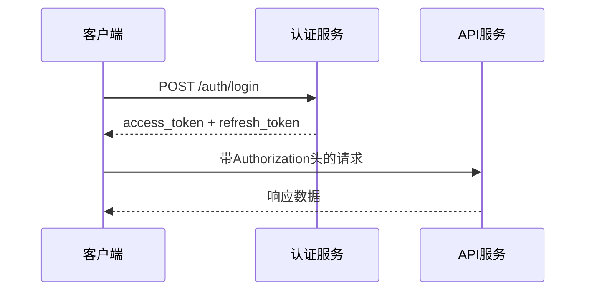

# API 接口文档

合作伙伴管理系统的完整API接口文档。

## 🔐 认证方式

### 请求头配置
```http
Authorization: Bearer {access_token}
Content-Type: application/json
```

### 认证流程


## 📋 通用响应格式

### 成功响应
```json
{
  "success": true,
  "data": {},
  "message": "操作成功",
  "timestamp": "2024-09-16T10:00:00Z"
}
```

### 错误响应
```json
{
  "success": false,
  "error": {
    "code": "ERROR_CODE",
    "message": "错误描述",
    "details": {}
  },
  "timestamp": "2024-09-16T10:00:00Z"
}
```

## 🔑 认证相关接口

### 用户登录
```http
POST /api/auth/login
```

**请求体**:
```json
{
  "email": "user@example.com",
  "password": "password123"
}
```

**响应**:
```json
{
  "success": true,
  "data": {
    "user": {
      "id": "user_123",
      "email": "user@example.com",
      "name": "用户名",
      "role": "admin",
      "partnerId": "partner_123"
    },
    "accessToken": "eyJhbGciOiJIUzI1NiIs...",
    "refreshToken": "eyJhbGciOiJIUzI1NiIs...",
    "permissions": [
      "dashboard:read",
      "cards:read",
      "cards:write",
      "cards:import"
    ]
  }
}
```

### 刷新令牌
```http
POST /api/auth/refresh
```

### 用户注册
```http
POST /api/auth/register
```

### 用户登出
```http
POST /api/auth/logout
```

## 💳 会员卡管理接口

### 获取会员卡列表
```http
GET /api/cards/{partnerId}?page=1&limit=20&status=ACTIVE
```

**路径参数**:
- `partnerId`: 合作伙伴ID

**查询参数**:
- `page`: 页码 (默认: 1)
- `limit`: 每页数量 (默认: 20)
- `status`: 卡状态筛选
- `cardType`: 卡类型筛选

**响应**:
```json
{
  "success": true,
  "data": {
    "cards": [
      {
        "id": "card_123",
        "cardNumber": "1234567890",
        "cardSecret": "SECRET123",
        "status": "UNACTIVATED",
        "cardType": "NORMAL",
        "partnerId": "partner_123",
        "activationInfo": null,
        "bindingInfo": null,
        "validityPeriod": 365,
        "pointsBalance": 0,
        "cashBalance": 0,
        "createdAt": "2024-01-01T00:00:00Z",
        "updatedAt": "2024-01-01T00:00:00Z"
      }
    ],
    "pagination": {
      "page": 1,
      "limit": 20,
      "total": 100,
      "totalPages": 5
    }
  }
}
```

### 导入会员卡
```http
POST /api/cards/{partnerId}/import
```

**权限要求**: `cards:import` (仅管理员)

**请求体**:
```json
{
  "cards": [
    {
      "cardNumber": "1234567890",
      "cardSecret": "SECRET123",
      "cardType": "NORMAL",
      "validityPeriod": 365
    }
  ]
}
```

### 激活会员卡
```http
POST /api/cards/activate
```

**请求体**:
```json
{
  "cardNumber": "1234567890",
  "cardSecret": "SECRET123",
  "phone": "13800138000",
  "bindingInfo": {
    "macAddress": "00:11:22:33:44:55",
    "channelPackage": "com.example.app"
  }
}
```

### 获取会员卡统计
```http
GET /api/cards/{partnerId}/stats
```

## 🏢 合作伙伴管理接口

### 获取合作伙伴列表
```http
GET /api/partners?page=1&limit=20
```

### 获取合作伙伴详情
```http
GET /api/partners/{partnerId}
```

### 创建合作伙伴
```http
POST /api/partners
```

### 更新合作伙伴信息
```http
PUT /api/partners/{partnerId}
```

## 💰 分账管理接口

### 获取分账记录
```http
GET /api/revenue-sharing/my-sharing/{partnerId}?startDate=2024-01-01&endDate=2024-12-31
```

**响应**:
```json
{
  "success": true,
  "data": {
    "records": [
      {
        "id": "sharing_123",
        "partnerId": "partner_123",
        "orderId": "order_123",
        "amount": 100.00,
        "sharingRate": 0.15,
        "sharingAmount": 15.00,
        "status": "SETTLED",
        "settlementDate": "2024-01-15T00:00:00Z",
        "createdAt": "2024-01-01T00:00:00Z"
      }
    ],
    "summary": {
      "totalSharing": 1500.00,
      "totalReceived": 1200.00,
      "totalPaid": 300.00,
      "sharingCount": 100
    }
  }
}
```

### 获取分账规则
```http
GET /api/revenue-sharing/rules/{partnerId}
```

### 配置分账规则
```http
POST /api/revenue-sharing/rules/{partnerId}
```

## 💼 订单管理接口

### 获取订单列表
```http
GET /api/orders/{partnerId}?page=1&limit=20&orderType=ACTIVATION&status=COMPLETED&startDate=2024-01-01&endDate=2024-12-31
```

**路径参数**:
- `partnerId`: 合作伙伴ID（管理员可传 "all" 查看所有）

**查询参数**:
- `page`: 页码 (默认: 1)
- `limit`: 每页数量 (默认: 20，最大: 100)
- `orderType`: 订单类型 (ACTIVATION | SUBSCRIPTION)
- `status`: 订单状态筛选
- `startDate`: 开始日期 (YYYY-MM-DD)
- `endDate`: 结束日期 (YYYY-MM-DD)
- `cardNumber`: 会员卡号模糊查询
- `phone`: 手机号模糊查询

**响应**:
```json
{
  "success": true,
  "data": {
    "orders": [
      {
        "id": "order_123",
        "orderNumber": "ORD20241201001",
        "orderType": "ACTIVATION",
        "partnerId": "partner_123",
        "partnerName": "合作伙伴A",
        "userId": "user_456",
        "cardId": "card_789",
        "cardNumber": "1234567890",
        "phone": "13800138000",
        "orderAmount": 100.00,
        "commissionRate": 0.15,
        "commissionAmount": 15.00,
        "actualAmount": 14.50,
        "fees": [
          {
            "type": "platform",
            "amount": 0.50,
            "description": "平台服务费"
          }
        ],
        "status": "COMPLETED",
        "paymentInfo": {
          "paymentMethod": "alipay",
          "paymentChannel": "scan_pay",
          "transactionId": "2024120100001",
          "paymentTime": "2024-12-01T10:30:00Z"
        },
        "metadata": {
          "deviceInfo": "iPhone 15",
          "appVersion": "1.0.0"
        },
        "createdAt": "2024-12-01T10:00:00Z",
        "completedAt": "2024-12-01T10:30:00Z",
        "settlementAt": "2024-12-01T10:31:00Z",
        "updatedAt": "2024-12-01T10:31:00Z"
      }
    ],
    "pagination": {
      "page": 1,
      "limit": 20,
      "total": 150,
      "totalPages": 8
    },
    "summary": {
      "totalOrders": 150,
      "totalAmount": 15000.00,
      "totalCommission": 2250.00,
      "totalActualAmount": 2175.00
    }
  }
}
```

### 获取订单详情
```http
GET /api/orders/detail/{orderId}
```

**响应**:
```json
{
  "success": true,
  "data": {
    "order": {
      "id": "order_123",
      "orderNumber": "ORD20241201001",
      "orderType": "ACTIVATION",
      "partnerId": "partner_123",
      "partnerName": "合作伙伴A",
      "partnerInfo": {
        "level": 1,
        "type": "DIRECT",
        "contactPerson": "张三",
        "contactPhone": "13900139000"
      },
      "userInfo": {
        "userId": "user_456",
        "phone": "13800138000",
        "registeredAt": "2024-11-01T00:00:00Z"
      },
      "cardInfo": {
        "cardId": "card_789",
        "cardNumber": "1234567890",
        "cardType": "NORMAL",
        "validityPeriod": 365,
        "activatedAt": "2024-12-01T10:30:00Z"
      },
      "commissionCalculation": {
        "baseAmount": 100.00,
        "commissionRate": 0.15,
        "commissionAmount": 15.00,
        "fees": [
          {
            "type": "platform",
            "rate": 0.005,
            "amount": 0.50,
            "description": "平台服务费 0.5%"
          }
        ],
        "actualAmount": 14.50
      },
      "statusHistory": [
        {
          "status": "PENDING",
          "timestamp": "2024-12-01T10:00:00Z",
          "operator": "system",
          "remarks": "订单创建"
        },
        {
          "status": "PROCESSING",
          "timestamp": "2024-12-01T10:15:00Z",
          "operator": "system",
          "remarks": "开始处理激活"
        },
        {
          "status": "COMPLETED",
          "timestamp": "2024-12-01T10:30:00Z",
          "operator": "system",
          "remarks": "激活成功"
        }
      ]
    }
  }
}
```

### 订单统计接口
```http
GET /api/orders/{partnerId}/stats?period=month&year=2024&month=12
```

**查询参数**:
- `period`: 统计周期 (day | week | month | quarter | year)
- `year`: 年份
- `month`: 月份 (可选)
- `week`: 周数 (可选)

**响应**:
```json
{
  "success": true,
  "data": {
    "period": "2024-12",
    "summary": {
      "totalOrders": 45,
      "activationOrders": 30,
      "subscriptionOrders": 15,
      "totalAmount": 4500.00,
      "totalCommission": 675.00,
      "averageOrderAmount": 100.00,
      "successRate": 0.95
    },
    "trends": [
      {
        "date": "2024-12-01",
        "orders": 5,
        "amount": 500.00,
        "commission": 75.00
      }
    ],
    "statusDistribution": {
      "COMPLETED": 42,
      "FAILED": 2,
      "CANCELLED": 1
    },
    "typeDistribution": {
      "ACTIVATION": 30,
      "SUBSCRIPTION": 15
    }
  }
}
```

### 订单导出接口
```http
POST /api/orders/{partnerId}/export
```

**请求体**:
```json
{
  "exportType": "excel",
  "filters": {
    "orderType": "ACTIVATION",
    "status": ["COMPLETED", "FAILED"],
    "startDate": "2024-01-01",
    "endDate": "2024-12-31"
  },
  "columns": [
    "orderNumber",
    "orderType",
    "partnerName",
    "cardNumber",
    "phone",
    "orderAmount",
    "commissionRate",
    "commissionAmount",
    "actualAmount",
    "status",
    "createdAt",
    "completedAt"
  ],
  "includeDetails": true
}
```

**响应**:
```json
{
  "success": true,
  "data": {
    "exportId": "export_12345",
    "status": "PROCESSING",
    "estimatedTime": 30,
    "message": "正在生成导出文件，预计需要 30 秒"
  }
}
```

### 获取导出状态
```http
GET /api/orders/export/{exportId}/status
```

**响应**:
```json
{
  "success": true,
  "data": {
    "exportId": "export_12345",
    "status": "COMPLETED",
    "progress": 100,
    "downloadUrl": "https://api.example.com/files/orders_export_20241201.xlsx",
    "fileSize": 2048576,
    "recordCount": 1500,
    "expiresAt": "2024-12-31T23:59:59Z",
    "createdAt": "2024-12-01T15:00:00Z",
    "completedAt": "2024-12-01T15:00:30Z"
  }
}
```

### 创建订单 (内部接口)
```http
POST /api/orders
```

**请求体**:
```json
{
  "orderType": "ACTIVATION",
  "partnerId": "partner_123",
  "userId": "user_456",
  "cardId": "card_789",
  "orderAmount": 100.00,
  "paymentInfo": {
    "paymentMethod": "alipay",
    "paymentChannel": "scan_pay",
    "transactionId": "2024120100001"
  },
  "metadata": {
    "deviceInfo": "iPhone 15",
    "appVersion": "1.0.0",
    "userAgent": "Mozilla/5.0..."
  }
}
```

### 更新订单状态 (内部接口)
```http
PUT /api/orders/{orderId}/status
```

**请求体**:
```json
{
  "status": "COMPLETED",
  "operator": "system",
  "remarks": "激活成功，自动更新状态",
  "completedAt": "2024-12-01T10:30:00Z",
  "settlementInfo": {
    "commissionAmount": 15.00,
    "actualAmount": 14.50,
    "fees": [
      {
        "type": "platform",
        "amount": 0.50
      }
    ]
  }
}
```

## 📊 报表系统接口

### 获取仪表板数据
```http
GET /api/dashboard/{partnerId}/data
```

**响应**:
```json
{
  "success": true,
  "data": {
    "overview": {
      "totalCards": 1000,
      "activeCards": 800,
      "totalRevenue": 50000.00,
      "monthlyGrowth": 0.15
    },
    "cardStats": {
      "unactivated": 200,
      "active": 800,
      "expired": 50,
      "cancelled": 10
    },
    "revenueStats": {
      "thisMonth": 5000.00,
      "lastMonth": 4500.00,
      "growth": 0.11
    },
    "trends": [
      {
        "date": "2024-01-01",
        "cards": 100,
        "revenue": 1000.00
      }
    ]
  }
}
```

## 🔄 权益回收池接口

### 获取回收池信息
```http
GET /api/recovery-pool/{partnerId}
```

**响应**:
```json
{
  "success": true,
  "data": {
    "id": "pool_123",
    "partnerId": "partner_123",
    "totalDays": 1000,
    "usedDays": 200,
    "availableDays": 800,
    "status": "ACTIVE",
    "lastUpdatedAt": "2024-01-01T00:00:00Z",
    "createdAt": "2024-01-01T00:00:00Z"
  }
}
```

### 处理权益回收
```http
POST /api/recovery-pool/process-recovery
```

**请求体**:
```json
{
  "redemptionRequestId": "request_123",
  "partnerId": "partner_123",
  "days": 30,
  "description": "权益回收入池",
  "operatorId": "user_123"
}
```

### 批量权益回收
```http
POST /api/recovery-pool/batch-recovery
```

### 批量兑换处理
```http
POST /api/recovery-pool/batch-exchange
```

## 📋 对账管理接口

### 获取对账报表
```http
GET /api/reconciliation/{partnerId}/statements?period=2024-01
```

### 生成对账单
```http
POST /api/reconciliation/{partnerId}/generate
```

### 确认对账
```http
POST /api/reconciliation/{partnerId}/confirm
```

## 🔍 订单管理接口 (简化版)

### 获取激活订单
```http
GET /api/orders/activation/{partnerId}?startDate=2024-01-01&endDate=2024-12-31
```

ℹ️ **注意**: 该接口为兼容接口，建议使用上方的统一订单管理接口。

### 获取订单详情
```http
GET /api/orders/{orderId}
```

ℹ️ **注意**: 该接口为兼容接口，建议使用 `/api/orders/detail/{orderId}` 获取更详细的信息。

## 📈 报表系统接口

### 获取业绩报表
```http
GET /api/reports/performance/{partnerId}?period=month&year=2024&month=1
```

### 获取会员增长报表
```http
GET /api/reports/member-growth/{partnerId}
```

### 导出报表
```http
GET /api/reports/export/{reportType}?format=excel&partnerId={partnerId}
```

## ⚙️ 系统设置接口

### 获取系统配置
```http
GET /api/settings/system
```

### 更新系统配置
```http
PUT /api/settings/system
```

### 获取用户权限
```http
GET /api/settings/permissions/{userId}
```

## 🚨 错误码说明

| 错误码 | HTTP状态码 | 说明 |
|--------|------------|------|
| AUTH_001 | 401 | 认证失败 |
| AUTH_002 | 401 | 令牌已过期 |
| AUTH_003 | 403 | 权限不足 |
| CARD_001 | 404 | 会员卡不存在 |
| CARD_002 | 400 | 会员卡已激活 |
| CARD_003 | 403 | 无导入权限 |
| PARTNER_001 | 404 | 合作伙伴不存在 |
| ORDER_001 | 404 | 订单不存在 |
| ORDER_002 | 403 | 无权查看该订单 |
| ORDER_003 | 400 | 订单状态无效 |
| ORDER_004 | 400 | 订单已完成，无法修改 |
| ORDER_005 | 429 | 导出频率过高 |
| ORDER_006 | 400 | 导出数据范围过大 |
| EXPORT_001 | 404 | 导出任务不存在 |
| EXPORT_002 | 410 | 导出文件已过期 |
| SYSTEM_001 | 500 | 系统内部错误 |

## 🔄 状态码说明

### 会员卡状态
- `UNACTIVATED`: 待激活
- `INACTIVE`: 未激活  
- `BOUND`: 已绑定
- `EXPIRED`: 已过期
- `CANCELLED`: 已销卡

### 分账状态
- `PENDING`: 待结算
- `PROCESSING`: 结算中
- `SETTLED`: 已结算
- `FAILED`: 结算失败

### 回收池状态
- `ACTIVE`: 活跃
- `SUSPENDED`: 暂停
- `ARCHIVED`: 已归档

## 📝 使用示例

### JavaScript/TypeScript
```typescript
// 使用axios调用API
import axios from 'axios'

const api = axios.create({
  baseURL: 'https://api.example.com',
  headers: {
    'Authorization': `Bearer ${accessToken}`,
    'Content-Type': 'application/json'
  }
})

// 获取会员卡列表
const getCards = async (partnerId: string) => {
  try {
    const response = await api.get(`/cards/${partnerId}`)
    return response.data
  } catch (error) {
    console.error('获取会员卡失败:', error)
    throw error
  }
}

// 激活会员卡
const activateCard = async (cardData: ActivationData) => {
  try {
    const response = await api.post('/cards/activate', cardData)
    return response.data
  } catch (error) {
    console.error('激活失败:', error)
    throw error
  }
}
```

### cURL示例
```bash
# 登录
curl -X POST https://api.example.com/auth/login \
  -H "Content-Type: application/json" \
  -d '{"email":"user@example.com","password":"password123"}'

# 获取会员卡列表
curl -X GET https://api.example.com/cards/partner_123 \
  -H "Authorization: Bearer YOUR_ACCESS_TOKEN"

# 导入会员卡
curl -X POST https://api.example.com/cards/partner_123/import \
  -H "Authorization: Bearer YOUR_ACCESS_TOKEN" \
  -H "Content-Type: application/json" \
  -d '{"cards":[{"cardNumber":"1234567890","cardSecret":"SECRET123","cardType":"NORMAL","validityPeriod":365}]}'
```

## 📋 变更日志

### v1.0.0
- 初始API版本发布
- 完整的认证和授权系统
- 会员卡管理功能
- 合作伙伴管理功能
- 权益回收池系统

### v0.9.0
- 权益回收池功能
- 批量操作接口
- 权限控制优化

---

**维护者**: Damingdong  
**API版本**: v1.0.0  
**最后更新**: 2024-09-16