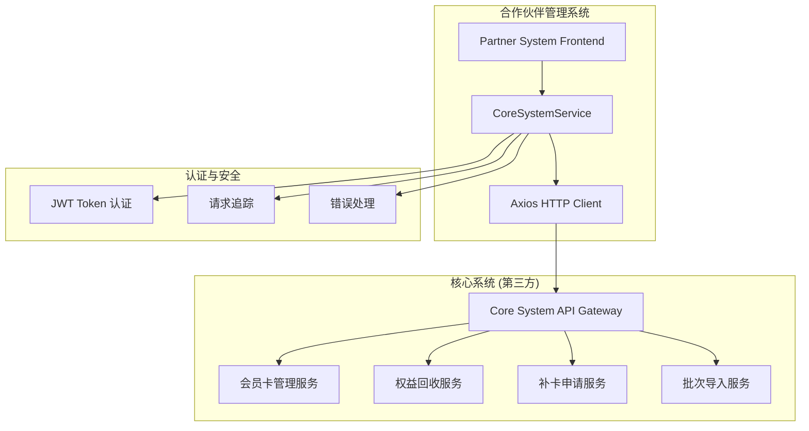

# 核心系统对接 - 第三方依赖文档

## 📋 文档概述

本文档详细说明了合作伙伴管理系统与核心系统对接的第三方依赖关系、接口规范、配置要求和集成方案。核心系统作为上游系统，提供会员卡管理、权益处理和业务数据支持等关键服务。

## 🏗️ 系统架构

### 依赖关系图



---

## 🔗 第三方系统信息

### 核心系统基本信息

| 属性 | 值 | 说明 |
|------|----|----|
| **系统名称** | 核心业务系统 | 上游业务核心系统 |
| **供应商** | 内部/第三方供应商 | 根据实际情况 |
| **API版本** | v1.0.0 | 当前支持版本 |
| **协议** | HTTPS | 安全传输协议 |
| **认证方式** | Bearer Token (JWT) | 基于Token的身份认证 |
| **数据格式** | JSON | 请求响应数据格式 |
| **字符编码** | UTF-8 | 标准字符编码 |

### 环境信息

| 环境 | 基础URL | 描述 | 状态 |
|------|---------|------|------|
| **开发环境** | `http://localhost:3001/api/core` | 本地开发测试 | Mock数据 |
| **测试环境** | `https://test-core-api.example.com/api/core` | 集成测试环境 | 测试数据 |
| **预生产环境** | `https://staging-core-api.example.com/api/core` | 预发布环境 | 生产级数据 |
| **生产环境** | `https://core-api.example.com/api/core` | 正式生产环境 | 真实数据 |

---

## ⚙️ 技术规范

### HTTP 客户端配置

```typescript
// 核心系统API客户端配置
const coreSystemConfig = {
  baseURL: process.env.VITE_CORE_API_BASE_URL || 'http://localhost:3001/api/core',
  timeout: 30000,  // 30秒超时
  headers: {
    'Content-Type': 'application/json',
    'Accept': 'application/json',
    'User-Agent': 'PartnerSystem/1.0.0'
  },
  retryDelay: 1000,  // 重试延迟
  maxRetries: 3      // 最大重试次数
}
```

### 认证机制

#### Token 认证
```typescript
// 请求头格式
{
  "Authorization": "Bearer <JWT_TOKEN>",
  "X-Request-ID": "req-{timestamp}-{random}",
  "Content-Type": "application/json"
}

// Token 格式
interface JWTPayload {
  sub: string;        // 用户ID
  iat: number;        // 签发时间
  exp: number;        // 过期时间
  aud: string;        // 目标系统
  iss: string;        // 签发者
  scope: string[];    // 权限范围
}
```

#### 请求追踪
每个请求都包含唯一的请求ID用于日志追踪和问题定位：
```typescript
// 请求ID生成规则
const requestId = `req-${Date.now()}-${Math.random().toString(36).substr(2, 9)}`;
```

---

## 🔌 API 接口规范

### 1. 会员卡批次导入

#### 接口信息
- **接口路径**: `POST /cards/batch-import`
- **功能描述**: 将合作伙伴的会员卡批量导入到核心系统
- **超时时间**: 30秒
- **重试策略**: 失败时重试3次

#### 请求参数
```typescript
interface ImportCardsRequest {
  partnerId: string;             // 合作伙伴ID
  batchName: string;             // 批次名称
  cards: CardImportData[];       // 会员卡数据
}

interface CardImportData {
  cardNumber: string;            // 卡号
  cardType: CardType;            // 卡类型 (REGULAR | BOUND)
  expiryDate?: string;           // 到期时间 (ISO 8601)
  batchNumber: string;           // 批次号
}
```

#### 响应数据
```typescript
interface BatchImportResponse {
  success: boolean;
  data: {
    batchId: string;             // 批次ID
    totalCards: number;          // 总卡数
    successCount: number;        // 成功导入数量
    failedCount: number;         // 失败数量
    errors: string[];            // 错误信息列表
  };
  message: string;
}
```

#### 错误处理
```typescript
// 常见错误代码
{
  "INVALID_PARTNER": "合作伙伴不存在",
  "DUPLICATE_CARD": "卡号重复",
  "INVALID_CARD_TYPE": "无效的卡类型",
  "BATCH_SIZE_EXCEEDED": "批次大小超限",
  "SYSTEM_ERROR": "系统内部错误"
}
```

### 2. 权益批量回收

#### 接口信息
- **接口路径**: `POST /rights/batch-recovery`
- **功能描述**: 当用户申请销卡时，批量回收剩余权益并转换为积分
- **积分计算**: 每10天 = 1积分

#### 请求参数
```typescript
interface RightsRecoveryRequest {
  partnerId: string;             // 合作伙伴ID
  cards: RightsRecoveryCard[];   // 待回收权益的卡
}

interface RightsRecoveryCard {
  cardId: string;                // 会员卡ID
  cardNumber: string;            // 卡号
  remainingDays: number;         // 剩余天数
  reason: string;                // 回收原因
}
```

#### 响应数据
```typescript
interface RightsRecoveryResponse {
  success: boolean;
  data: {
    recoveredCount: number;      // 回收成功数量
    totalPoints: number;         // 总积分
    failedCards: string[];       // 失败的卡号
  };
  message: string;
}
```

### 3. 批量补卡申请

#### 接口信息
- **接口路径**: `POST /cards/replacement-request`
- **功能描述**: 使用积分申请新的会员卡（月卡或年卡）
- **积分消耗**: 月卡=36积分，年卡=365积分

#### 请求参数
```typescript
interface ReplacementRequest {
  partnerId: string;             // 合作伙伴ID
  requests: ReplacementCardData[];
}

interface ReplacementCardData {
  originalCardId: string;        // 原卡ID
  points: number;                // 使用积分
  rewardType: 'monthly' | 'yearly'; // 兑换类型
  requestReason: string;         // 申请原因
}
```

#### 响应数据
```typescript
interface ReplacementResponse {
  success: boolean;
  newCards: MembershipCard[];    // 新生成的会员卡
  failedRequests: string[];      // 失败的申请ID
  message: string;
}
```

### 4. 状态查询接口

#### 批次导入状态查询
```typescript
// GET /cards/batch-import/{batchId}/status
interface BatchImportStatus {
  batchId: string;
  status: 'processing' | 'completed' | 'failed';
  progress: number;              // 进度百分比
  totalCards: number;
  processedCards: number;
  failedCards: number;
  errors: string[];
}
```

#### 权益回收状态查询
```typescript
// GET /rights/batch-recovery/{requestId}/status
interface RightsRecoveryStatus {
  requestId: string;
  status: 'processing' | 'completed' | 'failed';
  recoveredCount: number;
  totalCards: number;
  totalPoints: number;
  errors: string[];
}
```

#### 补卡申请状态查询
```typescript
// GET /cards/replacement-request/{requestId}/status
interface ReplacementStatus {
  requestId: string;
  status: 'processing' | 'completed' | 'failed';
  successCount: number;
  totalRequests: number;
  newCards: MembershipCard[];
  errors: string[];
}
```

### 5. 系统健康检查

#### 接口信息
- **接口路径**: `GET /health`
- **功能描述**: 检查核心系统连接状态和服务可用性

#### 响应数据
```typescript
interface HealthStatus {
  connected: boolean;            // 连接状态
  latency: number;               // 延迟(毫秒)
  version: string;               // 系统版本
  message: string;               // 状态信息
  timestamp: string;             // 检查时间
}
```

---

## 🔧 配置管理

### 环境变量配置

#### 开发环境 (.env.development)
```bash
# 核心系统API配置
VITE_CORE_API_BASE_URL=http://localhost:3001/api/core
VITE_CORE_API_TIMEOUT=30000
VITE_USE_MOCK=true

# 认证配置
VITE_CORE_JWT_SECRET=your-jwt-secret-key
VITE_CORE_TOKEN_EXPIRY=3600

# 调试配置
VITE_CORE_DEBUG=true
VITE_CORE_LOG_LEVEL=debug
```

#### 生产环境 (.env.production)
```bash
# 核心系统API配置
VITE_CORE_API_BASE_URL=https://core-api.example.com/api/core
VITE_CORE_API_TIMEOUT=30000
VITE_USE_MOCK=false

# 认证配置
VITE_CORE_JWT_SECRET=${CORE_JWT_SECRET}
VITE_CORE_TOKEN_EXPIRY=3600

# 监控配置
VITE_CORE_DEBUG=false
VITE_CORE_LOG_LEVEL=error
VITE_CORE_MONITOR_ENABLED=true
```

### 运行时配置

#### 超时与重试策略
```typescript
const networkConfig = {
  // 基础超时配置
  timeout: {
    connection: 5000,    // 连接超时
    request: 30000,      // 请求超时
    response: 30000      // 响应超时
  },
  
  // 重试策略
  retry: {
    maxAttempts: 3,      // 最大重试次数
    initialDelay: 1000,  // 初始延迟
    maxDelay: 5000,      // 最大延迟
    backoffFactor: 2     // 退避因子
  },
  
  // 熔断器配置
  circuitBreaker: {
    threshold: 5,        // 失败阈值
    timeout: 60000,      // 熔断超时
    monitoringPeriod: 10000 // 监控周期
  }
}
```

---

## 🔐 安全规范

### 数据传输安全

#### HTTPS 要求
- **传输协议**: 必须使用 HTTPS
- **TLS 版本**: TLS 1.2 或更高
- **证书验证**: 严格验证服务器证书

#### 数据加密
```typescript
// 敏感数据加密传输
interface SecurePayload {
  data: string;          // 加密后的数据
  algorithm: string;     // 加密算法
  iv: string;           // 初始向量
  checksum: string;     // 数据校验和
}
```

### 访问控制

#### API 访问限制
```typescript
// 访问频率限制
const rateLimits = {
  batchImport: {
    requests: 10,        // 每小时10次
    window: 3600000      // 1小时窗口
  },
  rightsRecovery: {
    requests: 50,        // 每小时50次
    window: 3600000
  },
  replacement: {
    requests: 100,       // 每小时100次
    window: 3600000
  }
}
```

#### IP 白名单
```bash
# 生产环境IP白名单
ALLOWED_IPS="192.168.1.0/24,10.0.0.0/8,172.16.0.0/12"
```

---

## 📊 监控与日志

### 性能监控

#### 关键指标
```typescript
interface PerformanceMetrics {
  // 响应时间指标
  responseTime: {
    p50: number;         // 50分位数
    p95: number;         // 95分位数
    p99: number;         // 99分位数
    avg: number;         // 平均值
  };
  
  // 成功率指标
  successRate: {
    total: number;       // 总请求数
    success: number;     // 成功数
    failed: number;      // 失败数
    rate: number;        // 成功率百分比
  };
  
  // 错误统计
  errors: {
    [errorCode: string]: number;
  };
}
```

### 日志规范

#### 日志级别
```typescript
enum LogLevel {
  ERROR = 'error',     // 错误信息
  WARN = 'warn',       // 警告信息
  INFO = 'info',       // 一般信息
  DEBUG = 'debug'      // 调试信息
}
```

#### 日志格式
```typescript
interface LogEntry {
  timestamp: string;    // 时间戳
  level: LogLevel;      // 日志级别
  requestId: string;    // 请求ID
  service: string;      // 服务名称
  method: string;       // HTTP方法
  url: string;          // 请求URL
  statusCode: number;   // 响应状态码
  duration: number;     // 请求耗时
  message: string;      // 日志消息
  error?: Error;        // 错误对象
  metadata?: any;       // 额外元数据
}
```

---

## 🚨 错误处理

### 错误分类

#### HTTP 状态码映射
| 状态码 | 错误类型 | 处理策略 |
|--------|----------|----------|
| 400 | 请求参数错误 | 修正参数后重试 |
| 401 | 认证失败 | 刷新Token后重试 |
| 403 | 权限不足 | 记录日志，提示用户 |
| 404 | 资源不存在 | 检查资源ID |
| 429 | 请求过频 | 延迟重试 |
| 500 | 服务器错误 | 重试3次后失败 |
| 502/503 | 服务不可用 | 启用熔断器 |

#### 业务错误码
```typescript
enum CoreSystemErrorCode {
  // 系统级错误
  SYSTEM_ERROR = 'CORE_001',
  SERVICE_UNAVAILABLE = 'CORE_002',
  TIMEOUT = 'CORE_003',
  
  // 认证错误
  AUTH_FAILED = 'CORE_101',
  TOKEN_EXPIRED = 'CORE_102',
  INSUFFICIENT_PERMISSION = 'CORE_103',
  
  // 业务错误
  INVALID_PARTNER = 'CORE_201',
  DUPLICATE_CARD = 'CORE_202',
  INSUFFICIENT_POINTS = 'CORE_203',
  BATCH_SIZE_EXCEEDED = 'CORE_204',
  
  // 数据错误
  INVALID_DATA_FORMAT = 'CORE_301',
  MISSING_REQUIRED_FIELD = 'CORE_302',
  DATA_VALIDATION_FAILED = 'CORE_303'
}
```

### 降级策略

#### Mock 数据降级
```typescript
// 当核心系统不可用时，使用Mock数据
const fallbackToMockData = async <T>(
  apiCall: () => Promise<T>,
  mockData: T
): Promise<T> => {
  try {
    return await apiCall();
  } catch (error) {
    console.warn('核心系统不可用，使用Mock数据:', error);
    return mockData;
  }
};
```

#### 缓存策略
```typescript
// 使用缓存减少对核心系统的依赖
const cacheStrategy = {
  // 缓存配置
  ttl: 300000,           // 5分钟过期
  maxSize: 1000,         // 最大缓存条目
  
  // 缓存键策略
  keyTemplate: 'core:{method}:{params}',
  
  // 缓存更新策略
  updatePolicy: 'write-through'  // 写透策略
};
```

---

## 🧪 测试与验证

### Mock 数据配置

#### Mock 服务器设置
```typescript
// Mock数据配置
const mockConfig = {
  enabled: process.env.VITE_USE_MOCK === 'true',
  delay: parseInt(process.env.VITE_MOCK_DELAY || '500'),
  errorRate: parseFloat(process.env.VITE_MOCK_ERROR_RATE || '0'),
  
  // Mock数据
  responses: {
    batchImport: {
      success: true,
      data: {
        batchId: 'mock-batch-id',
        totalCards: 100,
        successCount: 98,
        failedCount: 2,
        errors: ['2张卡片导入失败: 卡号重复']
      }
    }
  }
};
```

### 集成测试

#### 测试用例
```typescript
describe('CoreSystemService Integration Tests', () => {
  beforeEach(() => {
    // 设置测试环境
    vi.clearAllMocks();
  });

  it('should successfully import cards batch', async () => {
    const request: ImportCardsRequest = {
      partnerId: 'test-partner-001',
      batchName: 'Test Batch',
      cards: [
        {
          cardNumber: 'TEST001',
          cardType: CardType.REGULAR,
          batchNumber: 'BATCH001'
        }
      ]
    };

    const response = await CoreSystemService.batchImportCards(request);
    
    expect(response.success).toBe(true);
    expect(response.data.totalCards).toBe(1);
  });
});
```

---

## 📖 部署指南

### 环境准备

#### 依赖检查清单
- [ ] 核心系统API地址配置
- [ ] JWT认证密钥配置
- [ ] 网络连接测试通过
- [ ] SSL证书验证通过
- [ ] 防火墙规则配置
- [ ] 监控告警配置

#### 配置验证
```bash
# 验证核心系统连接
curl -H "Authorization: Bearer $JWT_TOKEN" \
     -H "Content-Type: application/json" \
     $CORE_API_BASE_URL/health

# 验证配置文件
npm run config:validate

# 运行集成测试
npm run test:integration
```

### 上线部署

#### 部署步骤
1. **配置环境变量**
2. **验证网络连接**
3. **执行集成测试**
4. **启动监控服务**
5. **执行健康检查**
6. **配置告警规则**

#### 回滚策略
```bash
# 快速回滚到Mock模式
export VITE_USE_MOCK=true
pm2 restart partner-system

# 恢复正常模式
export VITE_USE_MOCK=false
pm2 restart partner-system
```

---

## 📞 技术支持

### 联系信息

| 角色 | 联系人 | 联系方式 | 负责范围 |
|------|--------|----------|----------|
| **技术负责人** | 张工程师 | zhang@example.com | 整体技术架构 |
| **接口负责人** | 李工程师 | li@example.com | API接口设计 |
| **运维负责人** | 王工程师 | wang@example.com | 部署与监控 |
| **紧急联系人** | 值班电话 | +86-400-xxx-xxxx | 24小时支持 |

### 问题升级

#### 问题级别
- **P0 - 紧急**: 系统完全不可用，影响生产
- **P1 - 高优**: 核心功能受影响，需要紧急修复
- **P2 - 中等**: 部分功能受影响，计划修复
- **P3 - 低优**: 优化建议，后续版本处理

#### 响应时间
- **P0**: 15分钟内响应，2小时内解决
- **P1**: 1小时内响应，8小时内解决
- **P2**: 4小时内响应，24小时内解决
- **P3**: 1个工作日内响应，下版本解决

---

## 📝 版本历史

| 版本 | 日期 | 变更内容 | 负责人 |
|------|------|----------|--------|
| v1.0.0 | 2024-01-20 | 初始版本，基础API对接 | 开发团队 |
| v1.1.0 | 2024-02-15 | 增加权益回收功能 | 开发团队 |
| v1.2.0 | 2024-03-10 | 补卡申请功能上线 | 开发团队 |
| v1.3.0 | 2024-04-05 | 性能优化与监控增强 | 运维团队 |

---

**文档维护**: 技术团队  
**最后更新**: 2024-01-20  
**文档版本**: v1.0.0  
**状态**: 生效中