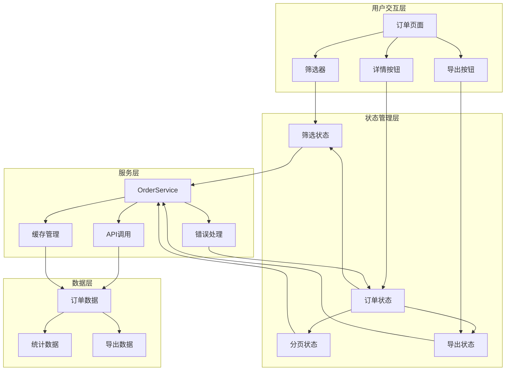
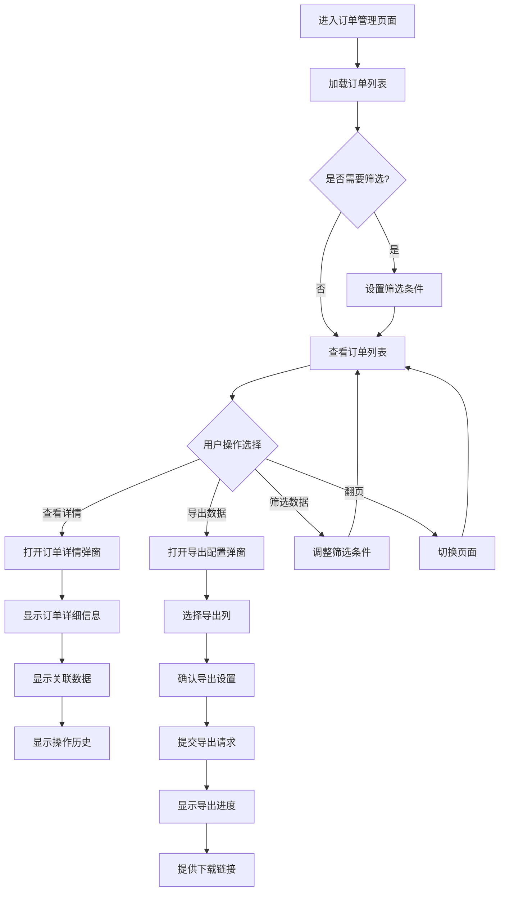

# 订单管理功能详细规格说明文档

## 📋 文档概述

### 文档目的
本文档详细描述合作伙伴系统中订单管理功能的设计和实现规格，包括功能需求、技术实现、数据模型、用户界面和测试规范。

### 适用范围
- 产品经理：了解功能需求和用户体验设计
- 开发工程师：实现功能开发和技术架构
- 测试工程师：编写测试用例和质量保证
- UI/UX设计师：设计用户界面和交互流程

## 🎯 功能需求规格

### 核心功能目标
订单管理功能的核心目的是让合作伙伴能够：
1. **查询订单信息**：查看与自己相关的所有激活订单和订阅订单
2. **了解收益明细**：查看订单金额、分成比例和实际收益
3. **导出数据分析**：将订单数据导出为Excel格式进行进一步分析
4. **追踪订单状态**：实时了解订单处理状态和历史记录

### 功能优先级分级

#### P0 - 核心功能（必须实现）
- [x] 订单列表查询和展示
- [x] 订单详情查看
- [x] 基本筛选功能（时间、类型、状态）
- [x] Excel导出功能
- [x] 权限控制（合作伙伴只能查看自己的订单）

#### P1 - 重要功能（优先实现）
- [x] 订单统计面板
- [x] 高级筛选功能
- [x] 分页和性能优化
- [x] 导出进度跟踪

#### P2 - 增强功能（后续迭代）
- [ ] 订单趋势分析图表
- [ ] 自定义导出模板
- [ ] 订单搜索功能
- [ ] 批量操作功能

## 🏗️ 技术实现规格

### 前端技术规格

#### 组件架构设计
```typescript
// 订单管理页面组件结构
interface OrderManagementArchitecture {
  // 主页面组件
  OrdersPage: {
    path: '/orders'
    permissions: ['orders:read']
    components: ['OrderList', 'OrderFilters', 'OrderStats']
    hooks: ['useOrders', 'useOrderFilters', 'useOrderExport']
  }
  
  // 订单列表组件
  OrderList: {
    features: ['分页', '排序', '选择', '批量操作']
    performance: ['虚拟滚动', '数据缓存', '懒加载']
    responsive: true
  }
  
  // 订单详情模态框
  OrderDetailModal: {
    features: ['详细信息', '状态历史', '相关数据']
    lazy: true
  }
  
  // 导出功能组件
  OrderExportDialog: {
    features: ['筛选配置', '列选择', '格式选择', '进度跟踪']
    async: true
  }
}
```

#### 数据流设计


### 数据模型规格

#### 订单数据模型
```typescript
// 订单基础模型
interface Order {
  // 唯一标识
  id: string                    // 订单内部ID
  orderNumber: string           // 订单编号，格式：ORD + YYYYMMDD + 序号
  
  // 订单分类
  orderType: OrderType          // 'ACTIVATION' | 'SUBSCRIPTION'
  businessType?: string         // 业务类型扩展字段
  
  // 关联信息
  partnerId: string             // 关联合作伙伴ID
  partnerName: string           // 合作伙伴名称（冗余字段，优化查询）
  userId?: string               // 关联用户ID（可选）
  cardId?: string               // 关联会员卡ID（激活订单必填）
  cardNumber?: string           // 会员卡号（冗余字段）
  phone?: string                // 用户手机号
  
  // 金额信息
  orderAmount: number           // 订单原始金额
  commissionRate: number        // 分成比例 (0-1)
  commissionAmount: number      // 计算分成金额
  actualAmount: number          // 实际到账金额（扣除费用后）
  fees: OrderFee[]              // 费用明细
  
  // 状态信息
  status: OrderStatus           // 订单状态
  statusDesc: string            // 状态描述
  
  // 支付信息
  paymentInfo?: PaymentInfo     // 支付相关信息
  
  // 时间戳
  createdAt: string             // 创建时间 ISO8601
  completedAt?: string          // 完成时间
  settlementAt?: string         // 结算时间
  updatedAt: string             // 更新时间
  
  // 扩展信息
  metadata?: Record<string, any> // 元数据，支持扩展
  tags?: string[]               // 标签，便于分类
  remarks?: string              // 备注信息
}

// 订单类型枚举
type OrderType = 'ACTIVATION' | 'SUBSCRIPTION'

// 订单状态枚举
type OrderStatus = 
  | 'PENDING'     // 待处理
  | 'PROCESSING'  // 处理中
  | 'COMPLETED'   // 已完成
  | 'FAILED'      // 失败
  | 'CANCELLED'   // 已取消
  | 'REFUNDED'    // 已退款

// 费用明细模型
interface OrderFee {
  type: 'platform' | 'payment' | 'tax' | 'other'
  amount: number
  rate?: number                 // 费率（可选）
  description: string
  calculation?: string          // 计算说明
}

// 支付信息模型
interface PaymentInfo {
  paymentMethod: string         // 支付方式：alipay, wechat, card等
  paymentChannel: string        // 支付渠道：scan_pay, app_pay等
  transactionId?: string        // 第三方交易ID
  paymentTime?: string          // 支付时间
  paymentAmount?: number        // 支付金额
  currency?: string             // 货币类型，默认CNY
}
```

#### 查询和筛选模型
```typescript
// 订单查询参数模型
interface OrderQueryParams {
  // 分页参数
  page: number                  // 页码，从1开始
  limit: number                 // 每页数量，最大100
  
  // 基础筛选
  orderType?: OrderType         // 订单类型筛选
  status?: OrderStatus[]        // 状态筛选，支持多选
  
  // 时间筛选
  startDate?: string            // 开始日期 YYYY-MM-DD
  endDate?: string              // 结束日期 YYYY-MM-DD
  dateField?: 'createdAt' | 'completedAt' | 'settlementAt' // 时间字段选择
  
  // 金额筛选
  minAmount?: number            // 最小金额
  maxAmount?: number            // 最大金额
  
  // 搜索条件
  cardNumber?: string           // 会员卡号模糊搜索
  phone?: string                // 手机号模糊搜索
  orderNumber?: string          // 订单号精确搜索
  
  // 排序参数
  sortBy?: 'createdAt' | 'orderAmount' | 'commissionAmount'
  sortOrder?: 'asc' | 'desc'
  
  // 权限相关（后端自动填充）
  partnerId?: string            // 合作伙伴ID，限制数据范围
}

// 分页查询结果模型
interface PaginatedOrderResult {
  orders: Order[]               // 订单列表
  pagination: {
    page: number                // 当前页码
    limit: number               // 每页数量
    total: number               // 总记录数
    totalPages: number          // 总页数
    hasNext: boolean            // 是否有下一页
    hasPrev: boolean            // 是否有上一页
  }
  summary: {
    totalOrders: number         // 查询范围内订单总数
    totalAmount: number         // 订单总金额
    totalCommission: number     // 分成总金额
    totalActualAmount: number   // 实际到账总金额
  }
}
```

### API接口规格

#### 核心接口定义
```typescript
// API接口规格
interface OrderManagementAPI {
  // 订单列表查询
  getOrders: {
    method: 'GET'
    path: '/api/orders/{partnerId}'
    params: OrderQueryParams
    response: PaginatedOrderResult
    permissions: ['orders:read']
    rateLimit: '100/minute'
  }
  
  // 订单详情查询
  getOrderDetail: {
    method: 'GET'
    path: '/api/orders/detail/{orderId}'
    response: OrderDetailResponse
    permissions: ['orders:read']
    validation: ['partnerId匹配', '订单存在性']
  }
  
  // 订单统计数据
  getOrderStats: {
    method: 'GET'
    path: '/api/orders/{partnerId}/stats'
    params: StatsQueryParams
    response: OrderStatsResponse
    permissions: ['orders:stats']
    cache: '5 minutes'
  }
  
  // 订单导出请求
  exportOrders: {
    method: 'POST'
    path: '/api/orders/{partnerId}/export'
    body: OrderExportRequest
    response: ExportTaskResponse
    permissions: ['orders:export']
    rateLimit: '5/hour'
    async: true
  }
  
  // 导出状态查询
  getExportStatus: {
    method: 'GET'
    path: '/api/orders/export/{exportId}/status'
    response: ExportStatusResponse
    permissions: ['orders:export']
  }
}
```

#### 导出功能规格
```typescript
// 导出请求模型
interface OrderExportRequest {
  // 导出格式
  format: 'excel' | 'csv'       // 支持的导出格式
  
  // 筛选条件
  filters: OrderQueryParams     // 复用查询参数模型
  
  // 列配置
  columns: ExportColumn[]       // 自定义导出列
  
  // 导出选项
  options: {
    includeHeader: boolean      // 是否包含表头
    includeStats: boolean       // 是否包含统计信息
    sheetName?: string          // Excel工作表名称
    maxRows?: number            // 最大导出行数，默认50000
  }
  
  // 通知设置
  notification?: {
    email?: string              // 完成后邮件通知
    webhook?: string            // 完成后回调通知
  }
}

// 导出列配置
interface ExportColumn {
  field: keyof Order            // 字段名
  title: string                 // 列标题
  width?: number                // 列宽度
  format?: 'currency' | 'date' | 'percent' | 'text' // 格式化类型
  required: boolean             // 是否必选
}

// 导出任务响应
interface ExportTaskResponse {
  exportId: string              // 导出任务ID
  status: 'QUEUED' | 'PROCESSING' | 'COMPLETED' | 'FAILED'
  estimatedTime: number         // 预估完成时间（秒）
  createdAt: string             // 任务创建时间
  message: string               // 状态描述
}

// 导出状态响应
interface ExportStatusResponse {
  exportId: string
  status: ExportTaskStatus
  progress: number              // 进度百分比 0-100
  processedRows: number         // 已处理行数
  totalRows: number             // 总行数
  downloadUrl?: string          // 下载地址（完成后）
  fileSize?: number             // 文件大小（字节）
  expiresAt?: string            // 下载链接过期时间
  error?: string                // 错误信息（失败时）
  createdAt: string
  completedAt?: string
}
```

## 🎨 用户界面规格

### 页面布局设计

#### 订单管理主页面
```typescript
// 页面布局结构
interface OrderPageLayout {
  header: {
    title: '订单管理'
    breadcrumb: ['首页', '订单管理']
    actions: ['导出', '刷新', '设置']
  }
  
  filters: {
    position: 'top'
    collapsible: true
    filters: [
      {
        type: 'dateRange'
        label: '时间范围'
        defaultValue: '最近30天'
        options: ['今天', '最近7天', '最近30天', '最近3个月', '自定义']
      },
      {
        type: 'select'
        label: '订单类型'
        options: [
          { value: 'all', label: '全部' },
          { value: 'ACTIVATION', label: '激活订单' },
          { value: 'SUBSCRIPTION', label: '订阅订单' }
        ]
      },
      {
        type: 'multiSelect'
        label: '订单状态'
        options: [
          { value: 'COMPLETED', label: '已完成' },
          { value: 'FAILED', label: '失败' },
          { value: 'CANCELLED', label: '已取消' }
        ]
      },
      {
        type: 'search'
        label: '搜索'
        placeholder: '订单号/卡号/手机号'
        debounce: 500
      }
    ]
  }
  
  stats: {
    position: 'top'
    cards: [
      {
        title: '订单总数'
        value: 'totalOrders'
        format: 'number'
        trend: true
      },
      {
        title: '订单总金额'
        value: 'totalAmount'
        format: 'currency'
        prefix: '¥'
      },
      {
        title: '分成总金额'
        value: 'totalCommission'
        format: 'currency'
        prefix: '¥'
        highlight: true
      },
      {
        title: '实际到账'
        value: 'totalActualAmount'
        format: 'currency'
        prefix: '¥'
      }
    ]
  }
  
  table: {
    columns: OrderTableColumn[]
    features: ['选择', '排序', '筛选', '分页']
    responsive: true
    virtualScroll: true // 大数据量时启用
  }
  
  pagination: {
    position: 'bottom-right'
    showSizeChanger: true
    showQuickJumper: true
    pageSizes: [20, 50, 100]
  }
}
```

#### 表格列配置
```typescript
// 订单表格列定义
interface OrderTableColumn {
  dataIndex: keyof Order
  title: string
  width?: number
  sortable?: boolean
  filterable?: boolean
  render?: (value: any, record: Order) => React.ReactNode
  responsive?: ('xs' | 'sm' | 'md' | 'lg' | 'xl')[]
}

const orderTableColumns: OrderTableColumn[] = [
  {
    dataIndex: 'orderNumber',
    title: '订单号',
    width: 160,
    sortable: true,
    render: (value, record) => (
      <Button variant="link" onClick={() => openOrderDetail(record.id)}>
        {value}
      </Button>
    )
  },
  {
    dataIndex: 'orderType',
    title: '类型',
    width: 100,
    filterable: true,
    render: (value) => (
      <Badge variant={value === 'ACTIVATION' ? 'default' : 'secondary'}>
        {value === 'ACTIVATION' ? '激活' : '订阅'}
      </Badge>
    )
  },
  {
    dataIndex: 'cardNumber',
    title: '会员卡号',
    width: 140,
    responsive: ['md', 'lg', 'xl'],
    render: (value) => value || '-'
  },
  {
    dataIndex: 'phone',
    title: '手机号',
    width: 120,
    responsive: ['lg', 'xl'],
    render: (value) => value ? maskPhone(value) : '-'
  },
  {
    dataIndex: 'orderAmount',
    title: '订单金额',
    width: 120,
    sortable: true,
    render: (value) => `¥${value.toFixed(2)}`
  },
  {
    dataIndex: 'commissionRate',
    title: '分成比例',
    width: 100,
    render: (value) => `${(value * 100).toFixed(1)}%`
  },
  {
    dataIndex: 'commissionAmount',
    title: '分成金额',
    width: 120,
    sortable: true,
    render: (value) => (
      <span className="font-medium text-green-600">
        ¥{value.toFixed(2)}
      </span>
    )
  },
  {
    dataIndex: 'actualAmount',
    title: '实际到账',
    width: 120,
    sortable: true,
    render: (value) => (
      <span className="font-medium">
        ¥{value.toFixed(2)}
      </span>
    )
  },
  {
    dataIndex: 'status',
    title: '状态',
    width: 100,
    filterable: true,
    render: (value) => (
      <Badge variant={getStatusVariant(value)}>
        {getStatusText(value)}
      </Badge>
    )
  },
  {
    dataIndex: 'createdAt',
    title: '创建时间',
    width: 160,
    sortable: true,
    responsive: ['md', 'lg', 'xl'],
    render: (value) => formatDateTime(value)
  },
  {
    dataIndex: 'actions',
    title: '操作',
    width: 80,
    render: (_, record) => (
      <DropdownMenu>
        <DropdownMenuTrigger>
          <MoreHorizontal className="h-4 w-4" />
        </DropdownMenuTrigger>
        <DropdownMenuContent>
          <DropdownMenuItem onClick={() => openOrderDetail(record.id)}>
            查看详情
          </DropdownMenuItem>
          {record.status === 'FAILED' && (
            <DropdownMenuItem onClick={() => retryOrder(record.id)}>
              重试处理
            </DropdownMenuItem>
          )}
        </DropdownMenuContent>
      </DropdownMenu>
    )
  }
]
```

### 交互设计规格

#### 用户操作流程


#### 响应式设计规格
```typescript
// 响应式断点配置
const responsiveBreakpoints = {
  xs: '0px',      // 手机竖屏
  sm: '640px',    // 手机横屏
  md: '768px',    // 平板竖屏
  lg: '1024px',   // 平板横屏/小笔记本
  xl: '1280px',   // 桌面显示器
  '2xl': '1536px' // 大屏显示器
}

// 响应式布局配置
interface ResponsiveLayout {
  xs: {
    columns: ['orderNumber', 'orderType', 'orderAmount', 'status']
    statsLayout: 'grid-cols-2'
    filtersCollapsed: true
    tableScroll: true
  }
  
  sm: {
    columns: ['orderNumber', 'orderType', 'orderAmount', 'commissionAmount', 'status']
    statsLayout: 'grid-cols-4'
    filtersCollapsed: true
    tableScroll: true
  }
  
  md: {
    columns: ['orderNumber', 'orderType', 'cardNumber', 'orderAmount', 'commissionAmount', 'status', 'createdAt']
    statsLayout: 'grid-cols-4'
    filtersCollapsed: false
    tableScroll: false
  }
  
  lg: {
    columns: 'all'
    statsLayout: 'grid-cols-4'
    filtersCollapsed: false
    tableScroll: false
  }
}
```

## 🧪 测试规格

### 单元测试规格

#### 服务层测试
```typescript
// OrderService 测试用例
describe('OrderService', () => {
  describe('getOrders', () => {
    test('应该正确获取合作伙伴订单列表', async () => {
      // 准备测试数据
      const partnerId = 'partner_123'
      const filters = {
        page: 1,
        limit: 20,
        orderType: 'ACTIVATION' as OrderType
      }
      
      // Mock API响应
      mockApiClient.get.mockResolvedValue({
        data: {
          orders: mockOrders,
          pagination: mockPagination,
          summary: mockSummary
        }
      })
      
      // 执行测试
      const result = await OrderService.getOrders(partnerId, filters)
      
      // 验证结果
      expect(result.orders).toHaveLength(20)
      expect(result.pagination.page).toBe(1)
      expect(mockApiClient.get).toHaveBeenCalledWith(
        `/orders/${partnerId}`,
        { params: filters }
      )
    })
    
    test('应该正确处理权限验证', async () => {
      // 设置非管理员用户
      mockAuthStore.getState.mockReturnValue({
        user: { partnerId: 'partner_456' },
        isAdmin: false
      })
      
      // 尝试访问其他合作伙伴的订单
      await expect(
        OrderService.getOrders('partner_123', {})
      ).rejects.toThrow(PermissionError)
    })
    
    test('应该正确处理API错误', async () => {
      mockApiClient.get.mockRejectedValue(new Error('Network Error'))
      
      await expect(
        OrderService.getOrders('partner_123', {})
      ).rejects.toThrow('Network Error')
    })
  })
  
  describe('exportOrders', () => {
    test('应该正确提交导出请求', async () => {
      const exportRequest = {
        format: 'excel' as const,
        filters: { orderType: 'ACTIVATION' as OrderType },
        columns: [
          { field: 'orderNumber', title: '订单号', required: true },
          { field: 'orderAmount', title: '订单金额', required: true }
        ],
        options: {
          includeHeader: true,
          includeStats: true
        }
      }
      
      mockApiClient.post.mockResolvedValue({
        data: {
          exportId: 'export_123',
          status: 'QUEUED',
          estimatedTime: 30
        }
      })
      
      const result = await OrderService.exportOrders('partner_123', exportRequest)
      
      expect(result.exportId).toBe('export_123')
      expect(result.status).toBe('QUEUED')
      expect(mockApiClient.post).toHaveBeenCalledWith(
        '/orders/partner_123/export',
        exportRequest
      )
    })
    
    test('应该正确验证导出频率限制', async () => {
      // 设置距离上次导出不足一小时
      const lastExportTime = Date.now() - 30 * 60 * 1000 // 30分钟前
      localStorage.setItem('lastOrderExportTime', lastExportTime.toString())
      
      await expect(
        OrderService.exportOrders('partner_123', mockExportRequest)
      ).rejects.toThrow(RateLimitError)
    })
  })
})
```

## 📝 验收标准

### 功能验收标准

#### 基本功能验收
- [ ] **订单列表查询**
  - 合作伙伴可以查看与自己相关的所有订单
  - 支持激活订单和订阅订单的查询
  - 支持分页查询，单页最多100条记录
  - 数据权限隔离：合作伙伴只能查看自己的订单

- [ ] **订单筛选功能**
  - 支持按订单类型筛选（激活/订阅）
  - 支持按订单状态筛选（已完成/失败/已取消）
  - 支持按时间范围筛选（创建/完成/结算时间）
  - 支持按金额范围筛选
  - 支持模糊搜索（订单号/卡号/手机号）

- [ ] **订单详情查看**
  - 显示订单完整信息（基本信息、金额明细、时间信息）
  - 显示分成计算详情（比例、金额、费用扣除）
  - 显示相关数据（会员卡、用户信息）
  - 显示订单状态历史和操作日志

- [ ] **Excel导出功能**
  - 支持自定义导出列选择
  - 支持筛选条件导出
  - 异步处理大数据量导出
  - 显示导出进度和状态
  - 提供下载链接和过期管理

- [ ] **订单统计功能**
  - 显示订单总数、总金额、分成总金额、实际到账金额
  - 支持不同时间维度统计（日/周/月/季/年）
  - 支持同比、环比数据对比
  - 支持图表可视化展示

### 性能验收标准

#### 响应时间要求
- [ ] **页面加载性能**
  - 首次页面加载时间 ≤ 2秒
  - 订单列表查询响应时间 ≤ 1秒
  - 订单详情查询响应时间 ≤ 500ms
  - 统计数据查询响应时间 ≤ 800ms

- [ ] **大数据量处理**
  - 支持10万+订单数据的查询和展示
  - 分页查询单次最多100条记录
  - 大数据量导出响应时间 ≤ 30秒
  - 虚拟滚动支持1000+记录的流畅滚动

- [ ] **并发处理能力**
  - 支持100+用户同时在线查询
  - API接口支持500+ QPS
  - 导出功能支持10个并发任务

### 用户体验验收标准

#### 界面交互
- [ ] **响应式设计**
  - 支持手机、平板、桌面端适配
  - 关键信息在小屏设备上正常显示
  - 交互操作在触屏设备上正常工作

- [ ] **用户友好性**
  - 加载状态有明确的进度提示
  - 错误信息有清晰的提示和指导
  - 空数据状态有友好的提示
  - 操作反馈及时准确

- [ ] **无障碍访问**
  - 支持键盘导航
  - 重要元素有适当的ARIA标签
  - 颜色对比度符合标准
  - 支持屏幕阅读器

### 安全验收标准

#### 数据安全
- [ ] **权限控制**
  - 合作伙伴只能访问自己的订单数据
  - 导出功能有适当的权限限制
  - API接口有完整的认证和授权
  - 敏感数据有适当的脱敏处理

- [ ] **数据完整性**
  - 订单数据与实际业务数据一致
  - 金额计算准确无误
  - 状态变更有完整的审计日志
  - 导出数据与查询数据一致

#### 系统安全
- [ ] **防护机制**
  - 有效防止SQL注入攻击
  - 有效防止XSS攻击
  - API接口有适当的频率限制
  - 大数据量查询有适当的限制

## 🗂️ 附录

### A. 错误码定义

```typescript
// 订单管理相关错误码
const ORDER_ERROR_CODES = {
  // 权限相关错误
  ORDER_001: {
    code: 'ORDER_001',
    message: '订单不存在',
    httpStatus: 404,
    description: '请求的订单ID不存在于系统中'
  },
  ORDER_002: {
    code: 'ORDER_002', 
    message: '无权查看该订单',
    httpStatus: 403,
    description: '当前用户无权限查看指定订单的详细信息'
  },
  ORDER_003: {
    code: 'ORDER_003',
    message: '订单状态无效',
    httpStatus: 400,
    description: '订单状态值不在允许的枚举范围内'
  },
  
  // 查询相关错误
  ORDER_004: {
    code: 'ORDER_004',
    message: '查询参数无效',
    httpStatus: 400,
    description: '分页参数、筛选条件或排序参数格式错误'
  },
  ORDER_005: {
    code: 'ORDER_005',
    message: '查询范围过大',
    httpStatus: 400,
    description: '查询的时间范围或数据量超过系统限制'
  },
  
  // 导出相关错误
  ORDER_006: {
    code: 'ORDER_006',
    message: '导出频率过高',
    httpStatus: 429,
    description: '导出操作过于频繁，请稍后再试'
  },
  ORDER_007: {
    code: 'ORDER_007',
    message: '导出数据范围过大',
    httpStatus: 400,
    description: '导出的数据量超过单次导出限制'
  },
  EXPORT_001: {
    code: 'EXPORT_001',
    message: '导出任务不存在',
    httpStatus: 404,
    description: '指定的导出任务ID不存在'
  },
  EXPORT_002: {
    code: 'EXPORT_002',
    message: '导出文件已过期',
    httpStatus: 410,
    description: '导出文件已超过保存期限，请重新导出'
  }
}
```

### B. 状态码映射

```typescript
// 订单状态显示映射
const ORDER_STATUS_MAPPING = {
  PENDING: {
    text: '待处理',
    color: 'orange',
    description: '订单已创建，等待系统处理'
  },
  PROCESSING: {
    text: '处理中',
    color: 'blue', 
    description: '订单正在处理中，请耐心等待'
  },
  COMPLETED: {
    text: '已完成',
    color: 'green',
    description: '订单已成功完成，服务已激活'
  },
  FAILED: {
    text: '失败',
    color: 'red',
    description: '订单处理失败，请联系客服'
  },
  CANCELLED: {
    text: '已取消',
    color: 'gray',
    description: '订单已被取消，无法恢复'
  },
  REFUNDED: {
    text: '已退款',
    color: 'purple',
    description: '订单已退款，金额将原路返回'
  }
}

// 订单类型显示映射
const ORDER_TYPE_MAPPING = {
  ACTIVATION: {
    text: '激活订单',
    description: '用户激活会员卡产生的订单',
    icon: 'CreditCard'
  },
  SUBSCRIPTION: {
    text: '订阅订单', 
    description: '用户购买订阅服务产生的订单',
    icon: 'Repeat'
  }
}
```

### C. 性能基准测试数据

```typescript
// 性能基准数据
const PERFORMANCE_BENCHMARKS = {
  // 页面加载性能
  pageLoad: {
    target: '< 2s',
    acceptable: '< 3s', 
    unacceptable: '> 5s'
  },
  
  // API响应时间
  apiResponse: {
    orderList: {
      target: '< 1s',
      acceptable: '< 2s'
    },
    orderDetail: {
      target: '< 500ms',
      acceptable: '< 1s'
    },
    orderStats: {
      target: '< 800ms',
      acceptable: '< 1.5s'
    },
    orderExport: {
      target: '< 30s',
      acceptable: '< 60s'
    }
  },
  
  // 内存使用
  memoryUsage: {
    initial: '< 50MB',
    withData: '< 100MB',
    maximum: '< 200MB'
  },
  
  // 并发处理
  concurrency: {
    users: '100+',
    qps: '500+',
    exportTasks: '10'
  }
}
```

---

**文档维护者**: AI助手  
**文档版本**: v1.0  
**创建时间**: 2024-12-01  
**最后更新**: 2024-12-01  
**下次评审**: 2024-12-15