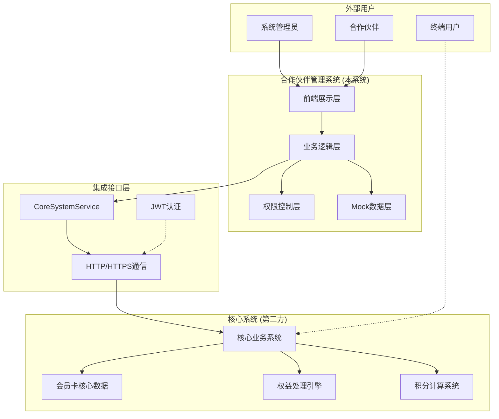
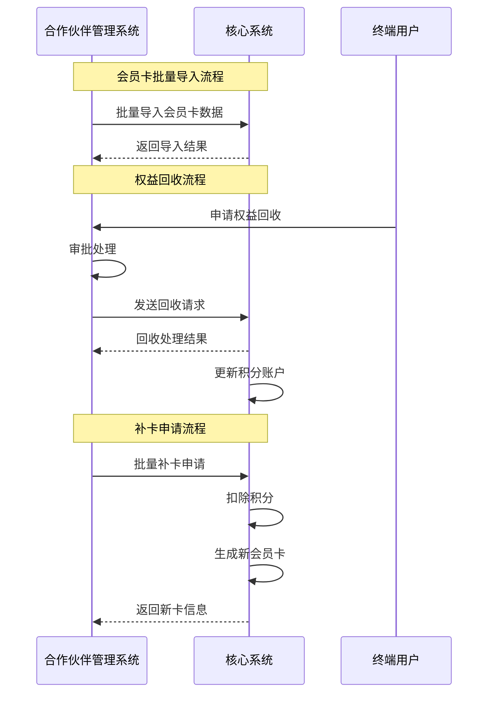
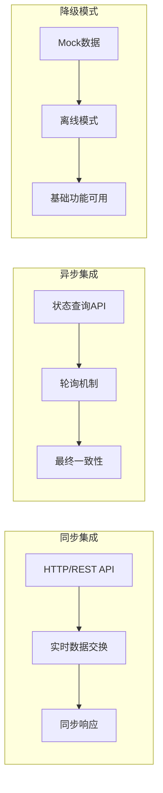
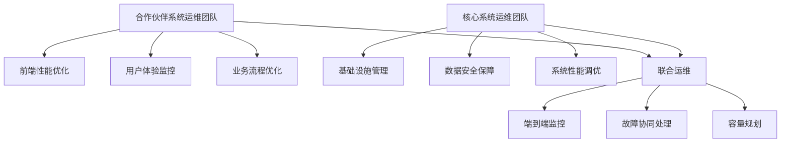

# 系统边界总结 - 合作伙伴管理系统 vs 核心系统

## 📋 文档概述

本文档基于已完成的技术文档、商业需求文档和架构设计文档，全面总结合作伙伴管理系统与核心系统（第三方）之间的系统边界、职责划分和集成关系。

---

## 🎯 系统定位与边界概览

### 系统边界图



---

## 🏢 职责边界划分

### 1. 合作伙伴管理系统（本系统）职责

#### 🎨 用户界面与交互
```typescript
interface PartnerSystemResponsibilities {
  // 前端展示职责
  presentation: {
    userInterface: "React + TypeScript + shadcn/ui"
    responsiveDesign: "多端适配，响应式布局"
    userExperience: "交互设计，用户体验优化"
    realTimeUpdates: "实时数据更新，状态同步"
  }
  
  // 权限控制职责
  accessControl: {
    roleBasedAccess: "基于角色的访问控制(RBAC)"
    featurePermissions: "功能级权限控制"
    dataIsolation: "合作伙伴数据隔离"
    sessionManagement: "用户会话管理"
  }
  
  // 业务流程管理职责
  businessProcess: {
    workflowOrchestration: "业务流程编排"
    approvalProcess: "权益回收审批流程"
    batchOperations: "批量操作管理"
    reportGeneration: "报表生成与展示"
  }
}
```

#### 🔐 权限与安全管理
- **用户认证**: JWT Token管理，登录状态维护
- **权限控制**: 细粒度功能权限控制（如 `cards:import` 仅管理员可用）
- **数据隔离**: 合作伙伴只能查看自己的数据
- **前端安全**: XSS防护，数据验证，安全传输

#### 📊 数据展示与分析
- **仪表板**: 业绩概览，数据可视化，趋势分析
- **报表系统**: 业绩报表，会员增长报表，财务报表
- **数据过滤**: 多维度数据筛选，搜索功能
- **实时更新**: 数据实时刷新，状态同步

#### 🔄 业务流程编排
- **权益回收审批**: 审批工作流，状态跟踪
- **批量操作管理**: 批量导入，批量处理进度跟踪
- **回收池管理**: 池状态管理，余额控制
- **分账管理**: 分账规则配置，结算状态跟踪

### 2. 核心系统（第三方）职责

#### 💾 核心数据存储
```typescript
interface CoreSystemResponsibilities {
  // 核心数据管理
  dataManagement: {
    membershipCards: "会员卡主数据存储"
    userAccounts: "用户账户信息管理"
    transactionRecords: "交易记录存储"
    pointsSystem: "积分系统管理"
  }
  
  // 业务规则引擎
  businessRules: {
    activationLogic: "激活逻辑验证"
    pointsCalculation: "积分计算规则"
    validityManagement: "有效期管理"
    statusTransition: "状态流转控制"
  }
  
  // 系统集成
  systemIntegration: {
    externalAPIs: "外部系统接口"
    dataSync: "数据同步机制"
    eventProcessing: "事件处理机制"
    notificationSystem: "消息通知系统"
  }
}
```

#### 🔨 核心业务逻辑
- **会员卡生命周期**: 创建、激活、绑定、过期、注销全流程
- **积分系统**: 积分计算、累积、消费、转换规则
- **权益计算**: 剩余权益计算、天数换算、积分转换
- **业务规则验证**: 激活条件验证、设备绑定验证

#### 🗄️ 主数据管理
- **会员卡主数据**: 卡号、密码、类型、状态等核心信息
- **用户账户**: 用户基本信息、绑定关系、账户状态
- **交易记录**: 激活记录、消费记录、权益变更记录
- **设备信息**: MAC地址、设备型号、绑定状态

#### ⚡ 实时处理能力
- **激活处理**: 实时激活验证和处理
- **状态更新**: 实时状态变更和通知
- **积分变动**: 实时积分计算和更新
- **事件触发**: 业务事件的实时响应

---

## 🔌 接口边界与集成

### 1. 数据流向边界



### 2. 核心集成接口

#### 🔄 从合作伙伴系统到核心系统的调用
```typescript
interface OutboundIntegration {
  // 会员卡管理类接口
  cardManagement: {
    "POST /cards/batch-import": "批量导入会员卡到核心系统"
    "GET /cards/batch-import/{batchId}/status": "查询导入状态"
  }
  
  // 权益处理类接口
  rightsProcessing: {
    "POST /rights/batch-recovery": "批量权益回收"
    "GET /rights/batch-recovery/{requestId}/status": "查询回收状态"
  }
  
  // 补卡申请类接口
  cardReplacement: {
    "POST /cards/replacement-request": "批量补卡申请"
    "GET /cards/replacement-request/{requestId}/status": "查询申请状态"
  }
  
  // 系统监控类接口
  systemMonitoring: {
    "GET /health": "系统健康检查"
  }
}
```

#### 📡 数据同步边界
- **实时同步**: 激活状态、积分变动等关键业务数据
- **批量同步**: 历史数据、统计数据的定期同步
- **事件驱动**: 基于业务事件的数据同步机制

### 3. 数据所有权边界

#### 🏢 合作伙伴管理系统拥有的数据
```typescript
interface PartnerSystemData {
  // 业务流程数据
  businessProcess: {
    approvalRecords: "审批记录"
    batchOperationLogs: "批量操作日志"
    recoveryPoolRecords: "回收池操作记录"
    sharingRules: "分账规则配置"
  }
  
  // 用户交互数据
  userInteraction: {
    loginSessions: "用户登录会话"
    uiPreferences: "用户界面偏好"
    operationLogs: "用户操作日志"
    dashboardConfigs: "仪表板配置"
  }
  
  // 报表分析数据
  analyticsData: {
    reportConfigurations: "报表配置"
    customQueries: "自定义查询"
    dataVisualizationSettings: "数据可视化设置"
  }
}
```

#### 🗄️ 核心系统拥有的数据
```typescript
interface CoreSystemData {
  // 核心业务数据
  coreBusinessData: {
    membershipCards: "会员卡主数据"
    userAccounts: "用户账户信息"
    pointsBalances: "积分余额"
    transactionHistory: "交易历史记录"
  }
  
  // 系统运行数据
  systemRuntimeData: {
    activationLogs: "激活日志"
    systemEvents: "系统事件"
    performanceMetrics: "性能指标"
    errorLogs: "错误日志"
  }
}
```

---

## ⚡ 性能边界与约束

### 1. 响应时间边界

| 操作类型 | 合作伙伴系统要求 | 核心系统要求 | 说明 |
|----------|------------------|--------------|------|
| **页面加载** | < 2秒 | N/A | 前端首屏加载时间 |
| **数据查询** | < 500ms | < 1秒 | API响应时间 |
| **批量导入** | 30秒超时 | 按批量大小 | 单次最多1000张卡 |
| **权益回收** | 30秒超时 | < 2秒 | 单次处理多张卡 |
| **补卡申请** | 30秒超时 | 按申请数量 | 积分扣除+卡片生成 |

### 2. 数据量边界

```typescript
interface CapacityLimits {
  // 合作伙伴系统限制
  partnerSystem: {
    maxCardsPerBatch: 1000        // 单次批量导入上限
    maxConcurrentUsers: 100       // 并发用户数上限
    maxRetentionDays: 90         // 操作日志保留天数
    maxReportRows: 10000         // 报表最大行数
  }
  
  // 核心系统限制
  coreSystem: {
    maxCardsPerPartner: 1000000   // 单个合作伙伴卡片上限
    maxAPIRequestsPerMinute: 1000 // API请求频率限制
    maxBatchProcessingTime: 300   // 批量处理最大时间(秒)
  }
}
```

### 3. 可用性边界

#### 🔄 故障处理机制
```typescript
interface FailureHandling {
  // 合作伙伴系统
  partnerSystem: {
    fallbackToMock: "核心系统不可用时降级到Mock数据"
    cacheStrategy: "缓存重要数据，离线可用"
    userNotification: "及时通知用户系统状态"
    operationQueue: "操作队列，系统恢复后重试"
  }
  
  // 核心系统
  coreSystem: {
    highAvailability: "99.9%可用性保证"
    dataBackup: "数据备份与恢复机制"
    loadBalancing: "负载均衡，分布式部署"
    errorHandling: "优雅的错误处理和响应"
  }
}
```

---

## 🔐 安全边界与责任

### 1. 安全职责划分

#### 🛡️ 合作伙伴管理系统安全责任
```typescript
interface PartnerSystemSecurity {
  // 前端安全
  frontendSecurity: {
    xssProtection: "XSS攻击防护"
    csrfProtection: "CSRF攻击防护"
    inputValidation: "用户输入验证"
    secureStorage: "敏感数据安全存储"
  }
  
  // 认证授权
  authenticationAuthorization: {
    userAuthentication: "用户身份认证"
    sessionManagement: "会话管理"
    roleBasedAccess: "基于角色的访问控制"
    permissionValidation: "权限验证"
  }
  
  // 通信安全
  communicationSecurity: {
    httpsTransmission: "HTTPS安全传输"
    tokenManagement: "JWT Token管理"
    apiSecurityHeaders: "安全请求头设置"
  }
}
```

#### 🔒 核心系统安全责任
```typescript
interface CoreSystemSecurity {
  // 数据安全
  dataSecurity: {
    dataEncryption: "敏感数据加密存储"
    dataBackup: "数据备份安全"
    dataIntegrity: "数据完整性保证"
    accessLogging: "数据访问审计日志"
  }
  
  // 系统安全
  systemSecurity: {
    infrastructureSecurity: "基础设施安全"
    networkSecurity: "网络安全防护"
    intrustionDetection: "入侵检测系统"
    securityPatching: "安全补丁管理"
  }
  
  // 业务安全
  businessSecurity: {
    transactionSecurity: "交易安全保证"
    antiFreud: "反欺诈机制"
    riskControl: "风险控制系统"
  }
}
```

### 2. 数据安全边界

#### 📋 数据分类与保护
| 数据类型 | 敏感级别 | 负责系统 | 保护措施 |
|----------|----------|----------|----------|
| **用户密码** | 极高 | 核心系统 | 加密存储，不可逆 |
| **会员卡密** | 高 | 核心系统 | 加密存储，传输加密 |
| **手机号** | 高 | 核心系统 | 脱敏显示，加密存储 |
| **MAC地址** | 中 | 核心系统 | 哈希处理 |
| **操作日志** | 中 | 合作伙伴系统 | 定期清理，访问控制 |
| **业绩数据** | 中 | 合作伙伴系统 | 权限隔离，数据脱敏 |

---

## 🔄 集成模式与依赖

### 1. 集成架构模式



### 2. 依赖关系分析

#### 🔗 合作伙伴系统对核心系统的依赖
```typescript
interface SystemDependencies {
  // 强依赖（必须可用）
  criticalDependencies: {
    userAuthentication: "用户登录认证依赖核心系统"
    cardActivation: "会员卡激活必须调用核心系统"
    realTimeBalance: "实时积分查询依赖核心系统"
  }
  
  // 弱依赖（可降级）
  softDependencies: {
    batchOperations: "批量操作失败可重试"
    reportGeneration: "报表可使用缓存数据"
    statisticsData: "统计数据可延迟更新"
  }
  
  // 无依赖（独立功能）
  independentFeatures: {
    userInterface: "界面展示独立"
    permissionControl: "权限控制自主"
    workflowManagement: "审批流程自主"
    configurationManagement: "配置管理自主"
  }
}
```

### 3. 容错与降级策略

#### ⚡ 系统降级机制
```typescript
interface DegradationStrategy {
  // 核心系统不可用时的降级策略
  coreSystemUnavailable: {
    level1: "使用Mock数据保证基础展示功能"
    level2: "缓存最后一次成功的数据"
    level3: "仅提供配置和审批等离线功能"
    level4: "显示系统维护页面"
  }
  
  // 部分接口故障时的处理
  partialFailure: {
    retryMechanism: "自动重试机制，3次失败后放弃"
    alternativeData: "使用备选数据源"
    userNotification: "向用户展示友好错误信息"
    operationQueue: "将操作加入队列，稍后重试"
  }
}
```

---

## 📊 监控与运维边界

### 1. 监控职责分工

#### 📈 合作伙伴系统监控
```typescript
interface PartnerSystemMonitoring {
  // 前端性能监控
  frontendMetrics: {
    pageLoadTime: "页面加载时间监控"
    userInteractionResponse: "用户交互响应时间"
    jsErrors: "JavaScript错误监控"
    apiResponseTime: "API调用响应时间"
  }
  
  // 用户行为监控
  userBehavior: {
    userJourney: "用户行为路径分析"
    featureUsage: "功能使用统计"
    errorRate: "用户操作错误率"
  }
  
  // 业务指标监控
  businessMetrics: {
    approvalEfficiency: "审批效率监控"
    batchOperationSuccess: "批量操作成功率"
    userSatisfaction: "用户满意度指标"
  }
}
```

#### 🔧 核心系统监控
```typescript
interface CoreSystemMonitoring {
  // 系统性能监控
  systemPerformance: {
    cpuUtilization: "CPU使用率"
    memoryUsage: "内存使用情况"
    diskIO: "磁盘IO性能"
    networkLatency: "网络延迟"
  }
  
  // 业务处理监控
  businessProcessing: {
    activationSuccessRate: "激活成功率"
    transactionThroughput: "交易处理吞吐量"
    dataConsistency: "数据一致性检查"
  }
  
  // 安全监控
  securityMonitoring: {
    unauthorizedAccess: "未授权访问尝试"
    suspiciousActivity: "可疑活动检测"
    dataBreachAttempts: "数据泄露尝试"
  }
}
```

### 2. 运维协作模式

#### 🤝 运维协作流程


---

## 📋 总结与建议

### 🎯 边界划分原则

1. **职责单一原则**: 每个系统专注于自己的核心职责
2. **数据所有权明确**: 避免数据重复和不一致
3. **接口标准化**: 使用标准的RESTful API进行集成
4. **故障隔离**: 单个系统故障不影响其他系统核心功能
5. **安全责任明确**: 各系统承担相应的安全责任

### 🔮 未来演进方向

#### 📈 架构演进建议
```typescript
interface ArchitectureEvolution {
  // 短期优化 (3-6个月)
  shortTerm: {
    enhanceMonitoring: "增强系统监控和告警"
    improveErrorHandling: "优化错误处理机制"
    performanceOptimization: "性能优化和调优"
  }
  
  // 中期演进 (6-12个月)
  mediumTerm: {
    microservicesTransition: "向微服务架构演进"
    eventDrivenArchitecture: "引入事件驱动模式"
    apiGateway: "统一API网关管理"
  }
  
  // 长期规划 (1-2年)
  longTerm: {
    cloudNativeTransformation: "云原生架构转型"
    aiDataAnalytics: "AI驱动的数据分析"
    crossPlatformExpansion: "跨平台扩展支持"
  }
}
```

### ⚠️ 关键风险与应对

1. **依赖风险**: 核心系统故障影响业务连续性
   - **应对**: 完善降级机制，增强Mock数据能力

2. **数据一致性风险**: 分布式系统数据不一致
   - **应对**: 建立数据同步机制和一致性检查

3. **性能风险**: 系统间调用延迟累积
   - **应对**: 优化接口性能，实现异步处理

4. **安全风险**: 系统间通信安全隐患
   - **应对**: 强化认证机制，加密敏感数据传输

---

**文档维护者**: 架构团队  
**文档版本**: v1.0.0  
**最后更新**: 2024-09-16  
**审核状态**: 已审核