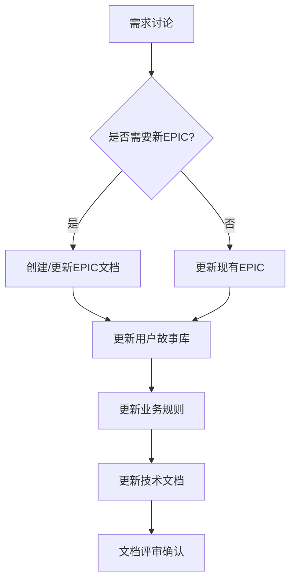

# 产品经理协作框架 - 需求与开发协作指南

## 📋 概述

本文档定义了产品经理、AI助手和技术团队之间的协作流程，确保需求沟通、文档更新和开发工作的顺畅进行。

## 🎯 协作原则

### 1. 单一信息源原则
- **EPIC文档**：功能范围和业务价值定义
- **用户故事库**：具体功能需求和验收标准
- **业务规则文档**：系统行为约束和验证逻辑
- **技术文档**：实现方案和架构设计

### 2. 版本控制原则
- 所有文档使用语义化版本号
- 变更记录必须完整可追溯
- 相关文档版本需要同步更新

### 3. 渐进式细化原则
- 从业务目标 → EPIC → 用户故事 → 技术实现
- 每个阶段都有明确的交付物和验收标准

## 🔄 协作流程

### 阶段一：需求讨论和澄清

#### 1.1 需求提出格式
```markdown
**需求背景**：
- 业务目标：解决什么问题？
- 用户痛点：当前存在什么问题？
- 预期价值：期望达到什么效果？

**功能范围**：
- 核心功能：必须实现的功能点
- 扩展功能：可以后续实现的功能
- 排除功能：明确不包含的功能

**约束条件**：
- 技术约束：系统架构限制
- 业务约束：业务流程限制
- 时间约束：上线时间要求
```

#### 1.2 讨论要点检查清单
- [ ] 需求是否与现有EPIC对齐？
- [ ] 是否需要创建新的用户故事？
- [ ] 是否需要更新业务规则？
- [ ] 技术可行性是否评估？
- [ ] 优先级是否明确？

### 阶段二：文档更新和确认

#### 2.1 文档更新顺序


#### 2.2 文档更新检查清单
- [ ] EPIC文档的业务价值描述清晰
- [ ] 用户故事验收标准可验证
- [ ] 业务规则编号连续且完整
- [ ] 技术需求与业务规则一致
- [ ] 版本信息和变更记录已更新

### 阶段三：开发任务分解

#### 3.1 任务分解模板
```markdown
## 开发任务分解 - [EPIC名称]

### 前端开发任务
- [ ] 页面组件开发
- [ ] 数据接口对接
- [ ] 用户交互实现
- [ ] 样式和响应式适配

### 后端开发任务
- [ ] 数据模型设计
- [ ] API接口开发
- [ ] 业务逻辑实现
- [ ] 数据验证和安全

### 测试任务
- [ ] 单元测试编写
- [ ] 集成测试验证
- [ ] 端到端测试
- [ ] 性能测试
```

#### 3.2 进度跟踪指标
- **文档完成度**：相关文档是否已更新
- **技术设计完成度**：技术方案是否明确
- **开发完成度**：功能实现进度
- **测试完成度**：测试覆盖率和通过率

## 💬 沟通协议

### 1. 需求讨论沟通模板

#### 1.1 新功能需求讨论
```markdown
**产品经理提问格式**：

【需求背景】
- 业务目标：[具体目标]
- 用户痛点：[具体问题]
- 预期价值：[量化指标]

【功能需求】
- 核心功能：[功能点列表]
- 用户角色：[涉及的用户类型]
- 优先级：[P0/P1/P2]

【技术约束】
- 现有系统限制：[已知约束]
- 集成要求：[外部系统集成]
- 性能要求：[响应时间等]

请分析：
1. 是否需要创建新的EPIC？
2. 需要哪些用户故事？
3. 业务规则是否需要更新？
4. 技术可行性评估？
```

#### 1.2 功能优化需求讨论
```markdown
**产品经理提问格式**：

【优化目标】
- 当前问题：[具体问题描述]
- 优化方案：[建议的解决方案]
- 预期效果：[改进指标]

【影响范围】
- 涉及模块：[系统模块列表]
- 用户影响：[用户体验变化]
- 数据影响：[数据结构和流程]

【约束条件】
- 兼容性要求：[是否向后兼容]
- 迁移方案：[数据迁移计划]
- 回滚计划：[出现问题时的应对]
```

### 2. 进度同步沟通模板

#### 2.1 开发进度同步
```markdown
**AI助手进度报告格式**：

【本周进展】
- 已完成：[具体完成的任务]
- 进行中：[当前正在进行的任务]
- 遇到的问题：[需要协助的问题]

【下周计划】
- 计划任务：[下周要完成的任务]
- 依赖条件：[完成计划的前提]
- 风险预警：[可能影响进度的风险]

【文档更新】
- 已更新文档：[文档列表和版本]
- 待更新文档：[需要更新的文档]
- 文档评审：[需要产品经理确认的内容]
```

#### 2.2 问题解决沟通
```markdown
**问题描述格式**：

【问题概述】
- 问题现象：[具体表现]
- 重现步骤：[如何重现问题]
- 影响范围：[影响的功能和用户]

【技术分析】
- 根本原因：[技术层面的原因]
- 解决方案：[建议的解决方式]
- 替代方案：[备选方案]

【决策需求】
- 需要确认：[需要产品经理决策的事项]
- 时间要求：[解决的时间限制]
- 资源需求：[需要的人力或技术资源]
```

## 📊 文档管理体系

### 1. 文档关联关系

#### 1.1 核心文档关联矩阵
```markdown
| 文档类型 | 关联文档 | 关联方式 | 更新触发条件 |
|---------|---------|---------|-------------|
| EPIC文档 | 用户故事库 | 用户故事引用 | EPIC范围变更 |
| EPIC文档 | 业务规则 | 业务规则引用 | 业务逻辑变更 |
| 用户故事 | 业务规则 | 验收标准依赖 | 功能需求变更 |
| 技术文档 | EPIC文档 | 技术实现对应 | 技术方案变更 |
```

#### 1.2 文档版本同步规则
- **主版本变更**：业务目标或架构重大调整
- **次版本变更**：功能范围或业务规则变更
- **修订版本变更**：技术实现或文档优化

### 2. 文档质量检查

#### 2.1 完整性检查
```markdown
EPIC文档检查项：
- [ ] 业务价值描述清晰
- [ ] 功能范围明确（包含/排除）
- [ ] 用户故事映射完整
- [ ] 业务规则引用正确
- [ ] 技术需求具体可行

用户故事检查项：
- [ ] 角色-功能-价值格式正确
- [ ] 验收标准可验证
- [ ] 优先级明确
- [ ] 状态跟踪准确
```

#### 2.2 一致性检查
```markdown
跨文档一致性：
- [ ] EPIC与用户故事优先级一致
- [ ] 业务规则编号连续且存在
- [ ] 技术实现与业务需求匹配
- [ ] 文档版本信息同步
```

## 🚀 具体协作场景

### 场景一：新功能开发

#### 1.1 产品经理发起
```markdown
我想开发一个【功能名称】功能：

**业务背景**：解决用户【具体问题】，提升【业务指标】
**核心功能**：[功能点1]、[功能点2]、[功能点3]
**用户角色**：[角色A]、[角色B]
**优先级**：P1（希望在【时间】前上线）

请分析：
1. 是否需要新的EPIC？还是可以归入现有EPIC？
2. 需要创建哪些用户故事？
3. 业务规则需要哪些更新？
```

#### 1.2 AI助手响应
```markdown
**分析结果**：

1. **EPIC归属**：建议【创建新EPIC/归入现有EPIC】
   - 理由：[分析依据]
   - EPIC编号：[建议编号]

2. **用户故事需求**：需要【数量】个新用户故事
   - US-XXX: [故事描述]
   - US-YYY: [故事描述]

3. **业务规则更新**：需要更新【规则数量】条业务规则
   - BR-ZZZ: [规则描述]

4. **技术可行性**：[技术评估结果]

**下一步行动**：
- [ ] 创建/更新EPIC文档
- [ ] 更新用户故事库
- [ ] 更新业务规则文档
- [ ] 技术方案设计
```

### 场景二：功能优化

#### 2.1 产品经理发起
```markdown
现有功能【功能名称】需要优化：

**当前问题**：[具体问题描述]
**优化目标**：[期望达到的效果]
**影响范围**：[涉及的用户和功能]

**约束条件**：
- 必须保持向后兼容
- 不能影响现有用户数据
- 上线时间要求：[具体时间]

请分析优化方案的技术可行性。
```

#### 2.2 AI助手响应
```markdown
**技术分析**：

1. **可行性评估**：[可行/需要调整/不可行]
   - 技术难点：[具体技术挑战]
   - 解决方案：[建议的解决方式]

2. **影响分析**：
   - 数据影响：[数据结构变化]
   - 性能影响：[系统性能变化]
   - 用户影响：[用户体验变化]

3. **实施建议**：
   - 推荐方案：[具体实施步骤]
   - 风险预警：[可能的风险]
   - 回滚方案：[出现问题时的应对]

**文档更新需求**：
- [ ] 更新相关用户故事验收标准
- [ ] 更新业务规则（如需要）
- [ ] 更新技术文档
```

## 📈 协作效果评估

### 1. 协作效率指标
- **需求澄清时间**：从提出需求到明确方案的时间
- **文档更新及时性**：需求确认后文档更新的速度
- **开发启动时间**：从文档就绪到开发开始的时间

### 2. 质量指标
- **需求变更率**：开发过程中需求变更的频率
- **文档一致性**：相关文档之间的一致性程度
- **开发返工率**：因需求不明确导致的返工情况

### 3. 持续改进
- **定期回顾**：每月进行协作流程回顾
- **问题收集**：收集协作过程中的痛点
- **流程优化**：基于反馈持续改进协作流程

---

**文档版本**: v1.0  
**创建日期**: 2025-01-28  
**维护人**: 产品经理  
**下次评审**: 2025-02-28

## 🔗 相关文档
- [产品经理技能指南](./PRODUCT_MANAGER_SKILLS.md)
- [用户故事库](./USER_STORIES.md)
- [EPIC文档](./EPICS/)
- [业务规则文档](../business/BUSINESS_RULES.md)