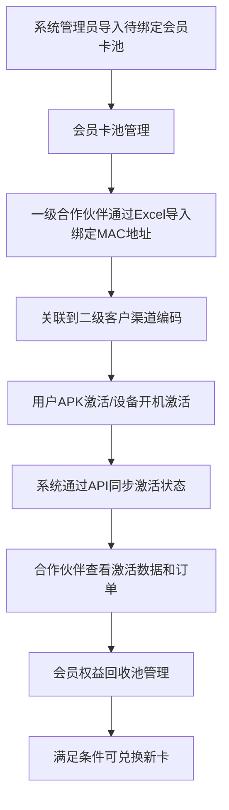

# 完整版产品需求文档 - 合作伙伴管理系统 MVP第一期

## 📋 文档概述

### 文档目的
本文档整合了MVP第一期的所有产品需求，包括业务需求、市场需求、产品功能、技术实现、用户故事等完整内容，为业务和研发团队提供统一的沟通基础。

### 文档范围
- **业务范围**：会员卡预售全生命周期管理
- **功能范围**：会员卡池管理→设备绑定→激活跟踪→订单管理
- **技术范围**：React + TypeScript + Vite技术栈
- **时间范围**：12周MVP开发周期

### 目标读者
- 业务团队：理解产品价值和业务逻辑
- 研发团队：明确技术实现和开发要求
- 测试团队：制定测试计划和验收标准
- 项目管理：跟踪进度和风险管理

---

## 🎯 第一部分：业务需求 (BRD)

### 1.1 业务背景和目标

#### 业务背景
合作伙伴管理系统旨在为会员卡预售业务提供完整的全生命周期管理解决方案，主要解决以下业务问题：

1. **会员卡预售管理**：支持渠道方案商和酒店运营商的会员卡预售业务
2. **设备绑定管理**：基于MAC地址的设备绑定，支持酒店客户为房间电视设备预绑定会员卡
3. **激活状态跟踪**：通过API接口与外部系统同步APK激活和设备开机激活状态
4. **订单管理透明化**：合作伙伴可查看激活订单和订阅订单，支持线下对账
5. **会员权益回收池**：支持会员卡权益回收和再次兑换，形成业务闭环

#### 业务目标
- **提高运营效率**：自动化会员卡管理、设备绑定、激活跟踪流程
- **增强合作伙伴体验**：提供直观的业务数据查看和统计功能
- **降低运营成本**：减少人工干预，提高数据处理准确性
- **支持业务扩展**：灵活的分级合作伙伴管理体系

### 1.2 目标用户画像（基于RBAC多角色权限设计）

#### 平台方（超级管理员）
- **业务定位**：系统最高权限管理者，负责全局业务管理和风控
- **核心职责**：全局系统管理、角色权限配置、会员权益回收池管理、所有数据查看
- **权限范围**：完整系统访问权限，无数据限制
- **使用场景**：系统配置、权限管理、会员权益回收池管理、全局业务监控
- **核心功能**：角色权限配置、会员权益回收池管理、全局数据查看、系统参数配置

#### 会员卡代理商
- **业务定位**：代理销售/管理会员卡业务，负责卡池导入、设备绑定和权益回收
- **核心职责**：会员卡池管理、设备绑定、激活订单查看、会员权益回收池管理（仅限自有数据）
- **权限范围**：只能查看和管理自己导入的卡池、绑定的设备、相关的激活订单、自有设备的权益回收
- **使用场景**：会员卡池导入、MAC地址绑定、激活订单查看、设备管理、权益回收和兑换
- **核心功能**：会员卡池管理、设备绑定、激活订单查看、会员权益回收池管理
- **特点**：不一定参与用户订阅分账，部分代理商只做卡业务，但拥有自有设备的权益回收和兑换权限

#### 渠道分账角色
- **业务定位**：仅参与用户订阅后的分账结算，负责收益核对
- **核心职责**：订阅订单查看、分账明细导出（仅限自有渠道）
- **权限范围**：只能查看自己渠道的订阅订单和分账明细
- **使用场景**：订阅订单查询、分账数据导出、收益核对
- **核心功能**：订阅订单查看、分账明细导出
- **特点**：不一定有会员卡代理权限，部分渠道只做用户运营分账

#### 混合角色（代理商+分账）
- **业务定位**：既代理会员卡业务，也参与用户订阅分账
- **核心职责**：同时具备代理商和分账角色的全部权限
- **权限范围**：会员卡代理权限 + 渠道分账权限的完整组合
- **使用场景**：完整的业务操作，从卡池导入到分账核对的完整流程
- **核心功能**：会员卡池管理、设备绑定、订阅订单查看、分账明细导出

#### 二级客户/硬件厂商
- **业务定位**：仅提供硬件或对接服务，不直接操作系统
- **核心职责**：仅查看自身相关设备状态，无直接操作权限
- **权限范围**：仅能查看自身相关设备状态，通过代理商或分账角色间接参与
- **使用场景**：设备状态查看、通过代理商代操作
- **核心功能**：设备状态查看

### 1.3 核心业务流程

#### 会员卡全生命周期管理流程


### 1.4 关键业务规则

#### 会员卡分配机制
- **导入方式**：系统管理员导入待绑定会员卡池
- **绑定方式**：一级合作伙伴通过Excel导入绑定MAC地址
- **操作支持**：批量导入和单个操作都支持
- **流程**：二级客户提供MAC地址，一级代理代操作

#### 设备绑定规则
- **绑定方式**：一个MAC地址可绑定多张会员卡
- **操作支持**：批量导入和单个绑定
- **回收限制**：单个MAC地址最多回收3次

#### 激活状态同步
- **同步方式**：通过API接口与外部系统对接
- **同步时机**：实时/准实时同步
- **数据来源**：APK激活和酒店设备开机激活

#### 数据权限管理
- **权限原则**：上级可查看下级数据，同级数据隔离
- **安全控制**：用户敏感信息和卡密采用中间部分星号替代

#### 订单管理规则
- **激活订单**：会员卡兑换激活的订单，不参与分账，用于与有会员卡业务的渠道商对数
- **订阅订单**：最终用户的前端APK自主行为产生的订单，参与分账，按金额和比例分账给渠道合作伙伴
- **导出功能**：支持Excel导出，用于线下对账和分账核对

#### 会员权益回收池
- **回收方式**：批量/单条MAC地址回收
- **累计逻辑**：回收天数累计到分类权益池
- **兑换规则**：满足条件（如年卡365天）可兑换新卡

---

## 📊 第二部分：市场需求 (MRD)

### 2.1 市场分析

#### 目标市场概况
- **市场规模**：企业级合作伙伴管理软件市场年增长率15%
- **主要客户**：中大型企业，特别是拥有分销渠道的企业
- **地域分布**：主要集中在经济发达地区

#### 竞争分析
| 竞争对手 | 优势 | 劣势 | 市场份额 |
|---------|------|------|----------|
| Salesforce Partner | 品牌知名度高，功能全面 | 价格昂贵，定制复杂 | 35% |
| HubSpot Partner Hub | 用户体验好，集成性强 | 功能相对简单 | 25% |
| 定制开发方案 | 完全定制，贴合需求 | 开发周期长，成本高 | 20% |
| 其他解决方案 | 价格有优势 | 功能不完善 | 20% |

### 2.2 产品定位

#### 价值主张
**"简单、高效、透明的合作伙伴管理平台"**

#### 差异化优势
1. **专业化会员卡管理**：支持会员卡预售全生命周期管理
2. **设备绑定自动化**：基于MAC地址的批量绑定功能
3. **成本优势**：相比竞品更具价格竞争力
4. **快速部署**：标准化产品，快速上线

### 2.3 市场策略

#### 定价策略
- **基础版**：满足中小型企业基本需求
- **专业版**：包含高级报表和分析功能
- **企业版**：完全定制化解决方案

#### 推广策略
1. **内容营销**：行业白皮书、案例分享
2. **渠道合作**：与技术合作伙伴建立合作关系
3. **客户推荐**：建立客户推荐奖励机制

---

## 🚀 第三部分：产品功能需求 (PRD)

### 3.1 功能架构

#### 3.1.1 左侧菜单结构设计（基于角色权限）

##### 系统管理员（平台方） - 完整功能视图
```
🏠 工作台
├── 系统概览

📦 会员卡中心
├── 卡池管理
│   ├── 库存概览
│   └── 会员卡导入
└── 权益管理
    └── 回收与兑换

🔄 设备管理
└── 绑定管理
    └── MAC地址导入

⚡ 激活中心
├── 激活统计
├── 异常处理
└── 批量查询

💰 订单中心
├── 激活订单
│   ├── 订单查询
│   └── 订单详情
├── 订阅订单
│   ├── 订单查询
│   ├── 订单导出
│   └── 分账管理
└── 订单统计

📊 数据洞察
├── 业务概览
├── 激活分析
└── 财务对账

⚙️ 系统管理
├── 平台配置
├── 渠道管理
├── 权限管理
└── 用户管理
```

##### 一级渠道（合作伙伴） - 业务操作视图
```
🏠 工作台
└── 我的业务概览

📦 会员卡中心
├── 我的卡池
└── 权益管理
    └── 我的回收

🔄 设备管理
└── 绑定管理
    └── MAC地址导入

⚡ 激活中心
└── 我的激活

💰 订单中心
├── 激活订单
│   └── 我的订单
├── 订阅订单
│   ├── 我的订单
│   ├── 订单导出
│   └── 我的分账
└── 订单统计

📊 数据洞察
├── 我的业务
└── 我的激活分析
```

##### 渠道分账客户 - 财务对账视图
```
💰 订阅订单
├── 订单查询
├── 订单导出
└── 分账核对

📊 财务对账
└── 对账汇总
```

##### 二级客户 - 无访问权限

### 3.2 核心功能模块

#### 3.2.1 会员卡管理系统

**会员卡类型与状态**
- **会员卡类型**: REGULAR(普通), BOUND(绑定)
- **会员卡状态**: PENDING_BIND(待绑定), BOUND(已绑定), ACTIVE(激活), EXPIRED(已过期), CANCELLED(已销卡)

**核心功能**
- **会员卡池管理**：系统管理员导入待绑定会员卡池，建立会员卡库存
- **Excel导入绑定**：一级合作伙伴通过Excel模板导入MAC地址绑定
- **会员卡列表**：支持搜索、筛选、分页
- **会员卡详情**：查看详细信息和管理历史
- **批量操作**：支持导入、导出、批量状态变更

**Excel模板设计规范**
- **固定列名顺序**：MAC地址、渠道编码、备注信息
- **MAC地址校验**：标准MAC地址格式验证（6组十六进制数）
- **数据校验规则**：重复检查、渠道编码验证、数据完整性
- **错误处理机制**：绑定失败时给出MAC地址和原因，支持下载错误报告

#### 3.2.2 设备绑定管理系统

**设备绑定流程**
1. 系统管理员导入待绑定会员卡池
2. 一级代理通过Excel导入MAC地址进行绑定
3. 系统自动关联到二级客户渠道编码
4. 记录绑定关系并更新会员卡状态
5. 支持批量导入和单个操作

**设备管理功能**
- **MAC地址绑定**：支持单个和批量MAC地址绑定
- **设备状态跟踪**：实时跟踪设备绑定和激活状态
- **绑定历史记录**：查看设备绑定和变更历史
- **权限控制**：各层级合作伙伴只能管理自己权限范围内的设备

#### 3.2.3 激活中心（设备激活的专业运营与监控中心）

**激活中心定位**
- **核心价值**：提供设备激活的全局监控和专业运营能力
- **功能定位**：设备激活的专业运营与监控中心，与订单管理中的激活订单形成互补
- **用户群体**：系统管理员、运营人员

**激活中心核心功能**
- **激活统计仪表盘**：激活率、趋势、渠道对比分析
- **异常激活管理**：检测、处理激活失败等异常情况
- **批量激活查询**：批量查看激活状态，支持数据导出
- **激活趋势分析**：时间序列分析，激活状态监控

**与订单管理中的激活订单关系**
- **激活中心**：提供设备激活的全局监控和专业运营能力
- **订单管理中的激活订单**：专注于与渠道商的激活订单对数需求
- **协同价值**：激活中心提供更深入的激活分析，订单管理满足对数需求

#### 3.2.4 订单管理系统

**订单类型定义**
- **激活订单 (ACTIVATION)**：会员卡兑换激活的订单，不参与分账，用于与有会员卡业务的渠道商对数
- **订阅订单 (SUBSCRIPTION)**：最终用户的前端APK自主行为产生的订单，参与分账，按金额和比例分账给渠道合作伙伴

**订单管理功能**
- **激活订单管理**：
  - **订单查询**：支持激活订单查询，按时间、渠道、MAC等条件筛选
  - **订单对数**：用于与渠道商进行激活订单对数
  - **权限控制**：系统管理员和一级渠道可查看相关激活订单

- **订阅订单管理**：
  - **订单查询**：支持订阅订单查询，按时间、渠道等条件筛选
  - **订单导出**：支持Excel格式导出订阅订单数据，用于财务分账核对
  - **分账管理**：按金额和比例分账给渠道合作伙伴
  - **权限控制**：系统管理员、一级渠道、渠道分账客户可查看相关订阅订单

- **信息脱敏**：用户敏感信息和卡密采用中间部分星号替代展示

#### 3.2.5 会员权益回收池系统

**回收规则**
- **回收方式**：支持批量/单条MAC地址回收
- **回收限制**：单个设备MAC地址限制回收次数为3次
- **累计逻辑**：回收的权益按天数累计到分类权益池
- **兑换规则**：满足条件（如年卡365天）可兑换新卡

**回收池功能**
- **回收操作**：一级代理通过Excel导入进行回收操作
- **状态监控**：实时监控回收池状态和使用情况
- **兑换管理**：支持权益兑换和会员卡生成

### 3.3 技术需求

#### 3.3.1 性能要求
- **页面加载**：首屏加载时间 ≤ 3秒
- **API响应**：接口响应时间 ≤ 2秒
- **并发支持**：支持1000+并发用户
- **数据量**：支持千万级数据存储

#### 3.3.2 安全要求
- **数据加密**：敏感数据AES-256加密
- **权限控制**：基于角色的访问控制
- **审计日志**：完整的操作审计记录
- **传输安全**：HTTPS/TLS加密传输
- **信息脱敏**：用户敏感信息和卡密采用星号替代

#### 3.3.3 兼容性要求
- **浏览器支持**：Chrome 90+, Firefox 88+, Safari 14+, Edge 90+
- **移动端支持**：iOS 14+, Android 10+
- **分辨率支持**：320px - 2560px

---

## 📈 第四部分：EPIC和用户故事

### 4.1 EPIC定义

#### EPIC-001: 会员卡全生命周期管理 (CARD_LIFECYCLE)
**描述**: 支持会员卡从导入、绑定、激活到回收的完整生命周期管理
**优先级**: P0 | **预估工时**: 4周

#### EPIC-002: 设备绑定管理 (DEVICE_BINDING)
**描述**: 基于MAC地址的设备绑定和状态跟踪
**优先级**: P0 | **预估工时**: 3周

#### EPIC-003: 权限管理系统 (PERMISSION_MANAGEMENT)
**描述**: 分级权限控制和数据隔离
**优先级**: P0 | **预估工时**: 2周

#### EPIC-004: 激活状态跟踪 (ACTIVATION_TRACKING)
**描述**: API接口状态同步和激活数据统计
**优先级**: P0 | **预估工时**: 2周

#### EPIC-005: 订单管理系统 (ORDER_MANAGEMENT)
**描述**: 订单查询、导出和信息脱敏
**优先级**: P0 | **预估工时**: 2周

### 4.2 核心用户故事 (P0优先级)

#### US-001: 查看会员卡列表
**作为** 合作伙伴
**我想要** 查看我管理的会员卡列表
**以便于** 了解会员卡的整体状态

#### US-002: Excel导入绑定MAC地址
**作为** 一级合作伙伴
**我想要** 通过Excel模板导入MAC地址进行绑定
**以便于** 批量管理设备绑定关系

#### US-003: 查看激活状态
**作为** 合作伙伴
**我想要** 查看会员卡的激活状态
**以便于** 了解业务运营情况

#### US-004: 订单查询和导出
**作为** 合作伙伴
**我想要** 查询和导出订单数据
**以便于** 进行线下对账和分析

#### US-005: 权限范围内的数据查看
**作为** 合作伙伴
**我想要** 只能查看我权限范围内的数据
**以便于** 保护业务数据安全

---

## 📅 第五部分：MVP实施计划

### 5.1 MVP阶段性里程碑

#### 里程碑1：会员卡预售和设备绑定 (第8周)
**核心能力**: 支持完整的会员卡预售和设备绑定业务流程
- ✅ **会员卡池管理**：系统管理员导入待绑定会员卡池
- ✅ **Excel导入绑定**：一级合作伙伴通过Excel模板导入MAC地址绑定
- ✅ **权限分级**：支持渠道方案商、酒店运营商的分级权限
- ✅ **会员权益回收池基础**：支持回收功能基础结构

#### 里程碑2：激活状态跟踪和订单管理 (第10周)
**核心能力**: 提供完整的激活状态跟踪和订单管理功能
- ✅ **激活状态同步**：通过API接口与外部系统同步激活状态
- ✅ **订单管理**：支持激活订单和订阅订单的查询、导出
- ✅ **数据权限隔离**：各层级合作伙伴只能查看自己权限范围内的数据
- ✅ **数据安全**：用户敏感信息和卡密采用星号替代展示

#### 里程碑3：系统稳定性和性能优化 (第12周)
**核心能力**: 确保系统稳定运行和良好用户体验
- ✅ **性能优化**：页面加载时间≤3秒，API响应时间≤2秒
- ✅ **数据准确性**：关键业务数据准确性≥99.9%
- ✅ **用户体验**：界面简洁直观，操作流程顺畅
- ✅ **权限控制**：完整的角色权限管理体系

### 5.2 开发资源规划

#### 前端开发 (4人)
- React + TypeScript开发
- 组件库和UI设计
- 用户体验优化

#### 后端开发 (3人)
- API接口开发
- 数据库设计和优化
- 系统集成

#### 测试团队 (2人)
- 功能测试和验收测试
- 性能测试和安全测试
- 用户验收测试

#### 产品管理 (1人)
- 需求管理和优先级排序
- 用户反馈收集和分析
- 项目进度跟踪

### 5.3 风险控制策略

#### 技术风险
- **风险**: API接口对接延迟
- **应对**: 预留本地模拟接口，分阶段集成

#### 业务风险
- **风险**: Excel模板格式变更
- **应对**: 模板版本管理，向后兼容

#### 资源风险
- **风险**: 人员变动影响进度
- **应对**: 文档完善，知识共享机制

---

## ✅ 第六部分：验收标准

### 6.1 功能验收标准

#### 会员卡管理模块
- [ ] 会员卡导入成功率 ≥ 99.5%
- [ ] Excel模板下载功能完整可用
- [ ] MAC地址格式验证准确率 100%
- [ ] 批量导入处理时间 ≤ 30秒/1000条

#### 设备绑定模块
- [ ] MAC地址绑定准确率 ≥ 99.9%
- [ ] 绑定历史记录完整可查
- [ ] 错误处理机制有效运行
- [ ] 权限控制准确率 100%

#### 激活跟踪模块
- [ ] API接口响应时间 ≤ 2秒
- [ ] 激活状态同步准确率 ≥ 99.5%
- [ ] 异常激活检测功能正常
- [ ] 数据统计准确性 ≥ 99.9%

#### 订单管理模块
- [ ] 订单查询响应时间 ≤ 3秒
- [ ] 数据导出完整率 100%
- [ ] 信息脱敏准确率 100%
- [ ] 权限隔离准确率 100%

### 6.2 性能验收标准
- [ ] 页面加载时间 ≤ 3秒
- [ ] 并发用户支持 ≥ 100
- [ ] 数据导出速度 ≥ 1000条/秒
- [ ] 系统可用性 ≥ 99.5%

### 6.3 安全验收标准
- [ ] 数据加密有效运行
- [ ] 权限控制严格有效
- [ ] 审计日志完整可查
- [ ] 信息脱敏正确实施

---

## 📊 第七部分：数据模型设计

### 7.1 核心数据模型

#### 用户模型
```typescript
interface User {
  id: string;
  username: string;
  email: string;
  role: UserRole; // ADMIN, CHANNEL_PARTNER, HOTEL_OPERATOR
  partnerId?: string;
  parentPartnerId?: string; // 上级合作伙伴ID
  createdAt: string;
  updatedAt: string;
}
```

#### 会员卡模型
```typescript
interface MembershipCard {
  id: string;
  cardNumber: string;
  status: CardStatus; // PENDING_BIND, BOUND, ACTIVE, EXPIRED, CANCELLED
  partnerId: string; // 当前持有者ID
  parentPartnerId?: string; // 上级合作伙伴ID
  macAddress?: string; // 绑定的MAC地址
  channelCode?: string; // 渠道编码
  activatedAt?: string; // 激活时间
  activationType?: 'APK' | 'DEVICE'; // 激活类型
  remainingDays: number;
  createdAt: string;
  updatedAt: string;
}
```

#### 订单模型
```typescript
interface Order {
  id: string;
  orderNumber: string;
  orderType: 'ACTIVATION' | 'SUBSCRIPTION';
  partnerId: string;
  // 激活订单特有字段
  cardId?: string;
  cardNumber?: string;
  macAddress?: string;
  // 订阅订单特有字段
  orderAmount?: number; // 仅订阅订单显示
  commissionRate?: number;
  commissionAmount?: number;
  actualAmount?: number;
}
```

### 7.2 数据库设计原则
- **数据完整性**：关键字段必填验证
- **数据一致性**：关联数据一致性检查
- **性能优化**：合理索引设计和查询优化
- **扩展性**：支持业务增长和数据量增加

---

## 🤝 第八部分：团队协作规范

### 8.1 开发流程
1. **需求分析**：产品团队提供详细需求文档
2. **技术设计**：开发团队进行技术方案设计
3. **代码实现**：按照编码规范进行开发
4. **代码审查**：Peer Review确保代码质量
5. **测试验证**：测试团队进行功能验证
6. **部署上线**：运维团队负责生产部署

### 8.2 沟通机制
- **日常站会**：每日15分钟进度同步
- **周度评审**：每周功能演示和进度评审
- **问题跟踪**：使用Jira进行问题跟踪和管理
- **文档共享**：Confluence文档知识库

### 8.3 质量保证
- **代码规范**：ESLint + Prettier统一代码风格
- **单元测试**：核心业务逻辑单元测试覆盖率 ≥ 80%
- **集成测试**：关键业务流程集成测试
- **性能测试**：负载测试和压力测试

---

## 🎯 总结

### 产品价值主张
通过MVP第一期的实施，我们将实现：

✅ **业务价值**：会员卡预售全生命周期自动化管理，提升运营效率50%
✅ **技术价值**：建立可扩展的技术架构，支持未来业务增长
✅ **用户价值**：为合作伙伴提供透明、高效的业务管理平台

### 成功标准定义
- **业务成功**：会员卡预售业务流程自动化程度 ≥ 90%
- **技术成功**：系统可用性 ≥ 99.9%，页面加载时间 ≤ 3秒
- **用户成功**：合作伙伴满意度 ≥ 90%
- **团队成功**：按时交付所有里程碑功能

### 下一步行动计划
1. **立即执行**：业务和研发团队评审本文档
2. **短期计划**：基于PRD输出详细技术设计文档
3. **中期计划**：启动MVP第一阶段开发工作

---

**文档版本**: v1.0  
**创建日期**: 2025-10-29  
**产品经理**: AI助手  
**审核状态**: 待业务和研发团队评审  
**关联文档**:
- [业务需求文档](../business/BRD.md)
- [市场需求文档](../business/MRD.md)  
- [功能特性列表](./FEATURE_LIST.md)
- [用户故事库](./USER_STORIES.md)
- [技术架构文档](../technical/ARCHITECTURE.md)