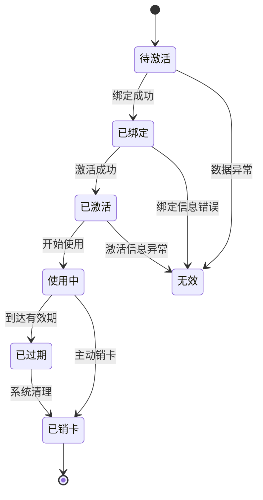
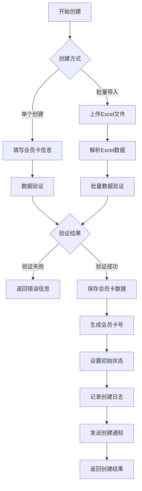
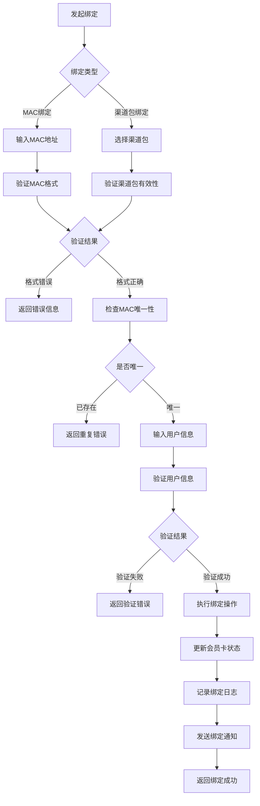

# EPIC: 会员卡全生命周期管理

## 📋 EPIC概述

### 业务价值
实现会员卡从创建到销毁的完整生命周期管理，确保会员卡状态流转的准确性和可追溯性。

### 目标用户
- 系统管理员：负责会员卡的创建、导入和管理
- 合作伙伴：查看和管理自己相关的会员卡
- 操作员：处理会员卡的日常运营操作

### 业务目标
- 实现会员卡状态的自动化流转
- 提供完整的会员卡操作历史记录
- 支持批量会员卡管理操作
- 确保会员卡数据的准确性和一致性

## 🎯 用户故事

### 用户故事 1: 会员卡创建和导入
**作为** 系统管理员
**我希望** 能够批量创建和导入会员卡
**以便** 快速建立会员卡库，支持业务扩展

**验收标准**:
- [ ] 支持Excel模板导入会员卡
- [ ] 单次导入最多支持1000张会员卡
- [ ] 导入时进行数据验证和去重检查
- [ ] 导入完成后生成导入报告
- [ ] 支持导入失败记录的导出和重试

### 用户故事 2: 会员卡状态管理
**作为** 合作伙伴
**我希望** 能够查看和管理我的会员卡状态
**以便** 及时了解会员卡使用情况

**验收标准**:
- [ ] 支持按状态筛选会员卡
- [ ] 显示会员卡的详细状态信息
- [ ] 支持会员卡状态的批量变更
- [ ] 状态变更时记录操作日志
- [ ] 状态变更后发送通知

### 用户故事 3: 会员卡绑定流程
**作为** 用户
**我希望** 能够绑定会员卡到设备或账户
**以便** 开始使用会员权益

**验收标准**:
- [ ] 支持MAC地址绑定验证
- [ ] 支持渠道包绑定验证
- [ ] 绑定过程有明确的进度提示
- [ ] 绑定失败时提供详细错误信息
- [ ] 绑定成功后更新会员卡状态

### 用户故事 4: 会员卡激活处理
**作为** 系统
**我希望** 能够自动处理会员卡激活
**以便** 准确记录激活行为并更新状态

**验收标准**:
- [ ] 激活时验证会员卡有效性
- [ ] 激活成功后生成激活订单
- [ ] 更新会员卡为激活状态
- [ ] 记录激活时间和操作信息
- [ ] 激活失败时提供重试机制

### 用户故事 5: 会员卡过期处理
**作为** 系统
**我希望** 能够自动检测和处理过期会员卡
**以便** 及时清理过期资源

**验收标准**:
- [ ] 每日定时扫描即将过期的会员卡
- [ ] 过期前7天发送提醒通知
- [ ] 过期后自动更新会员卡状态
- [ ] 支持手动延长会员卡有效期
- [ ] 过期会员卡可重新激活

### 用户故事 6: 会员卡销卡处理
**作为** 管理员
**我希望** 能够处理会员卡的销卡申请
**以便** 规范会员卡的生命周期结束

**验收标准**:
- [ ] 支持手动销卡操作
- [ ] 销卡前进行确认提示
- [ ] 销卡后记录销卡原因
- [ ] 销卡后释放相关资源
- [ ] 销卡操作可撤销（限时）

## 🔄 业务流程

### 会员卡状态流转图


### 会员卡创建流程


### 会员卡绑定流程


## 📊 数据模型

### 会员卡核心属性
```typescript
interface MembershipCard {
  id: string;
  cardNumber: string;          // 会员卡号
  cardType: CardType;         // 卡类型: REGULAR, BOUND
  status: CardStatus;         // 状态: PENDING_BIND, BOUND, ACTIVE, EXPIRED, CANCELLED
  partnerId: string;          // 关联合作伙伴
  
  // 金额信息
  totalAmount: number;        // 总金额
  remainingAmount: number;    // 剩余金额
  
  // 时间信息
  validityPeriod: number;      // 有效期(天)
  createdAt: string;          // 创建时间
  activatedAt?: string;       // 激活时间
  expiredAt?: string;         // 过期时间
  cancelledAt?: string;       // 销卡时间
  
  // 绑定信息
  bindingInfo?: {
    macAddress?: string;      // MAC地址
    channelPackage?: string;   // 渠道包
    phone?: string;           // 绑定手机号
    boundAt: string;          // 绑定时间
  };
  
  // 使用统计
  usageCount: number;         // 使用次数
  lastUsedAt?: string;        // 最后使用时间
}
```

### 会员卡操作记录
```typescript
interface CardOperationLog {
  id: string;
  cardId: string;
  operation: CardOperation;   // 操作类型: CREATE, BIND, ACTIVATE, EXPIRE, CANCEL
  operatorId: string;         // 操作人ID
  operatorType: 'SYSTEM' | 'USER' | 'ADMIN';
  
  // 操作详情
  previousStatus?: CardStatus; // 操作前状态
  currentStatus: CardStatus;  // 操作后状态
  operationData: any;         // 操作相关数据
  
  // 时间信息
  operatedAt: string;         // 操作时间
  ipAddress?: string;         // 操作IP
  userAgent?: string;         // 用户代理
}
```

## 🔧 技术实现

### 状态机设计
```typescript
class CardStateMachine {
  private transitions: Map<CardStatus, CardStatus[]> = new Map([
    ['PENDING_BIND', ['BOUND', 'CANCELLED']],
    ['BOUND', ['ACTIVE', 'CANCELLED']],
    ['ACTIVE', ['EXPIRED', 'CANCELLED']],
    ['EXPIRED', ['CANCELLED']],
    ['CANCELLED', []]
  ]);

  canTransition(from: CardStatus, to: CardStatus): boolean {
    const allowedTransitions = this.transitions.get(from);
    return allowedTransitions ? allowedTransitions.includes(to) : false;
  }

  transition(card: MembershipCard, toStatus: CardStatus, data?: any): boolean {
    if (!this.canTransition(card.status, toStatus)) {
      return false;
    }
    
    // 执行状态转换
    card.status = toStatus;
    this.updateTimestamps(card, toStatus);
    this.recordOperationLog(card, toStatus, data);
    
    return true;
  }
}
```

### 批量操作优化
```typescript
class BatchCardOperation {
  async importCards(file: File): Promise<ImportResult> {
    const data = await this.parseExcel(file);
    const validationResults = await this.validateBatch(data);
    
    // 分批处理，避免内存溢出
    const batchSize = 100;
    const results: ImportResult[] = [];
    
    for (let i = 0; i < data.length; i += batchSize) {
      const batch = data.slice(i, i + batchSize);
      const result = await this.processBatch(batch);
      results.push(result);
    }
    
    return this.aggregateResults(results);
  }
}
```

## 📈 成功指标

### 业务指标
- **会员卡创建成功率**: ≥99%
- **绑定成功率**: ≥95%
- **激活成功率**: ≥98%
- **状态转换准确性**: 100%

### 性能指标
- **批量导入速度**: 1000张/分钟
- **单卡操作响应时间**: ≤500ms
- **状态查询响应时间**: ≤200ms

### 用户体验指标
- **操作成功率**: ≥95%
- **错误处理满意度**: ≥4/5分
- **功能易用性评分**: ≥4.5/5分

---

**EPIC状态**: 进行中  
**优先级**: 高  
**预计完成时间**: 6周  
**负责人**: 开发团队  
**相关文档**: [PRD](../PRD.md), [技术设计文档](../../technical/CARD_MANAGEMENT.md)