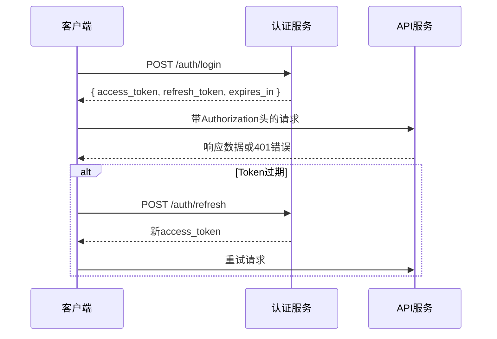

# API 规范文档 - 合作伙伴管理系统

## 📋 文档概述

### 文档目的
本文档定义了合作伙伴管理系统的完整API规范，包括接口设计原则、认证机制、数据格式、错误处理等标准，为前后端开发提供统一的技术规范。

### 适用范围
- 后端开发团队：API接口实现依据
- 前端开发团队：API调用和集成指南
- 测试团队：API测试用例设计依据
- 运维团队：API监控和故障排查参考

### 版本信息
- **当前版本**: v1.0
- **生效时间**: 2025-01-05
- **维护责任人**: 技术架构师

## 🔐 认证与安全

### 认证机制

#### JWT Token认证
```typescript
// 请求头配置
interface RequestHeaders {
  Authorization: `Bearer ${string}`;
  'Content-Type': 'application/json';
  'X-Request-ID'?: string;
}

// Token结构
interface JWTToken {
  sub: string;           // 用户ID
  role: UserRole;       // 用户角色
  partnerId?: string;    // 合作伙伴ID（如有）
  iat: number;          // 签发时间
  exp: number;          // 过期时间
}
```

#### 认证流程


### 安全要求
- **HTTPS强制**: 所有API请求必须使用HTTPS
- **Token有效期**: access_token 2小时，refresh_token 7天
- **请求频率限制**: 1000次/分钟/IP
- **敏感操作**: 需要二次验证或管理员审批

## 📊 通用规范

### 响应格式标准

#### 成功响应
```typescript
interface SuccessResponse<T = any> {
  success: true;
  data: T;
  message?: string;
  timestamp: string; // ISO 8601格式
  requestId: string;
}
```

#### 错误响应
```typescript
interface ErrorResponse {
  success: false;
  error: {
    code: string;       // 错误码
    message: string;    // 错误描述
    details?: any;      // 错误详情
    traceId?: string;   // 追踪ID
  };
  timestamp: string;
  requestId: string;
}
```

### 分页规范
```typescript
interface PaginatedResponse<T> {
  data: T[];
  pagination: {
    total: number;      // 总记录数
    page: number;       // 当前页码
    limit: number;      // 每页数量
    pages: number;      // 总页数
  };
}

// 分页查询参数
interface PaginationParams {
  page?: number;        // 页码，默认1
  limit?: number;       // 每页数量，默认20，最大100
  sortBy?: string;      // 排序字段
  sortOrder?: 'asc' | 'desc'; // 排序方向
}
```

### 时间格式
- **API请求/响应**: ISO 8601格式 (YYYY-MM-DDTHH:mm:ss.sssZ)
- **数据库存储**: UTC时间
- **前端显示**: 根据用户时区转换

## 🔄 核心业务API

### 会员卡管理API

#### 获取会员卡列表
```http
GET /api/cards
```

**查询参数**:
```typescript
interface CardListQuery extends PaginationParams {
  status?: CardStatus[];     // 状态筛选
  type?: CardType[];        // 类型筛选
  partnerId?: string;        // 合作伙伴ID
  search?: string;          // 搜索关键词
  startDate?: string;       // 开始时间
  endDate?: string;         // 结束时间
}
```

**响应示例**:
```json
{
  "success": true,
  "data": {
    "cards": [
      {
        "id": "card_001",
        "cardNumber": "12345678901234",
        "status": "ACTIVE",
        "type": "SUBSCRIPTION",
        "partnerId": "partner_001",
        "activatedAt": "2024-01-01T00:00:00Z",
        "expiresAt": "2024-12-31T23:59:59Z"
      }
    ]
  },
  "pagination": {
    "total": 100,
    "page": 1,
    "limit": 20,
    "pages": 5
  }
}
```

#### 激活会员卡
```http
POST /api/cards/{cardId}/activate
```

**请求体**:
```typescript
interface ActivateCardRequest {
  activationCode: string;   // 激活码
  deviceInfo?: {
    macAddress: string;     // 设备MAC地址
    deviceType: string;    // 设备类型
  };
  operatorId: string;       // 操作人ID
}
```

### 订单管理API

#### 获取订单列表
```http
GET /api/orders
```

**查询参数**:
```typescript
interface OrderListQuery extends PaginationParams {
  type?: OrderType[];       // 订单类型筛选
  status?: OrderStatus[];   // 状态筛选
  partnerId?: string;      // 合作伙伴ID
  startDate?: string;      // 开始时间
  endDate?: string;        // 结束时间
  minAmount?: number;      // 最小金额
  maxAmount?: number;      // 最大金额
}
```

#### 创建订单
```http
POST /api/orders
```

**请求体**:
```typescript
interface CreateOrderRequest {
  type: OrderType;          // 订单类型
  amount: number;          // 订单金额
  partnerId: string;       // 合作伙伴ID
  productId: string;       // 产品ID
  customerInfo: {
    name: string;          // 客户姓名
    phone: string;         // 手机号
    email?: string;        // 邮箱
  };
  metadata?: Record<string, any>; // 扩展元数据
}
```

### 分账管理API

#### 获取分账明细
```http
GET /api/revenue-sharing/records
```

**查询参数**:
```typescript
interface RevenueRecordQuery extends PaginationParams {
  orderId?: string;        // 订单ID
  partnerId?: string;     // 合作伙伴ID
  ruleId?: string;        // 规则ID
  status?: RevenueRecordStatus[]; // 状态筛选
  startDate?: string;     // 开始时间
  endDate?: string;       // 结束时间
}
```

#### 手动重算分账
```http
POST /api/revenue-sharing/records/{recordId}/recalculate
```

**请求体**:
```typescript
interface RecalculateRevenueRequest {
  reason: string;          // 重算原因
  operatorId: string;      // 操作人ID
  force?: boolean;        // 强制重算
}
```

### 权益回收池API

#### 获取回收池信息
```http
GET /api/recovery-pool/{partnerId}
```

**响应示例**:
```json
{
  "success": true,
  "data": {
    "pool": {
      "id": "pool_001",
      "partnerId": "partner_001",
      "totalDays": 2580,
      "usedDays": 365,
      "availableDays": 2215,
      "status": "ACTIVE",
      "lastUpdatedAt": "2024-01-05T10:00:00Z"
    },
    "stats": {
      "totalRecoveryCount": 45,
      "totalExchangeCount": 12,
      "monthlyUsage": 120,
      "utilizationRate": 0.14
    }
  }
}
```

#### 处理权益回收
```http
POST /api/recovery-pool/process-recovery
```

**请求体**:
```typescript
interface ProcessRecoveryRequest {
  redemptionRequestId: string; // 回收申请ID
  partnerId: string;         // 合作伙伴ID
  days: number;              // 回收天数
  description: string;       // 回收描述
  operatorId: string;        // 操作人ID
}
```

## ⚡ 性能与优化

### 缓存策略
- **静态数据**: 缓存24小时（如配置数据、字典数据）
- **业务数据**: 缓存5分钟（如会员卡列表、订单列表）
- **实时数据**: 不缓存或缓存30秒（如余额、状态）

### 批量操作
- **批量查询**: 支持IDs批量查询，最多100个ID
- **批量创建**: 支持批量创建，每次最多50条记录
- **批量更新**: 支持条件批量更新

### 异步处理
- **耗时操作**: 文件导入、数据导出、批量计算等
- **进度查询**: 提供任务状态查询接口
- **结果回调**: 支持Webhook回调通知

## 🔒 权限控制

### 角色权限矩阵
```typescript
enum APIEndpoint {
  // 会员卡管理
  GET_CARDS = '/api/cards',
  POST_CARDS_ACTIVATE = '/api/cards/{id}/activate',
  
  // 订单管理
  GET_ORDERS = '/api/orders',
  POST_ORDERS = '/api/orders',
  
  // 分账管理
  GET_REVENUE_RECORDS = '/api/revenue-sharing/records',
  POST_RECALCULATE = '/api/revenue-sharing/records/{id}/recalculate',
  
  // 回收池管理
  GET_RECOVERY_POOL = '/api/recovery-pool/{partnerId}',
  POST_PROCESS_RECOVERY = '/api/recovery-pool/process-recovery'
}

const ROLE_PERMISSIONS = {
  ADMIN: Object.values(APIEndpoint),
  PARTNER: [
    APIEndpoint.GET_CARDS,
    APIEndpoint.GET_ORDERS,
    APIEndpoint.GET_REVENUE_RECORDS,
    APIEndpoint.GET_RECOVERY_POOL
  ],
  OPERATOR: [
    APIEndpoint.GET_CARDS,
    APIEndpoint.POST_CARDS_ACTIVATE,
    APIEndpoint.GET_ORDERS,
    APIEndpoint.GET_REVENUE_RECORDS,
    APIEndpoint.GET_RECOVERY_POOL
  ]
};
```

## 🧪 测试规范

### 单元测试要求
- **覆盖率**: 核心业务逻辑≥90%
- **边界测试**: 所有边界条件必须测试
- **异常测试**: 错误场景和异常处理测试

### 集成测试要求
- **API测试**: 所有接口的完整流程测试
- **数据一致性**: 跨服务数据一致性验证
- **性能测试**: 响应时间和并发能力测试

### 自动化测试
- **CI/CD集成**: 每次提交自动运行测试
- **环境验证**: 开发、测试、生产环境一致性验证
- **回归测试**: 重要功能回归测试覆盖

---

**文档版本**: v1.0  
**创建日期**: 2025-01-05  
**维护责任人**: 技术架构师  
**下次评审**: 2025-02-05