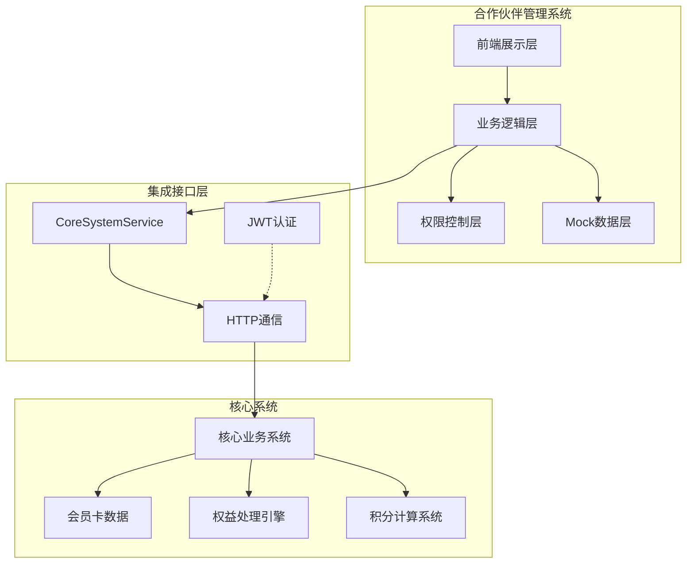
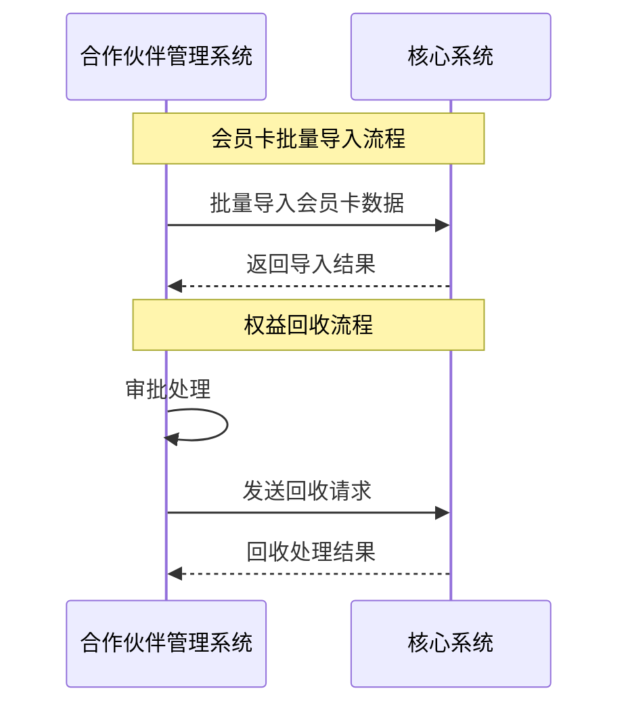

# 系统架构边界分析

## 📋 文档概述

本文档详细分析了合作伙伴管理系统与核心系统之间的架构边界、职责划分、数据流向和集成模式，为系统设计和开发提供清晰的指导。

## 🎯 系统定位与边界

### 系统边界概览



## 🏢 职责边界划分

### 合作伙伴管理系统职责

#### 用户界面与交互
- **前端展示**: React + TypeScript + shadcn/ui 技术栈
- **响应式设计**: 多端适配，用户体验优化
- **实时更新**: 数据实时刷新，状态同步

#### 权限控制
- **RBAC**: 基于角色的访问控制
- **数据隔离**: 合作伙伴数据权限隔离
- **会话管理**: 用户登录状态维护

#### 业务流程管理
- **工作流编排**: 权益回收审批流程
- **批量操作**: 批量导入和进度跟踪
- **报表生成**: 业绩报表和数据分析

### 核心系统职责

#### 核心数据管理
- **会员卡主数据**: 卡号、密码、状态等核心信息
- **用户账户**: 用户基本信息和管理
- **交易记录**: 激活、消费等交易历史

#### 业务规则引擎
- **激活逻辑**: 会员卡激活验证
- **积分计算**: 积分累积和消费规则
- **状态流转**: 会员卡状态变更控制

## 🔌 接口边界与集成

### 数据流向边界



### 核心集成接口

#### 从合作伙伴系统到核心系统的调用

```typescript
interface OutboundIntegration {
  // 会员卡管理
  cardManagement: {
    "POST /cards/batch-import": "批量导入会员卡"
    "GET /cards/batch-import/{batchId}/status": "查询导入状态"
  }
  
  // 权益处理
  rightsProcessing: {
    "POST /rights/batch-recovery": "批量权益回收"
    "GET /rights/batch-recovery/{requestId}/status": "查询回收状态"
  }
  
  // 系统监控
  systemMonitoring: {
    "GET /health": "系统健康检查"
  }
}
```

## 📊 数据所有权边界

### 合作伙伴管理系统数据

```typescript
interface PartnerSystemData {
  // 业务流程数据
  businessProcess: {
    approvalRecords: "审批记录"
    batchOperationLogs: "批量操作日志"
    recoveryPoolRecords: "回收池操作记录"
  }
  
  // 用户交互数据
  userInteraction: {
    loginSessions: "用户登录会话"
    operationLogs: "用户操作日志"
    dashboardConfigs: "仪表板配置"
  }
}
```

### 核心系统数据

```typescript
interface CoreSystemData {
  // 核心业务数据
  coreBusinessData: {
    membershipCards: "会员卡主数据"
    userAccounts: "用户账户信息"
    pointsBalances: "积分余额"
    transactionHistory: "交易历史记录"
  }
  
  // 系统运行数据
  systemRuntimeData: {
    activationLogs: "激活日志"
    systemEvents: "系统事件"
    performanceMetrics: "性能指标"
  }
}
```

## ⚡ 性能边界与约束

### 响应时间边界

| 操作类型 | 合作伙伴系统要求 | 核心系统要求 |
|----------|------------------|--------------|
| **页面加载** | < 2秒 | N/A |
| **数据查询** | < 500ms | < 1秒 |
| **批量导入** | 30秒超时 | 按批量大小 |
| **权益回收** | 30秒超时 | < 2秒 |

### 数据量边界

```typescript
interface CapacityLimits {
  // 合作伙伴系统限制
  partnerSystem: {
    maxCardsPerBatch: 1000        // 单次批量导入上限
    maxConcurrentUsers: 100       // 并发用户数上限
  }
  
  // 核心系统限制
  coreSystem: {
    maxCardsPerPartner: 1000000   // 单个合作伙伴卡片上限
    maxAPIRequestsPerMinute: 1000 // API请求频率限制
  }
}
```

## 🔐 安全边界与责任

### 安全职责划分

#### 合作伙伴管理系统安全责任

```typescript
interface PartnerSystemSecurity {
  // 前端安全
  frontendSecurity: {
    xssProtection: "XSS攻击防护"
    csrfProtection: "CSRF攻击防护"
    inputValidation: "用户输入验证"
  }
  
  // 认证授权
  authenticationAuthorization: {
    userAuthentication: "用户身份认证"
    sessionManagement: "会话管理"
    roleBasedAccess: "基于角色的访问控制"
  }
}
```

#### 核心系统安全责任

```typescript
interface CoreSystemSecurity {
  // 数据安全
  dataSecurity: {
    dataEncryption: "敏感数据加密存储"
    dataIntegrity: "数据完整性保证"
    accessLogging: "数据访问审计日志"
  }
  
  // 系统安全
  systemSecurity: {
    infrastructureSecurity: "基础设施安全"
    networkSecurity: "网络安全防护"
    securityPatching: "安全补丁管理"
  }
}
```

## 🔄 集成模式与依赖

### 依赖关系分析

```typescript
interface SystemDependencies {
  // 强依赖（必须可用）
  criticalDependencies: {
    userAuthentication: "用户登录认证依赖核心系统"
    cardActivation: "会员卡激活必须调用核心系统"
    realTimeBalance: "实时积分查询依赖核心系统"
  }
  
  // 弱依赖（可降级）
  softDependencies: {
    batchOperations: "批量操作失败可重试"
    reportGeneration: "报表可使用缓存数据"
  }
  
  // 无依赖（独立功能）
  independentFeatures: {
    userInterface: "界面展示独立"
    permissionControl: "权限控制自主"
    workflowManagement: "审批流程自主"
  }
}
```

### 容错与降级策略

```typescript
interface DegradationStrategy {
  // 核心系统不可用时的降级策略
  coreSystemUnavailable: {
    level1: "使用Mock数据保证基础展示功能"
    level2: "缓存最后一次成功的数据"
    level3: "仅提供配置和审批等离线功能"
  }
  
  // 部分接口故障时的处理
  partialFailure: {
    retryMechanism: "自动重试机制"
    alternativeData: "使用备选数据源"
    userNotification: "向用户展示友好错误信息"
  }
}
```

## 📊 监控与运维边界

### 监控职责分工

#### 合作伙伴系统监控

```typescript
interface PartnerSystemMonitoring {
  // 前端性能监控
  frontendMetrics: {
    pageLoadTime: "页面加载时间监控"
    userInteractionResponse: "用户交互响应时间"
    apiResponseTime: "API调用响应时间"
  }
  
  // 用户行为监控
  userBehavior: {
    userJourney: "用户行为路径分析"
    featureUsage: "功能使用统计"
  }
}
```

#### 核心系统监控

```typescript
interface CoreSystemMonitoring {
  // 系统性能监控
  systemPerformance: {
    cpuUtilization: "CPU使用率"
    memoryUsage: "内存使用情况"
    networkLatency: "网络延迟"
  }
  
  // 业务处理监控
  businessProcessing: {
    activationSuccessRate: "激活成功率"
    transactionThroughput: "交易处理吞吐量"
  }
}
```

## 📋 总结与建议

### 边界划分原则

1. **职责单一原则**: 每个系统专注于自己的核心职责
2. **数据所有权明确**: 避免数据重复和不一致
3. **接口标准化**: 使用标准的RESTful API进行集成
4. **故障隔离**: 单个系统故障不影响其他系统核心功能

### 关键风险与应对

1. **依赖风险**: 核心系统故障影响业务连续性
   - **应对**: 完善降级机制，增强Mock数据能力

2. **数据一致性风险**: 分布式系统数据不一致
   - **应对**: 建立数据同步机制和一致性检查

3. **性能风险**: 系统间调用延迟累积
   - **应对**: 优化接口性能，实现异步处理

---

**文档维护者**: 架构团队  
**文档版本**: v1.0.0  
**最后更新**: 2024-09-16  
**审核状态**: 已审核