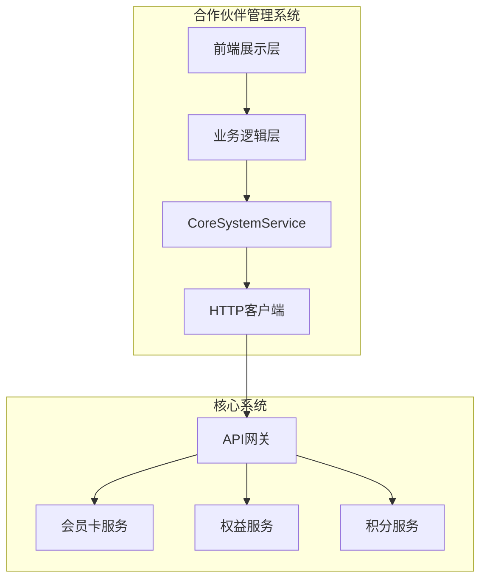

# 系统集成规范

## 📋 文档概述

本文档定义了合作伙伴管理系统与核心系统之间的集成规范，包括接口设计、认证机制、错误处理、监控策略等技术标准。

## 🏗️ 集成架构设计

### 系统依赖关系



### 技术栈配置

```typescript
// 核心系统集成配置
const coreSystemConfig = {
  baseURL: process.env.VITE_CORE_API_BASE_URL,
  timeout: 30000,
  headers: {
    'Content-Type': 'application/json',
    'Accept': 'application/json',
    'User-Agent': 'PartnerSystem/1.0.0'
  }
};
```

## 🔌 API 接口规范

### 1. 会员卡批次导入

**接口路径**: `POST /cards/batch-import`

**功能描述**: 批量导入会员卡到核心系统

**请求参数**:
```typescript
interface ImportCardsRequest {
  partnerId: string;             // 合作伙伴ID
  batchName: string;             // 批次名称
  cards: CardImportData[];       // 会员卡数据
}
```

**响应数据**:
```typescript
interface BatchImportResponse {
  success: boolean;
  data: {
    batchId: string;             // 批次ID
    totalCards: number;          // 总卡数
    successCount: number;        // 成功导入数量
    failedCount: number;         // 失败数量
  };
}
```

### 2. 权益批量回收

**接口路径**: `POST /rights/batch-recovery`

**功能描述**: 批量回收会员卡剩余权益并转换为积分

**积分计算规则**: 每10天 = 1积分

### 3. 批量补卡申请

**接口路径**: `POST /cards/replacement-request`

**功能描述**: 使用积分申请新的会员卡

**积分消耗规则**: 月卡=36积分，年卡=365积分

## 🔐 认证与安全

### JWT Token 认证

```typescript
// 请求头格式
{
  "Authorization": "Bearer <JWT_TOKEN>",
  "X-Request-ID": "req-{timestamp}-{random}"
}
```

### 请求追踪机制

每个请求包含唯一请求ID用于日志追踪：
```typescript
const requestId = `req-${Date.now()}-${Math.random().toString(36).substr(2, 9)}`;
```

## ⚙️ 配置管理

### 环境变量配置

```bash
# 开发环境
VITE_CORE_API_BASE_URL=http://localhost:3001/api/core
VITE_USE_MOCK=true

# 生产环境
VITE_CORE_API_BASE_URL=https://core-api.example.com/api/core
VITE_USE_MOCK=false
```

### 超时与重试策略

```typescript
const networkConfig = {
  timeout: {
    connection: 5000,    // 连接超时
    request: 30000,      // 请求超时
  },
  retry: {
    maxAttempts: 3,      // 最大重试次数
    initialDelay: 1000,  // 初始延迟
  }
};
```

## 🚨 错误处理规范

### 错误分类与处理策略

| 状态码 | 错误类型 | 处理策略 |
|--------|----------|----------|
| 400 | 请求参数错误 | 修正参数后重试 |
| 401 | 认证失败 | 刷新Token后重试 |
| 403 | 权限不足 | 记录日志，提示用户 |
| 429 | 请求过频 | 延迟重试 |
| 500 | 服务器错误 | 重试3次后失败 |

### 降级策略

```typescript
// Mock数据降级机制
const fallbackToMockData = async <T>(
  apiCall: () => Promise<T>,
  mockData: T
): Promise<T> => {
  try {
    return await apiCall();
  } catch (error) {
    console.warn('核心系统不可用，使用Mock数据');
    return mockData;
  }
};
```

## 📊 监控与日志

### 性能监控指标

```typescript
interface PerformanceMetrics {
  responseTime: {
    p50: number;         // 50分位数
    p95: number;         // 95分位数
    avg: number;         // 平均值
  };
  successRate: {
    total: number;       // 总请求数
    success: number;     // 成功数
    rate: number;        // 成功率
  };
}
```

### 日志规范

```typescript
interface LogEntry {
  timestamp: string;    // 时间戳
  level: 'error' | 'warn' | 'info' | 'debug';
  requestId: string;    // 请求ID
  service: string;      // 服务名称
  method: string;       // HTTP方法
  url: string;          // 请求URL
  statusCode: number;   // 响应状态码
  duration: number;     // 请求耗时
}
```

## 🧪 测试策略

### 集成测试

```typescript
describe('CoreSystemService Integration Tests', () => {
  it('should successfully import cards batch', async () => {
    const request: ImportCardsRequest = {
      partnerId: 'test-partner-001',
      batchName: 'Test Batch',
      cards: [/* 测试数据 */]
    };

    const response = await CoreSystemService.batchImportCards(request);
    expect(response.success).toBe(true);
  });
});
```

### Mock 服务器配置

```typescript
const mockConfig = {
  enabled: process.env.VITE_USE_MOCK === 'true',
  delay: 500,           // 模拟网络延迟
  errorRate: 0,         // 错误率
};
```

## 📖 部署指南

### 环境准备清单

- [ ] 核心系统API地址配置
- [ ] JWT认证密钥配置
- [ ] 网络连接测试通过
- [ ] SSL证书验证通过

### 配置验证

```bash
# 验证核心系统连接
curl -H "Authorization: Bearer $JWT_TOKEN" \
     $CORE_API_BASE_URL/health

# 运行集成测试
npm run test:integration
```

## 📞 技术支持

### 问题升级流程

| 级别 | 响应时间 | 解决时间 | 负责人 |
|------|----------|----------|--------|
| P0 - 紧急 | 15分钟内 | 2小时内 | 技术负责人 |
| P1 - 高优 | 1小时内 | 8小时内 | 接口负责人 |
| P2 - 中等 | 4小时内 | 24小时内 | 运维团队 |

---

**文档维护**: 技术团队  
**最后更新**: 2024-01-20  
**版本**: v1.0.0