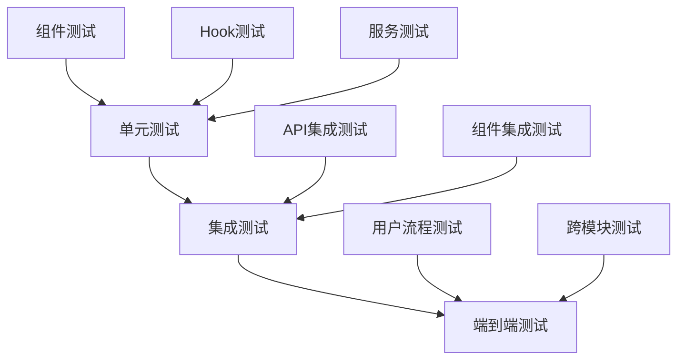

# 测试指南 - 合作伙伴管理系统

## 📋 文档概述

### 文档目的
本文档为合作伙伴管理系统提供完整的测试指导，包括测试策略、测试框架配置、测试用例设计、自动化测试等，确保代码质量和系统稳定性。

### 适用范围
- 开发团队：编写和维护测试用例
- 测试团队：执行测试和验证功能
- 质量保证：制定测试标准和流程

### 版本信息
- **当前版本**: v1.0
- **生效时间**: 2025-01-05
- **维护责任人**: 质量保证工程师

## 🧪 测试策略

### 测试金字塔模型



### 测试覆盖率目标

| 测试类型 | 覆盖率目标 | 重点覆盖范围 |
|---------|-----------|-------------|
| 单元测试 | ≥ 80% | 核心业务逻辑、工具函数 |
| 组件测试 | ≥ 70% | 用户交互、状态管理 |
| 集成测试 | ≥ 60% | API接口、数据流 |
| 端到端测试 | ≥ 50% | 关键用户流程 |

### 测试环境

#### 测试环境配置
```typescript
// vitest.config.ts
export default defineConfig({
  test: {
    globals: true,                    // 启用全局测试函数
    environment: "jsdom",             // 使用jsdom环境
    setupFiles: ["./src/test/setup.ts"], // 测试设置文件
    
    // 覆盖率配置
    coverage: {
      provider: "v8",
      reporter: ["text", "json", "html", "lcov"],
      exclude: [
        "node_modules/",
        "src/test/",
        "**/*.d.ts",
        "**/*.config.{js,ts}",
        "**/index.{js,ts}",
        "src/main.tsx",
        "src/vite-env.d.ts"
      ],
      thresholds: {
        lines: 80,
        functions: 80,
        branches: 70,
        statements: 80
      }
    },
    
    // 测试文件匹配
    include: ["src/**/*.{test,spec}.{js,ts,jsx,tsx}"],
    
    // Mock配置
    mockReset: true,
    clearMocks: true
  }
});
```

#### 测试设置文件
```typescript
// src/test/setup.ts
import { afterEach } from 'vitest';
import { cleanup } from '@testing-library/react';
import '@testing-library/jest-dom';

// 每次测试后清理DOM
afterEach(() => {
  cleanup();
});

// 全局Mock配置
vi.mock('@/services/cardService', () => ({
  cardService: {
    getCards: vi.fn(),
    activateCard: vi.fn()
  }
}));
```

## 🔧 测试框架配置

### Vitest配置详解

#### 测试脚本配置
```json
// package.json
{
  "scripts": {
    "test": "vitest",
    "test:watch": "vitest --watch",
    "test:coverage": "vitest --coverage",
    "test:ui": "vitest --ui",
    "test:run": "vitest run",
    "test:type-check": "tsc --noEmit"
  }
}
```

#### 测试环境变量
```typescript
// src/test/env.ts
export const TEST_CONFIG = {
  API_BASE_URL: 'http://localhost:3001',
  MOCK_DELAY: 100, // Mock请求延迟
  TEST_TIMEOUT: 10000 // 测试超时时间
};

// 测试数据工厂
export const createTestCard = (overrides?: Partial<ICard>): ICard => ({
  id: 'test-card-1',
  cardNumber: '12345678901234',
  status: 'ACTIVE',
  type: 'SUBSCRIPTION',
  partnerId: 'test-partner-1',
  activatedAt: '2024-01-01T00:00:00Z',
  expiresAt: '2024-12-31T23:59:59Z',
  ...overrides
});
```

### Mock数据管理

#### API Mock配置
```typescript
// src/test/mocks/handlers.ts
import { http, HttpResponse } from 'msw';

export const handlers = [
  // 获取会员卡列表
  http.get('/api/cards', ({ request }) => {
    const url = new URL(request.url);
    const partnerId = url.searchParams.get('partnerId');
    
    const mockCards = [
      createTestCard({ id: '1', partnerId: partnerId || 'default' }),
      createTestCard({ id: '2', partnerId: partnerId || 'default' })
    ];
    
    return HttpResponse.json({
      success: true,
      data: { cards: mockCards },
      pagination: { total: 2, page: 1, limit: 20, pages: 1 }
    });
  }),
  
  // 激活会员卡
  http.post('/api/cards/:cardId/activate', async ({ request, params }) => {
    const { activationCode } = await request.json();
    
    if (!activationCode) {
      return HttpResponse.json(
        { success: false, error: { code: 'INVALID_CODE', message: '激活码无效' } },
        { status: 400 }
      );
    }
    
    return HttpResponse.json({ success: true });
  })
];
```

## 📝 测试用例设计

### 单元测试规范

#### 服务层测试
```typescript
// src/services/__tests__/cardService.test.ts
import { describe, it, expect, vi, beforeEach } from 'vitest';
import { cardService } from '../cardService';
import axios from 'axios';

// Mock axios
vi.mock('axios');
const mockedAxios = vi.mocked(axios);

describe('CardService', () => {
  beforeEach(() => {
    vi.clearAllMocks();
  });

  describe('getCards', () => {
    it('should fetch cards successfully', async () => {
      // Arrange
      const mockResponse = {
        data: {
          success: true,
          data: {
            cards: [
              { id: '1', cardNumber: '1234567890', status: 'ACTIVE' }
            ]
          }
        }
      };
      
      mockedAxios.get.mockResolvedValue(mockResponse);
      
      // Act
      const result = await cardService.getCards({ partnerId: 'test-1' });
      
      // Assert
      expect(mockedAxios.get).toHaveBeenCalledWith('/cards', {
        params: { partnerId: 'test-1' }
      });
      expect(result.cards).toHaveLength(1);
      expect(result.cards[0].id).toBe('1');
    });

    it('should handle API errors', async () => {
      // Arrange
      mockedAxios.get.mockRejectedValue(new Error('Network error'));
      
      // Act & Assert
      await expect(cardService.getCards({})).rejects.toThrow('Network error');
    });
  });

  describe('batchRedeemCards', () => {
    it('should redeem up to 100 cards per batch', async () => {
      // Arrange
      const mockCards = Array.from({ length: 100 }, (_, i) => ({
        id: `card-${i}`,
        status: 'RECOVERABLE'
      }));
      
      mockedAxios.post.mockResolvedValue({ data: { success: true } });
      
      // Act
      const result = await cardService.batchRedeemCards(mockCards);
      
      // Assert
      expect(mockedAxios.post).toHaveBeenCalledTimes(1);
      expect(result.success).toBe(true);
    });

    it('should reject batches exceeding 100 cards', async () => {
      // Arrange
      const mockCards = Array.from({ length: 101 }, (_, i) => ({
        id: `card-${i}`,
        status: 'RECOVERABLE'
      }));
      
      // Act & Assert
      await expect(cardService.batchRedeemCards(mockCards)).rejects.toThrow('单次批量兑换上限为100张');
    });

    it('should generate revenue sharing records after redemption', async () => {
      // Arrange
      const mockCards = [{ id: 'card-1', status: 'RECOVERABLE' }];
      const mockResponse = {
        data: {
          success: true,
          data: {
            sharingRecords: [{ cardId: 'card-1', amount: 10 }]
          }
        }
      };
      
      mockedAxios.post.mockResolvedValue(mockResponse);
      
      // Act
      const result = await cardService.batchRedeemCards(mockCards);
      
      // Assert
      expect(result.data.sharingRecords).toHaveLength(1);
    });
  });
});
```

#### 工具函数测试
```typescript
// src/lib/utils/__tests__/dateUtils.test.ts
import { describe, it, expect } from 'vitest';
import { formatDate, isValidDate, getDaysBetween } from '../dateUtils';

describe('dateUtils', () => {
  describe('formatDate', () => {
    it('should format date correctly', () => {
      const date = new Date('2024-01-01T00:00:00Z');
      expect(formatDate(date)).toBe('2024-01-01');
    });

    it('should handle invalid date', () => {
      expect(formatDate(null as any)).toBe('');
    });
  });

  describe('getDaysBetween', () => {
    it('should calculate days between two dates', () => {
      const start = new Date('2024-01-01');
      const end = new Date('2024-01-10');
      expect(getDaysBetween(start, end)).toBe(9);
    });
  });
});
```

### 组件测试规范

#### 基础组件测试
```typescript
// src/components/ui/__tests__/Button.test.tsx
import { render, screen, fireEvent } from '@testing-library/react';
import { Button } from '../Button';

describe('Button', () => {
  it('renders with correct text', () => {
    render(<Button>Click me</Button>);
    expect(screen.getByText('Click me')).toBeInTheDocument();
  });

  it('handles click events', () => {
    const handleClick = vi.fn();
    render(<Button onClick={handleClick}>Click me</Button>);
    
    fireEvent.click(screen.getByText('Click me'));
    expect(handleClick).toHaveBeenCalledTimes(1);
  });

  it('applies correct styles based on variant', () => {
    render(<Button variant="destructive">Delete</Button>);
    const button = screen.getByText('Delete');
    
    expect(button).toHaveClass('bg-destructive');
    expect(button).toHaveClass('text-destructive-foreground');
  });
});
```

#### 业务组件测试
```typescript
// src/components/cards/__tests__/CardList.test.tsx
import { describe, it, expect, vi, beforeEach } from 'vitest';
import { render, screen, waitFor } from '@testing-library/react';
import { CardList } from '../CardList';
import { useCardStore } from '@/store/cardStore';

// Mock store
vi.mock('@/store/cardStore');

const mockUseCardStore = vi.mocked(useCardStore);

describe('CardList', () => {
  const mockCards = [
    { id: '1', cardNumber: '1234567890', status: 'ACTIVE' },
    { id: '2', cardNumber: '0987654321', status: 'EXPIRED' }
  ];

  beforeEach(() => {
    mockUseCardStore.mockReturnValue({
      cards: mockCards,
      loading: false,
      error: null,
      fetchCards: vi.fn()
    });
  });

  it('renders card list correctly', () => {
    render(<CardList />);
    
    expect(screen.getByText('1234567890')).toBeInTheDocument();
    expect(screen.getByText('0987654321')).toBeInTheDocument();
  });

  it('shows loading state', () => {
    mockUseCardStore.mockReturnValue({
      cards: [],
      loading: true,
      error: null,
      fetchCards: vi.fn()
    });
    
    render(<CardList />);
    expect(screen.getByText('加载中...')).toBeInTheDocument();
  });

  it('shows error state', () => {
    mockUseCardStore.mockReturnValue({
      cards: [],
      loading: false,
      error: '获取数据失败',
      fetchCards: vi.fn()
    });
    
    render(<CardList />);
    expect(screen.getByText('获取数据失败')).toBeInTheDocument();
  });
});
```

### Hook测试规范

#### 自定义Hook测试
```typescript
// src/hooks/__tests__/useCards.test.ts
import { describe, it, expect, vi, beforeEach } from 'vitest';
import { renderHook, waitFor } from '@testing-library/react';
import { useCards } from '../useCards';
import { cardService } from '@/services/cardService';

// Mock service
vi.mock('@/services/cardService');

const mockCardService = vi.mocked(cardService);

describe('useCards', () => {
  const mockCards = [
    { id: '1', cardNumber: '1234567890', status: 'ACTIVE' }
  ];

  beforeEach(() => {
    vi.clearAllMocks();
  });

  it('fetches cards on mount', async () => {
    mockCardService.getCards.mockResolvedValue({
      cards: mockCards,
      pagination: { total: 1, page: 1, limit: 20, pages: 1 }
    });

    const { result } = renderHook(() => useCards('partner-1'));

    await waitFor(() => {
      expect(result.current.loading).toBe(false);
    });

    expect(result.current.cards).toEqual(mockCards);
    expect(mockCardService.getCards).toHaveBeenCalledWith({
      partnerId: 'partner-1',
      page: 1,
      limit: 20
    });
  });

  it('handles fetch errors', async () => {
    mockCardService.getCards.mockRejectedValue(new Error('Network error'));

    const { result } = renderHook(() => useCards('partner-1'));

    await waitFor(() => {
      expect(result.current.loading).toBe(false);
    });

    expect(result.current.error).toBe('获取会员卡列表失败');
  });
});
```

## 🚀 集成测试

### API集成测试
```typescript
// src/__tests__/integration/api.test.ts
import { describe, it, expect, beforeAll, afterAll } from 'vitest';
import { setupServer } from 'msw/node';
import { handlers } from '../../test/mocks/handlers';

const server = setupServer(...handlers);

beforeAll(() => server.listen());
afterAll(() => server.close());

describe('API Integration', () => {
  it('should complete user authentication flow', async () => {
    // 完整的认证流程测试
    const authResponse = await fetch('/api/auth/login', {
      method: 'POST',
      body: JSON.stringify({ username: 'test', password: 'test' })
    });
    
    expect(authResponse.status).toBe(200);
    
    const authData = await authResponse.json();
    expect(authData.success).toBe(true);
    expect(authData.data.access_token).toBeDefined();
  });
});
```

### 组件集成测试
```typescript
// src/__tests__/integration/cardManagement.test.tsx
import { describe, it, expect } from 'vitest';
import { render, screen, fireEvent, waitFor } from '@testing-library/react';
import { CardManagementPage } from '@/pages/Cards';
import { QueryClient, QueryClientProvider } from '@tanstack/react-query';

describe('Card Management Integration', () => {
  const createTestQueryClient = () => {
    return new QueryClient({
      defaultOptions: {
        queries: { retry: false },
        mutations: { retry: false }
      }
    });
  };

  it('should complete card activation flow', async () => {
    const queryClient = createTestQueryClient();
    
    render(
      <QueryClientProvider client={queryClient}>
        <CardManagementPage />
      </QueryClientProvider>
    );

    // 等待卡片列表加载
    await waitFor(() => {
      expect(screen.getByText('会员卡管理')).toBeInTheDocument();
    });

    // 点击激活按钮
    const activateButton = screen.getByText('激活');
    fireEvent.click(activateButton);

    // 填写激活码
    const activationInput = screen.getByPlaceholderText('请输入激活码');
    fireEvent.change(activationInput, { target: { value: '123456' } });

    // 提交激活
    const submitButton = screen.getByText('确认激活');
    fireEvent.click(submitButton);

    // 验证激活成功
    await waitFor(() => {
      expect(screen.getByText('激活成功')).toBeInTheDocument();
    });
  });
});
```

## 📊 测试报告与分析

### 覆盖率报告

#### 生成覆盖率报告
```bash
# 生成详细覆盖率报告
pnpm test:coverage

# 查看HTML报告
open coverage/index.html
```

#### 覆盖率分析
```typescript
// 覆盖率配置示例
coverage: {
  reporter: ['text', 'json', 'html', 'lcov'],
  reportsDirectory: './coverage',
  
  // 阈值配置
  thresholds: {
    global: {
      branches: 70,
      functions: 80,
      lines: 80,
      statements: 80
    },
    
    // 按文件类型设置不同阈值
    './src/services/**': {
      branches: 85,
      functions: 90,
      lines: 90,
      statements: 90
    },
    
    // 权益回收池模块
    './src/services/recoveryPoolService.ts': {
      branches: 90,
      functions: 95,
      lines: 95,
      statements: 95
    }
  }
}
```

### 性能测试

#### 组件性能测试
```typescript
// src/__tests__/performance/cardListPerformance.test.tsx
import { describe, it, expect } from 'vitest';
import { render } from '@testing-library/react';
import { CardList } from '@/components/cards/CardList';

describe('CardList Performance', () => {
  it('should render 1000 cards within 500ms', () => {
    const largeCardList = Array.from({ length: 1000 }, (_, i) => ({
      id: `card-${i}`,
      cardNumber: `123456789${i}`,
      status: 'ACTIVE'
    }));

    const startTime = performance.now();
    
    render(<CardList cards={largeCardList} />);
    
    const endTime = performance.now();
    const renderTime = endTime - startTime;
    
    expect(renderTime).toBeLessThan(500);
  });
});
```

## 🔄 持续集成

### GitHub Actions配置
```yaml
# .github/workflows/test.yml
name: Test Suite

on:
  push:
    branches: [ main, develop ]
  pull_request:
    branches: [ main ]

jobs:
  test:
    runs-on: ubuntu-latest
    
    steps:
    - uses: actions/checkout@v3
    
    - name: Setup Node.js
      uses: actions/setup-node@v3
      with:
        node-version: '18'
        cache: 'pnpm'
    
    - name: Install dependencies
      run: pnpm install
    
    - name: Run tests
      run: pnpm test:run
    
    - name: Generate coverage report
      run: pnpm test:coverage
    
    - name: Upload coverage to Codecov
      uses: codecov/codecov-action@v3
      with:
        file: ./coverage/lcov.info
```

---

**文档版本**: v1.0  
**创建日期**: 2025-01-05  
**维护责任人**: 质量保证工程师  
**下次评审**: 2025-02-05